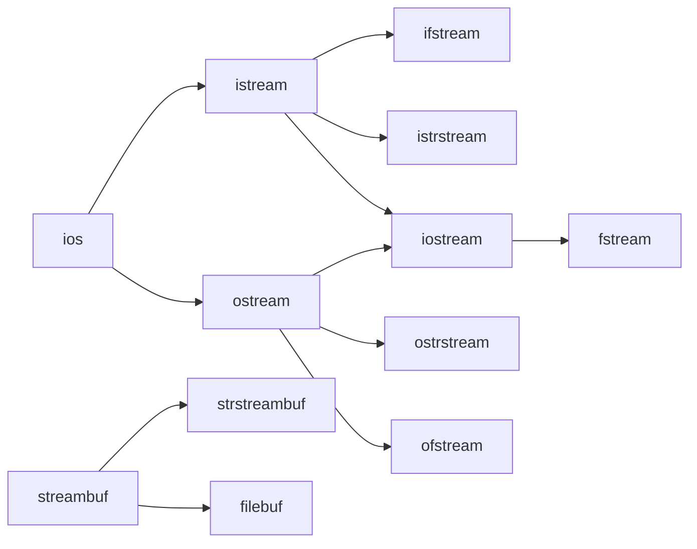
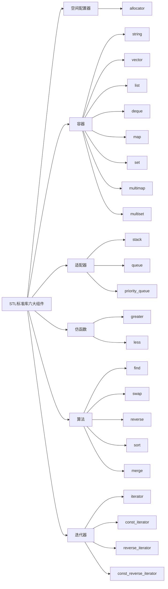

本文为自己复习C++时知识的补充与记录。

---

sizeof运算符返回变量的大小。

逗号运算符会顺序执行一系列运算。整个逗号表达式的值是以逗号分隔的列表中的最后一个表达式的值。

补码范围：

| 数        | 8              | 16                 | 32                          |
| --------- | -------------- | ------------------ | --------------------------- |
| $UMax_w$  | 0xFF<br />255  | 0xFFFF<br />65535  | 0xFFFFFFFF<br />4294967295  |
| $TMin_w$  | 0x80<br />-128 | 0x8000<br />-32768 | 0x80000000<br />-2147483648 |
| $TMax_w$  | 0x7F<br />127  | 0x7FFF<br />32767  | 0x7FFFFFFF<br />2147483647  |
| -1<br />0 | 0xFF<br />0x00 | 0xFFFF<br />0x0000 | 0xFFFFFFFF<br />0x00000000  |

**对有符号数，仅不要使用右移运算，因为到底是逻辑右移还是算术右移取决于编译器。**

对于二维数组的循环，尽管可以按照列进行遍历，但是不推荐。**循环时尽可能满足“空间局部性”**:

1. 在一个小的时间窗口内，访问的变量地址越接近越好，这样执行速度快。
2. 一般来说，需要将最长的循环放在最内层，最短的循环放在最外层，以减少CPU跨切循环层的次数。

`vector`是面向对象方式的动态数组。可以使用`capacity`和`size`方法来查看vector当前的容量和已经存储的元素个数。`insert`方法两个参数，第一个是位置的指针，第二个是插入的值。`pop_back()`从尾部删除，`push_back()`从尾部插入元素，`erase()`一个参数，删除元素的指针位置。**`end()`返回的是vector最后一个元素之后的位置，操作时注意是否-1。**

---

### OOP

- 封装：数据和代码捆绑在一起，避免外界干扰和不确定性访问，封装可以使得代码模块化。
- 继承：让某种类型对象获得另一个类型对象的属性和方法，继承可以扩展已存在的代码。
- 多态：同一事物表现出不同事物的能力，即向不同对象会产生不同的行为，多态的目的是为了接口重用。

---

### 字符

字符常量：括在`单引号`中。如果常量以L（仅当大写）开头，则表示它是一个宽字符常量(例如L'x')，此时必须被存储在`wchar_t`类型的变量中。否则就是一个窄字符变量。

字符串是以空字符`\0`结束的字符数组。

| 二进制 | 十进制 | 对应字符 |
| :----: | :----: | :------: |
|  0x41  |   65   |    A     |
|  0x61  |   97   |    a     |
|  0x30  |   48   |    0     |
|  0x7F  |  127   |   DEL    |

为了表示Unicode字符集，有三种Unicode的编码方式：

- UTF-8：1byte来表示字符，兼容ASCII码。特点存储效率高，变长(不方便内部随机访问)，无字节序问题(可作为外部编码)
- UTF-16：分为UTF-16BE(big endian),UTF-16LE(little endian)。特点定长(方便内部随机访问)，有字节序问题(不可作为外部编码)
- UTF-32：分为UTF-32BE(big endian),UTF-32LE(little endian)。特点定长(方便内部随机访问)，有字节序问题(不可作为外部编码)

#### stdio

字符串常见操作：

- 字符串长度:strlen(s)，不包括`\0`。
- 字符串比较:strcmp(s1,s2),相同返回0，s1<s2返回值小于0，s1>s2返回值大于0。按照ASCII码进行比较。
- 字符串拷贝:strcpy(s1,s2)，字符串s2复制到s1中。
- 复制指定长度字符串:strncpy(s1,s2,n)。将字符串s2中前n个字符拷贝到s1中。
- 字符串拼接:strcat(s1,s2)。将字符串s2接到s1后面。
- 查找字符串:strchr(s1,ch)。指向字符串s1中字符ch的第一次出现的位置。
- 查找字符串strstr(s1,s2)。指向字符串s2的第一次出现的位置。

推荐使用strnlen_s,strcpy_s,strncpy_s,strcat_s等API函数，更安全。

在进行底层代码安全性测试的时候需要加上`CRT_SECURE_NO_WARNINGS`让编译器忽略错误。

#### string

获得字符串长度：`s.length`或`s.size()`二者等价。`s.capacity()`查看字符串总空间。

转换为C风格的字符串使用如下代码：

```Cpp
const char *c_str = s1.c_str();
```

`c_str()`生成一个const char*指针，指向以空字符终止的数组。

---

### 指针

`const`和`*`修饰的部分：1.先看左侧最近的部分;2.如果左侧没有，则看右侧。

`*`操作符具有从右往左的结合性。`**`这个表达式相当于`*(*c)`，必须从里向外逐层求值。 

#### 野指针

直接使用未初始化或非法指针，可能发生两种情况：**1.定位到非法地址，程序出错，从而终止。2.定位到一个可以访问的地址，无意修改了它，这样的错误难以捕捉，引发的错误可能与原先用于操作的代码完全不相干！**

用指针进行间接访问之前，一定要非常小心，**确保它已经初始化，并被恰当的赋值。**

对于一个指针，如果已经知道将被初始化为什么地址，那么请赋值给它，否则请将它**设置为NULL**。

在对一个指针进行间接引用前，请先判断这个指针的值是否为NULL。

野指针是指向"垃圾"内存的指针。if判断对它们不起作用，因为没有置NULL。一般有三种情况：

1.   指针变量没有初始化;
2. 已经释放不用的指针没有置NULL,如delete和free之后的指针；
3. 指针操作超越了变量的作用范围;

没有初始化的，不用的或者超出范围的指针请置为NULL。

编译器程序分解成符号的方法是：一个字符一个字符的读入，一直到读入的字符不再能组成一个有意义的符号。这个处理过程称为"贪心法"。

栈内分配内存从高地址向低地址分配，堆区分配内存是从低地址到高地址。


主流的编程语言中，C++是唯一一个依赖RAII(Resource Acquisition Is Initialization)来做资源管理的。

RAII依托栈和析构函数，来对所有资源——包括堆内存在内进行管理。对RAII的使用，使得C++不需要类似于Java那样的垃圾收集方法，也能有效的对内存进行管理。RAII的存在，也是垃圾收集虽然理论上可以在C++使用，但从来没有真正流行的原因。

RAII有些比较成熟的智能指针代表：如`std:auto_ptr`和`boost:shared_ptr`。

栈和堆中变量对比：

|                | stack                                                        | heap                                                         |
| -------------- | ------------------------------------------------------------ | ------------------------------------------------------------ |
| 作用域         | 函数体内，语句块{}作用域                                     | 整个程序范围内，由new,malloc开始，delete,free结束            |
| 编译期大小确定 | 变量大小范围确定                                             | 变量大小范围不确定，需要在运行期确定                         |
| 大小范围       | Windows系统默认栈大小是1M,linux常见的默认的栈大小是8M或10M(通过ulimit -s查看，不同的linux发行版本不保证相同)Manjaro就是8M | 所有系统的堆空间上限是接近内存(虚拟内存)的总大小的(一部分被OS占用) |
| 内存分配方式   | 地址由高到低减少                                             | 地址由低到高增加                                             |
| 内容是否可变   | 可变                                                         | 可变                                                         |

全局静态存储区和常量存储区的变量对比：

|                      | 全局静态存储区 | 常量存储区 |
| -------------------- | -------------- | ---------- |
| 存储内容             | 全局变量       | 常量       |
| 编译期间大小是否确定 | 确定           | 确定       |
| 内容是否可变         | 可变           | 不可变     |

#### 内存泄漏

##### 定义

内存泄漏指程序中已动态分配的堆内存由于某种原因程序未释放或无法释放造成系统内存的浪费，导致程序运行速度减慢甚至系统崩溃等严重后果。

##### 发生原因和排查方式

1. 内存泄漏主要发生在堆内存分配方式中，即“配置了内存后，所有指向该内存的指针都遗失了”。若缺乏语言这样的gc机制，这样的内存片就无法归还系统。
2. 因为内存泄漏属于程序运行中的问题，无法通过编译识别，所以只能在程序运行过程中来识别和诊断。

---

### 智能指针

 **C++11之后对空指针的判断推荐使用`nullter`，避免`NULL`的二义性。**

`unique_ptr`、`shared_ptr`、`weak_ptr`和C++11中已经废弃的`auto_ptr`，在C++17中被正式删除。需要导入头文件`<memory>`

#### auto_ptr \(不推荐使用\)

由`new expression`获得对象，在`auto_ptr`对象销毁时，他所管理的对象也会自动被delete掉。

所有权转移：不小心把它传递给另外的智能指针，原本的指针就不再拥有这个对象了。在拷贝/赋值过程中，会直接剥夺指针对原对象对内存的控制权，转交给新对象，然后再将原对象指针置为`nullptr`。

**当拷贝/赋值时发生所有权转移，再次访问原对象时程序就会报错。**

#### unique_ptr

`unique_ptr`是专属所有权，所以`uniqure_ptr`管理的内存，只能被一个对象持有，不支持复制和赋值。

移动语义：`unique_ptr`禁止了拷贝语义，但有时我们也需要能够转移所有权，于是提供了移动语义，即可以使用std::move()进行控制所有权的转移。

语法: `std::make_unique<int>(10)`或`unique_ptr<int>(new int(10))`

#### shared_ptr

`shared_ptr`通过一个引用计数共享一个对象，代表的是共享所有权，即多个`shared_ptr`可以共享同一块内存。

`shared_ptr`是为了解决`auto_ptr`在对象所有权上的局限性，在使用引用计数的机制上提供了可以共享所有权的智能指针，当然这需要额外的开销。当引用计数为0时，该对象没有被使用，可以进行析构。

但是可能存在一些问题：

- 循环引用:引用计数会带来循环引用的问题

  循环引用会导致堆里的内存无法被正常回收，造成内存泄漏。


#### weak_ptr

`weak_ptr`被设计为与`shared_ptr`共同工作，用一种观察者模式工作。

作用是协助`shared_ptr`工作，可获得资源的观测权，像旁观者那样观测资源的使用情况。观察者意味着`weak_ptr`只对`shared_ptr`进行引用，而不改变其引用计数，当被观察的`shared_ptr`失效后，相应的`weak_ptr`也相应失效。

---

### 引用

使用引用的优点：

1. 不存在空引用，避免了空指针的出现。
2. 必须初始化，避免了野指针的出现。
3. 一个引用必须永远指向它初始化的那个对象

**有了指针为什么还需要引用？**为了支持函数运算符重载。

**有了引用为什么还需要指针?**为了兼容C语言。

左值引用：<类型>& <变量名>，定义的时候就需要进行初始化。

右值引用：<类型>&& <变量名>

---

### 自定义结构

#### 枚举

使用`#define`和`const`创建符号变量，使用`enum`不仅能够创建符号常量，还能定义新的数据类型。

枚举类型enum(enumeration)的声明和定义：

```cpp
enum wT{Monday,Tuesday,Wednesday,Thursday,Friday,Saturday,Sunday};
wT weekday;
```

#### 结构体

使用`struct`定义

```cpp
strcut Student{
    char name[6];
    int age;
}
//让对象实例成为一个callable,能够作为std::function
struct Display {
    void operator()(const int &n) const {
        cout << n << " ";
    }
};
//调用可使用
Display{}(1);//打印1
//或者
for_each(begin,end,Display());
```

**结构体的内存布局需要综合考虑CPU的位数和当前结构体中最大的类型所占空间。不同的结构体中数据的排序也会导致结构体占用空间的不同。结构体所占的空间必然是最大元素所占空间的整数倍。**

结构体中数据——缺省对齐原则

针对32位CPU：

- char：任何地址
- short：偶数地址
- int：4的整数倍地址
- double ：8的整数倍地址

修改默认编译选项：

- Visual C++:

  #pragma pack(n)

- g++:

  \_attribute\_(aligned(n))

  \_attribute\_\(\_packed\_\)

**此处的n表示是n的倍数进行分配。**

**推荐把小的元素分配在一起！！！！**

#### 联合体

使用`union`定义

```cpp
union Score{
    double sc;
    char level;
}
```

**联合体的空间按照最大元素所占空间决定。**

#### 宏定义

宏定义版min函数：`#define MIN(a,b) (((a)>=(b))?(b):(a))`，这里的a或b可能是式子，所以加上括号。

---

### 泛型

- 如果说面向对象是一种通过间接层来调用函数，以换取一种抽象，那么泛型编程则是更直接的抽象，因为它不会因为间接层而损失效率；
- 不同于面向对象的动态期多态，泛型编程则是一种静态期多态，通过编译器生成最直接的代码；
- 泛型编程可以将算法与特定类型，结构相剥离，尽可能复用代码；

```cpp
template<class T>
T max(T a, T b) {
    return a > b ? a : b;
}

//特化
template<>
char *max(char *a, char *b) {
    return (strcmp(a, b) > 0) ? (a) : (b);
}

//简单的for_each实现
template<typename T,typename Func>
void for_each(T* begin,T* end,const Func& f){
    while (begin!=end) f(*begin++);
}
```

#### 模板元编程

```cpp
template<int n>
struct Sum {
    enum Value {
        N = Sum<n - 1>::N + n
    };
};
template<>
struct Sum<1> {
    enum Value {
        N = 1
    };
};
int main(){
    cout << Sum<100>::N;
    return 0;
}
```

这个函数的整个计算过程不是在运行时完成，而是在编译期完成。

---

### 函数

函数名与参数列表一起构成了函数签名。

函数的参数默认值必须是最右的有值才行，这取决于代码编译成汇编语言时先操作的是最右的参数进行压栈，之后从右向左进行赋值。

#### 判断

switch分支与if分支比较：

使用场景：

1. switch只支持常量值固定相等的分支判断;
2. if还可以判断区间范围;
3. 用switch能做的，用if都能做，但反过来则不行;

性能比较：

1. 分支少时，差别不是很大;分支多时，switch性能较高;
2. if开始几个分支效果高，之后效率递减;
3. switch所有case的速度几乎一样;

#### 循环

从汇编的角度来看，`do while`效率高于`while`更高于`for`。

#### 函数指针

指向函数入口地址的指针就是函数指针。

一般形式：`数据类型 (*指针变量名)(参数表)`

区分：

​	`int(*p)int`//是指针，指向一个函数入口地址

​	`int* p(int)`//是函数，返回的值是一个指针

#### 命名空间

命名空间可作为附加信息来区分不同库中相同名称的函数、类、变量等，命名空间即定义了上下文。本质上，命名空间就是定义了一个范围。

用法:

```cpp
//定义函数时
namespace <自定义空间名>{
    //定义函数
}
//函数实现时
namespace <自定义空间名>{
    //实现函数 
}
```

#### 内联函数

内联函数在编译时，编译器会把该函数的代码副本放置在每个调用该函数的地方。

引入内联函数的目的是解决程序中函数调用的效率问题。**内联函数内部不能有太复杂的逻辑，编译器有时会有自己的优化策略，所以内联不一定起作用。**

用法：`inline <函数定义>`

#### 递归

缺陷：

- 空间上需要开辟大量的栈空间
- 时间上可能需要有大量重复运算

优化：

- 尾递归：所有递归形式的调用都出现在函数的末尾
- 使用循环代替
- 使用动态规划，空间换时间

---

### 类

C++使用`struct`、`class`来定义一个类。struct默认成员权限是public，class默认成员权限是private。

**析构函数前面需要加上`virtual`**。

子类方法实现不一致时，父类的该方法前面需要加上`virtual`。**这里也是多态的体现**。

子类继承父类形式：`class <子类> :<权限修饰符> <类名>`。

类定义和实现的简单展示：

```cpp
//Complex.h
#ifndef ACWING_COMPLEX_H
#define ACWING_COMPLEX_H

#include <iostream>

class Complex {

public:
    Complex();

    Complex(double real, double image); // 构造函数
    virtual ~Complex(); //析构函数
    double getReal() const;

    double getImage() const;

    void setReal(double r);

    void setImage(double i);

    Complex operator+(const Complex &x) const;//+运算符重载
    Complex &operator+=(const Complex &x);

    Complex &operator=(const Complex &x);//=运算符重载
    Complex(const Complex &x);//拷贝构造
    //前置和后置++
    //前置++
    Complex &operator++();

    //后置++
    Complex operator++(int);

    //前置--
    Complex &operator--();

    //后置--
    Complex operator--(int);

    //等于
    bool operator==(const Complex &x);

    //不等于
    bool operator!=(const Complex &x);

protected:
    //输入输出运算符
    friend std::ostream &operator<<(std::ostream &os, const Complex &x);

    friend std::istream &operator>>(std::istream &is, Complex &x);

private:
    double _real;
    double _image;
};

#endif //ACWING_COMPLEX_H

//Complex.cpp

#include "Complex.h"
#include <iostream>

Complex::Complex() : _real(0), _image(0) {}

Complex::Complex(double real, double image) : _real(real), _image(image) {}

Complex::~Complex() {

}

double Complex::getReal() const {
    return _real;
}

double Complex::getImage() const {
    return _image;
}

void Complex::setReal(double r) {
    _real = r;
}

void Complex::setImage(double i) {
    _image = i;
}

Complex Complex::operator+(const Complex &x) const {
    //避免临时对象的产生，因为定义一个新的临时对象在返回的时候会触发拷贝构造函数
    return Complex(x.getReal() + _real, x.getImage() + _image);
}

Complex &Complex::operator+=(const Complex &x) {
    _real += x.getReal();
    _image += x.getImage();
    /**
     * 上面两行也可以使用如下代码执行
     * _real+=x._real;
     * _image+=x._image;
     * 在编译器遇到_real和_image变量时，将会在其所属对象x所属的类域中查找该符号。
     * 既然查找的是类域，由于+=函数属于Complex类，+=函数可以访问Complex类中所有变量，所以可以直接访问私有变量。
     */
    return *this;
}

Complex &Complex::operator=(const Complex &x) {
    //检查自赋值
    if (this != &x) {
        _real = x.getReal();
        _image = x.getImage();
    }
    return *this;
}

Complex::Complex(const Complex &x) {
    _real = x.getReal();
    _image = x.getImage();
}

Complex &Complex::operator++() {
    _real++;
    _image++;
    return *this;
}

Complex Complex::operator++(int) {
    return Complex(_real++, _image++);
}

Complex &Complex::operator--() {
    _real--;
    _image--;
    return *this;
}

Complex Complex::operator--(int) {
    return Complex(_real--, _image--);
}

bool Complex::operator==(const Complex &x) {
    return (x.getReal() == _real) && (x.getImage() == _image);
}

bool Complex::operator!=(const Complex &x) {
    return !((x.getReal() == _real) && (x.getImage() == _image));
}

std::ostream &operator<<(std::ostream &os, const Complex &x) {
    os << "real value is " << x._real << ",image value is " << x._image;
    return os;
}

std::istream &operator>>(std::istream &is, Complex &x) {
    is >> x._real >> x._image;
    return is;
}

```

**成员函数的最后加上`const`表示该函数的权限为只读**。

当自定义了有参的构造函数时，默认的构造函数会消失，需要自己手动添加。

**尽量减少函数中临时对象的使用。如果可以在函数返回时利用新的数据直接返回对象，这样可以有效的避免系统调用拷贝构造函数。**

**前置++的运算符重载的声明为`<类型名>& operaotr++ ()`，后置++的运算符重载的声明为`<类型名> operator++ (int)`，**前置--和后置--类似。

**封装是编译期的概念，是针对类型而非对象，在类的成员函数中可以访问同类型实例对象的私有成员变量。**

#### 头文件的重复包含问题

为了避免同一个文件被include多次，有两种方式：

1. 使用宏来防止同一文件被多次包含；
   
   优点：可移植性好。
   
   缺点：无法防止宏名重复，难以派错。
   
   ```cpp
   #ifndef _SOMEFILE_H_
#define _SOMEFILE_H_
   ...
   #endif
   ```
   
2. 使用编译器来防止同一文件被多次包含；

   优点：可以防止宏名重复，易排错。

   缺点：可移植性不好。

   `#pragma once`

#### 抽象类与接口

接口描述了类的行为和功能能，而不需要完成类的特定实现。

C++接口是通过使用抽象类来实现的，抽象类与数据抽象互不混淆，数据抽象是一个把实现细节与相关数据分离开的概念。

如果类中至少有一个函数被声明为纯虚函数，则这个类就是抽象类。纯虚函数是通过在声明中使用`virtual <函数定义>=0`来指定。

抽象类不能被用于实例化对象，它只能作为接口使用，如果试图实例化一个抽象类的对象，会导致编译错误。

##### 虚函数

类的虚函数通过虚表的方式和类的成员变量组合在一起，寄存在类的对象中，但是类的成员函数并不在其中。而是通过this指针与对象相结合。this指针一般存储在`ecx`寄存器中。

---

### I/O流

传统的C中I/O有`printf,scanf,getch,gets`等函数，它们的问题是：

- 不可编程，仅仅能识别固有的数据类型;
- 代码的可移植性差;

C++中的I/O流`istream,ostream`等：

- 可编程，对于类库的设计者来说很有用;
- 简化编程，能使得I/O的风格一致;




#### 缓存区

标准IO提供的三种类型的缓存模式：

- 按块缓存：如文件系统
- 按行缓存：\n
- 不缓存

**使用`cin.ignore(<长度>,<作为结束的标识符>)`清空输入的脏数据。这里的长度可以设置为`std::cin.ignore(std::numeric_limits<std::streamsize>::max(),'\n');`，可能需要添加头文件`#include <limits>`。**

#### 文件操作

C++把每个文件都看成是一个有序的字节序列，每个文件都以文件结束标志结束。

按照文件中数据的组织形式可把文件分成为：

- 文本文件：文件中信息形式为ASCII码文件，每个字符占一个字节。

- 二进制文件：文件中信息的形式与其在内存中的形式相同。

文件操作步骤：

1. 打开文件用于读和写open;
2. 检查打开是否成功fail;
3. 读或者写read,write;
4. 检查是否读完`EOF(end of file)`;
5. 使用完文件后关闭文件close;

```cpp
#include <fstream>
#include <iostream>
void test(){
    std::fstream fout;
    fout.open("<文件路径>",<操作模式>);
    if(fout.fail()){
        std::cout<<"failed!"<<std::endl;
    }
    fout<<"<文字>"<<std::endl;
}
```


文件的方法方式：

| 方式          | 作用                                     |
| ------------- | ---------------------------------------- |
| ios::in       | 打开文件进行读操作(ifstream默认模式)     |
| ios::out      | 打开文件进行写操作(ofstream默认模式)     |
| ios::ate      | 打开一个已有输入或输出文件并查找到文件尾 |
| ios::app      | 打开文件以便在文件的尾部添加数据         |
| ios::nocreate | 如果文件不存在，则打开操作失败           |
| ios::trunc    | 如果文件存在，清除文件原有内容（默认）   |
| ios::binary   | 以二进制方式打开                         |

二进制文件复制函数：

```cpp
#include <fstream>
#include <iostream>
static const int BUFFERLEN=2048;
bool copyFile(const std::string &src, const std::string &dst) {
    //打开源文件和目标文件
    std::ifstream in(src.c_str(), std::ios::in | std::ios::binary);
    std::ofstream out(dst.c_str(), std::ios::out | std::ios::trunc);
    //判断文件打开是否成功
    if (!in||!out){
        return false;
    }
    //从源文件读取数据写入到目标文件中
    //通过读取源文件的EOF判断读写是否结束
    char temp[BUFFERLEN];
    while (!in.eof()){
        in.read(temp,BUFFERLEN);
        std::streamsize count=in.gcount();
        out.write(temp,count);
    }
    //关闭源文件与目标文件
    in.close();
    out.close();
}
```

---

### STL

- STL(Standard Template Library)算法是泛型的(generic)，不与任何特定的数据结构和对象绑定，不必在环境类似的情况下重写代码；
- STL算法可以量身定做，并且具有很好的效率；
- STL可以进行扩展，你可以编写自己的组件并且能与STL标准的组件进行很好的配合；



#### 容器

容器用来存放数据，STL的容器分为两大类：

- 序列式容器(Sequence Containers):其中的元素都是可排序的(ordered)，STL提供了`vector(单项开口的连续线性空间),list(环状双向列表),deque(双向开口的连续线性空间，并不是真正的连续线性空间，而是通过node_buffer模拟的)`等序列式容器，而`stack(栈，先进后出),queue(队列，先进先出),priority_queue(优先队列，按优先权)`则是容器适配器；
- 关联式容器(Associative Containers):每个数据元素都是由一个键(key)和值(value)组成，当元素被插入到容器时，按其键以某特定规则放入适当位置；常见的STL关联容器如:`set,muitiset,map(map.insert(pair<type1,type2>(value1,value2))或map.insert(map<type1,type2>::value_type(value1,value2)),multimap`；map中直接插入key一样的键值对会失败，数据不会被更新，但是用键进行修改则可以。

---

### 设计模式

- 23种面向对象的设计模式从分类上大致有创建型，结构型和行为型模式；
- 设计模式不是万能的，它建立在系统变化点上，哪里有变化哪里就可以用；
- 设计模式为了解耦合，为了扩展，它通常是演变过来的，需要演变才能准确定位；
- 设计模式是一种软件设计的方法，不是标准，当前大部分的框架中都已经包含了大量设计模式的思想；

#### 单例模式\(Singleton\)

实现思路：

1. Singleton拥有一个私有构造函数，确保用户无法通过new直接实例化。
2. 包含一个静态私有成员变量instance与静态公有方法Instance()。

```cpp
//Singleton.h
#ifndef ACWING_SINGLETON_H
#define ACWING_SINGLETON_H


class Singleton {
public:
    static const Singleton *getInstance();

    //构造函数与析构函数私有化，防止外部访问
private:
    Singleton();

    ~Singleton();

    //使用静态变量帮助解决资源的分配和释放
    static Singleton *This;

};


#endif //ACWING_SINGLETON_H
//Singleton.cpp
#include "Singleton.h"
Singleton* Singleton::This=new Singleton();
const Singleton *Singleton::getInstance() {
    return nullptr;
}

Singleton::Singleton() {

}

Singleton::~Singleton() {

}

```

#### 观察者模式\(Observer\)

实现思路：

1. 将问题的指责解耦合，将Observable和Observer抽象开，分清抽象和实体。

```cpp
//Observer.h
#ifndef ACWING_OBSERVER_H
#define ACWING_OBSERVER_H

class Observer {
public:
    Observer()= default;
    virtual ~Observer()= default;
    //当被观察对象发生变化时，通知被观察者调用这个方法
    virtual void Update(void* pArg)=0;
};

#endif //ACWING_OBSERVER_H

//Observable.h
#ifndef ACWING_OBSERVABLE_H
#define ACWING_OBSERVABLE_H

#include <list>
#include <string>
#include "Observer.h"

class Observable {
public:
    Observable();

    virtual ~Observable()=default;

    //注册观察者
    void Attach(Observer *pOb);

    //注销观察者
    void Detach(Observer *pOb);

    int GetObserverCount() const;

    void DetachAll(){
        _Obs.clear();
    }

    virtual void GetSomeNews(std::string str){
        SetChange(str);
    }

protected:
    void SetChange(std::string str);

private:
    std::list<Observer *> _Obs;
    bool _bChange;
    //通知函数
    void Notify(void *pArg);
};

#endif //ACWING_OBSERVABLE_H

//Observable.cpp
#include "Observable.h"

Observable::Observable() : _bChange(false) {}

void Observable::Attach(Observer *pOb) {
    if (!pOb) {
        return;
    }
    auto it = _Obs.begin();
    for (; it != _Obs.end(); it++) {
        if (*it == pOb) {
            return;
        }
    }
    _Obs.push_back(pOb);
}

void Observable::Detach(Observer *pOb) {
    if (!pOb || _Obs.empty()) {
        return;
    }
    _Obs.remove(pOb);
}

int Observable::GetObserverCount() const {
    return _Obs.size();
}

void Observable::Notify(void *pArg) {
    if (!_bChange) {
        return;
    }
    auto it = _Obs.begin();
    for (; it != _Obs.end(); it++) {
        (*it)->Update(pArg);
    }
    _bChange = false;
}

void Observable::SetChange(std::string str) {
    _bChange = true;
    Notify((void *) str.c_str());
}

//main.cpp
#include <iostream>
#include "Observable.h"

using namespace std;
class News: public Observable{
public:
    virtual void GetSomeNews(std::string str){
        SetChange("News: "+str);
    }
};
class User1: public Observer{
    void Update(void* pArg) override{
        cout<<"User1 Got News"<<", "<<(char *)pArg<<endl;
    }
};
class User2: public Observer{
    void Update(void* pArg) override{
        cout<<"User2 Got News"<<", "<<(char *)pArg<<endl;
    }
};

int main(){
    User1 user1;
    User2 user2;
    News n1;
    n1.Attach(&user1);
    n1.Attach(&user2);
    n1.GetSomeNews("hello world");
    cout<<n1.GetObserverCount()<<endl;
    n1.Detach(&user2);
    n1.GetSomeNews("hello world");
    cout<<n1.GetObserverCount()<<endl;
    n1.DetachAll();
    n1.GetSomeNews("hello world");
    cout<<n1.GetObserverCount()<<endl;
    return 0;
}
```

#### 适配器模式(Adapter)

- 适配器将类接口转换为客户端期望的另一个接口
- 使用适配器可防止类由于接口不兼容而不工作
- 适配器模式的动机是，如果可以更改接口，则可以重用现有软件

```cpp
//LegacyRectanle.h
#ifndef ACWING_LEGACYRECTANLE_H
#define ACWING_LEGACYRECTANLE_H
#include <iostream>
//原始数据类
class LegacyRectanle {
public:
    LegacyRectanle(double x1,double y1,double x2,double y2):_x1(x1),_y1(y1),_x2(x2),_y2(y2){};
    void LagacyRectangleDraw();
private:
    double _x1,_y1,_x2,_y2;
};

//接口调用类
class Rectangle{
public:
    virtual void Draw(std::string str)=0;
};

//第一种适配方式：使用多重继承
class RectangleAdapter: public Rectangle, public LegacyRectanle{
public:
    RectangleAdapter(double x,double y,double w,double h):LegacyRectanle(x,y,x+w,y+h){};
    virtual void Draw(std::string str);
};

//第二种适配方式：使用组合
class RectangleAdapter2: public Rectangle{
public:
    RectangleAdapter2(double x,double y,double w,double h):_legacyRectanle(x,y,x+w,y+h){};
    virtual void Draw(std::string str);
private:
    LegacyRectanle _legacyRectanle;
};
#endif //ACWING_LEGACYRECTANLE_H

//LegacyRectanle.cpp
#include "LegacyRectanle.h"
void LegacyRectanle::LagacyRectangleDraw() {
    std::cout<<_x1<<_y1<<_x2<<_y2<<std::endl;
}
void RectangleAdapter::Draw(std::string str) {
    LagacyRectangleDraw();
    std::cout<<str<<std::endl;
}
void RectangleAdapter2::Draw(std::string str) {
    _legacyRectanle.LagacyRectangleDraw();
    std::cout<<str<<std::endl;
}

#include "LegacyRectanle.h"
int main(){
    double x=2,y=5,w=1,h=3;
    Rectangle* a=dynamic_cast<Rectangle*>(new RectangleAdapter(x,y,w,h));
    a->Draw("hello");
    Rectangle* b=dynamic_cast<Rectangle*>(new RectangleAdapter2(x+1,y+2,w,h));
    b->Draw("hello");
    return 0;
}
```

---

### Tip

`sizeof(char str[])`为字面值+1。

#### 浅拷贝与深拷贝

浅拷贝：只拷贝指针地址，C++默认拷贝构造函数与赋值运算符重载都是浅拷贝；节省空间，但是容易引发多次释放。

深拷贝：重新分配堆内存，拷贝指针指向内容。浪费空间，但不会导致多次释放。

为了兼顾着浅拷贝和深拷贝的优点，解决方案有两种：

- 引用计数
- C++11的移动语义

#### noexcept

该关键字告诉编译器，函数中不会发生异常,这有利于编译器对程序做更多的优化。

如果在运行时，`oexecpt`函数向外抛出了异常（如果函数内部捕捉了异常并完成处理，这种情况不算抛出异常），程序会直接终止，调用std::terminate()函数，该函数内部会调用std::abort()终止程序。

##### C++的异常处理

C++的异常处理是在运行时而不是编译期检测的。为了实现运行时检测，编译器创建额外的代码，然而这会妨碍程序优化。在实践中，一般两种异常抛出方式是最常用的：

- 一个操作或函数可能抛出一个异常；
- 一个操作或函数不可能抛出一个异常；

后面这种情况在以往的C++中常用throw()表示，在C++11中已经被`noexcept`替代。

```cpp
//C++11之前
void swap(Type& x,Type& y) throw(){
    x.swap(y);
}
//C++11
void swap(Type& x,Type& y) noexcept{
    x.swap(y);
}
```

更加灵活的使用`noexcept`：

```cpp
void swap(Type& x, Type& y) noexcept(noexcept(x.swap(y))){
        x.swap(y);
    }
```

它表示，如果操作`x.swap(y)`不发生异常，那么函数`swap(Type& x, Type& y)`一定不发生异常。

并不是加上`noexcept`就能提高效率，以下场景鼓励使用`noexcept`：

- 移动构造函数
- 移动分配函数
- 析构函数(新版本的编译器中，析构函数是默认添加关键字`noexcept`)
- 叶子函数(叶子函数：指在寒回溯内部不分配栈空间，也不调用其他函数，也不存储非易失性寄存器，也不处理异常)

除此以外，不推荐使用`noexcept`。

#### =default和=delete

`=delete`和`=default`是c++11的新特性，分别是显式删除（告知编译器**不生成**函数默认的缺省版本）和显式缺省（告诉编译器**生成**函数默认的缺省版本），这样可以增强对“类默认函数的控制”。

##### 类与默认函数

当我们编写一个类的时候，若不显著写明，则类会默认为我们提供几个函数与全局默认操作符：

- 构造函数
- 析构函数
- 拷贝构造函数
- 拷贝赋值函数（operator=）
- 移动构造函数
- operator,
- operator&
- operator*
- operator->
- operator->*
- operator new
- operator delete

使用<类>(){}这样的方式来声明无参构造函数会带来一个问题，使得其不再是POD类型。

#### List

List将元素按顺序存储在链表中，与向量（vectors）相比，它允许快速的插入和删除，但随机访问比较慢。

| 函数            | 作用                           |
| --------------- | ------------------------------ |
| assign()        | 给list赋值                     |
| back()          | 返回最后一个元素               |
| begin()         | 返回指向第一个元素的迭代器     |
| clear()         | 删除所有元素                   |
| empty()         | 如果list是空的返回true         |
| end()           | 返回末尾的迭代器               |
| erase()         | 删除一个元素                   |
| front()         | 返回第一个元素                 |
| get_allocator() | 返回list的配置器               |
| insert()        | 插入一个元素到list中           |
| max_size()      | 返回list能容纳的最大元素数量   |
| merge()         | 合并两个list                   |
| pop_back()      | 删除最后一个元素               |
| pop_front()     | 删除第一个元素                 |
| push_back()     | 在list的末尾添加一个元素       |
| push_front()    | 在list的头部添加一个元素       |
| rbegin()        | 返回指向第一个元素的逆向迭代器 |
| remove()        | 从list中删除元素               |
| remove_if()     | 按指定条件删除元素             |
| rend()          | 指向list末尾的逆向迭代器       |
| resize()        | 改变list的大小                 |
| reverse()       | 把list中的元素倒转             |
| size()          | 返回list中的元素个数           |
| sort()          | 给list排序                     |
| splice()        | 合并两个list                   |
| swap()          | 交换两个list                   |
| unique()        | 删除list中的重复元素           |

#### POD

`POD`是Plain Old Data的缩写，是C++定义的一类数据结构。Plain表示它是一个普通类型，Old表示它是旧的与几十年前的C语言兼容，可以使用memcpy()这种最原始的函数进行操作。两个系统进行交换数据，如果没有办法对数据进行语义检查和解释，那就只能以非常底层的数据形式进行交互，而拥有 POD 特征的类或者结构体通过二进制拷贝后依然能保持数据结构不变。也就是说，**能用 C 的 `memcpy() `等函数进行操作的类、结构体就是 POD 类型的数据。**

##### POD特征

是不是 POD 类型的，可以用 `is_pod<T>::value `来判断。那什么样的类、结构体是拥有 POD 特性的呢？要求有两个：**一个是它必须很平凡、很普通；另一个是布局有序**。

- **能平凡就平凡**，**不能写析构函数/构造函数、拷贝/移动构造函数、拷贝/移动运算符，不能有虚函数与虚基类**，而是用编译期自动生成的。那“这个数据就是平凡的”，非要写的话，使用C++11的default关键字。如下所示：

  ```cpp
  #include <iostream>
  using namespace std;
  class A{
      A(){}
  };
  class B{
      
  };
  class C{
      C()=default;
  };
  int main(){
      cout<<std::is_trivial<A>::value<<endl;
      cout<<std::is_trivial<B>::value<<endl;
      cout<<std::is_trivial<C>::value<<endl;
      return 0;
  }
  // 输出
  0
  1
  1
  ```

- **布局有序，普通成员有相同的访问级别。注意是普通成员。静态成员之类的不在此考虑范围。**

- **类中的第一个非静态成员的类型不能与其基类相同，不然就不是标准布局的类型。**

- **只要有父类，普通成员只能在其中一个类中，不可分散。**

##### 使用POD数据

```cpp
#include <iostream>
using namespace std;
class A{
public:
    int a;
}
int main(){
    //初始化a1
    A a1;
    a1.a=10;
    //使用C语言的memcpy()底层函数拷贝数据到p中
    char* p=new char[sizeof(A)];
    memcpy(p,&a1,sizeof(A));
    //将p强制转换成A*
    A* a2=reinterpret_cast<A*>(p);
}
```

#### void*,NULL,nullptr

在C中`#define NULL ((void *)0)`，其中`void *`可以表示所有指针。

在C++中定义如下：

```cpp
#ifndef NULL
	#ifdef __cplusplus
		#define NULL 0
	#else
		#define NULL ((void *)0)
	#endif
#endif 
```

在C++11中，nullptr用来代表(void *)0,NULL则表示为0；

 #### 类型转换

提供给开发者用来进行指针和引用的转换。

- const_cast<new_type>(expression):用于转换指针或引用，去掉类型的const属性。但是其原本的数值并不会改变，只是一种处于无奈的情况。或者一个修饰了const属性的指针或引用指向的是一个非const修饰的数据时，才可以修改原数值。
- static_cast<new_type>(expression):用于基本类型转换，有继承关系类对象和类指针之间转换，由程序员来确保转换是安全的，它不会产生动态转换的类型安全检查的开销。
- reinterpret_cast<new_type>(expression):**很危险**，重新解释类型，既不检查指向的内容，也不检查指针类型本身，但要求转换前后的类型所占用空间大小一致，否则引发编译时错误。
- dynamic_cast<new_type>(expression):只能用于含有虚函数的类，必须用在多态体系中，用于类层次间的向上和向下转换；向下转化时，如果是非法的对于指针返回NULL，需要做判空处理。

