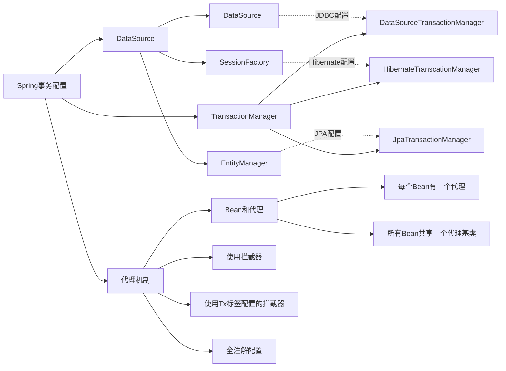

大型互联网网站特点：

- 高流量，流量大
- 高可用
- 大数据
- 敏捷开发，迭代快
- 用户体系庞大
- 可持续升级
- 安全防范
- 弹性扩展
- 吞吐量高，响应速度快

maven项目的打包方式分为三种：pom(用在父级工程或聚合工程)、jar(用于jar包使用)、war(打包成war，发布在服务器上的工程)。

聚合工程里可以分为顶级工程和子工程。这两者的关系是父子继承关系。子工程在maven中称之为模块(module)，模块之间是平级的，可以相互依赖(在相应的子模块pom文件中添加依赖关系)。

子模块可以使用顶级工程了所有的资源(依赖)，子模块之间如果要使用资源，必须构建依赖(构建关系)。

一个顶级工程是可以有多个不同的子工程共同组合而成，在项目中打包成jar包的形式。

顶级工程创建后，需要在创建子工程后检查顶级工程的pom文件中moduels标签中是否存在子工程module。

pom中的依赖具有传递性。

创建完顶级工程与子工程后，但是此时项目还是没有依赖关系还没有真正的建立。需要使用maven工具中lifecycle中的install，建立其中的依赖关系。

**不推荐使用数据库外键**，原因如下：

- 性能影响
- 热更新。但是外键会导致新更新的代码无法热更新
- 保留逻辑外键，但是不推荐物理外键，降低耦合度
- 数据库分库分表，物理外键不适合分布式数据库的分库分表

## 项目设置成SpringBoot项目

1. 在`pom.xml`文件中添加如下字段可以添加相关基础依赖：

```xml
<parent>
        <groupId>org.springframework.boot</groupId>
        <artifactId>spring-boot-starter-parent</artifactId>
        <version>2.3.2.RELEASE</version>
        <relativePath/>
</parent>
```

2. 设置资源属性

   在`pom.xml`中添加如下字段：

   ```xml
   <properties>
           <project.build.sourceEncoding>UTF-8</project.build.sourceEncoding>
           <project.reporting.outputEncoding>UTF-8</project.reporting.outputEncoding>
           <java.version>1.8</java.version>
   </properties>
   ```

3. 添加依赖

   在`pom.xml`中添加如下字段：

   ```xml
           <dependency>
               <groupId>org.springframework.boot</groupId>
               <artifactId>spring-boot-starter</artifactId>
               <exclusions>
                   <exclusion>
                       <groupId>org.springframework.boot</groupId>
                       <artifactId>spring-boot-starter-logging</artifactId>
                   </exclusion>
               </exclusions>
           </dependency>
           <dependency>
               <groupId>org.springframework.boot</groupId>
               <artifactId>spring-boot-starter-web</artifactId>
           </dependency>
           <dependency>
               <groupId>org.springframework.boot</groupId>
               <artifactId>spring-boot-configuration-processor</artifactId>
           </dependency>
   ```

4. 在相应项目的`src/main/java`中创建形如`com.wangzhengbest`的文件夹作为整个项目代码的存放空间。

5. 创建`Application.java`文件，添加如下字段:

```java
@SpringBootApplication
//扫描mybatis通用mapper所在包
@MapperScan(basePackages="com.wangzhengbest.mapper")
//扫描所有包，以及相关组件包
@ComponentScan(basePackages = {"com.wangzhengbest","org.n3r.idworker"})
public class Application {
    public static void main(String[] args) {
        SpringApplication.run(Application.class,args);
    }
}
```

6. 在当前项目的`resources`文件夹下创建`application.yml`配置文件。

7. 创建一个控制器，代码如下：

```java
@RestController
public class HelloController {

    @GetMapping("/hello")
    public Object hello(){
        return "Hello World!";
    }
}
```

​	*@RestController默认返回一个json对象*

​	@RequestMapping(“api地址”)

​	在函数的传入参数中添加@RequestParam表示该传参是一个请求类型的参数，而不是一个路径参数。@RequestBody作用类似上个，但是接收的是一个对象。

**maven-site-plugin报错**

若IDEA报错，可以将其添加至pom.xml文件中

```xml
<dependency>
            <groupId>org.apache.maven.plugins</groupId>
            <artifactId>maven-site-plugin</artifactId>
            <version>3.3</version>
</dependency>
```

**添加JUNIT测试**
在pom.xml文件中添加

```xml
<dependency>
            <groupId>org.springframework.boot</groupId>
            <artifactId>spring-boot-starter-test</artifactId>
            <scope>test</scope>
</dependency>
```


## 整合数据库相关设置

1. 添加依赖

   在整个工程的`pom.xml`文件中添加如下字段:

```xml
<!--        mysql驱动-->
        <dependency>
            <groupId>mysql</groupId>
            <artifactId>mysql-connector-java</artifactId>
            <version>8.0.21</version>
        </dependency>
<!--        mybatis-->
        <dependency>
            <groupId>org.mybatis.spring.boot</groupId>
            <artifactId>mybatis-spring-boot-starter</artifactId>
            <version>2.1.0</version>
        </dependency>
```

2. 添加配置

   在当前项目的`application.yml`中添加相应配置：

```yaml
# 配置数据源信息
spring:
  # 数据源的相关设置
  datasource:
    # 数据源类型:HikariCP
    type: com.zaxxer.hikari.HikariDataSource
    # Mysql驱动
    drive-class-name: com.mysql.jdbc.Driver
    url: jdbc:mysql://数据库ip或者域名:mysql端口号/Project_Shop?useUnicode=true&characterEncoding=UTF-8&autoReconnect=true
    username: 用户名
    password: 密码
  hikari:
    connection-timeout: 30000 # 等待连接池分配链接的最大时长(毫秒)，超过这个时长还没有可用连接则发生SQLException,默认30秒
    minimum-idle: 5 # 最小连接数
    maximum-pool-size: 20 # 最大连接数
    auto-commit: true # 自动提交
    idle-timeout: 600000 # 连接超时的最大时长(毫秒),超时则被释放(retired),默认10分钟
    pool-name: DateSourceHikariCP # 连接池名字
    max-lifetime: 1800000 # 连接的生命时长(毫秒),超时而且没被使用则被释放,默认30分钟 1800000ms
    connection-test-query: SELECT 1

# Mybatis配置
mybatis:
  type-aliases-package: com.wangzhengbest.pojo # 所有POJO类所在包路径
  mapper-locations: classpath:mapper/*.xml # mapper映射文件,classpath表示项目的resources文件夹

# 内置Tomcat配置
server:
  port: 8088
  tomcat:
    uri-encoding: UTF-8
  max-http-header-size: 80KB
```


**Restful Web Service**

- 通信方式
- 信息传递
- 无状态
- 独立性

## 常用依赖

```xml
<dependency>
            <groupId>commons-codec</groupId>
            <artifactId>commons-codec</artifactId>
        </dependency>
        <dependency>
            <groupId>org.apache.commons</groupId>
            <artifactId>commons-lang3</artifactId>
        </dependency>
        <dependency>
            <groupId>commons-io</groupId>
            <artifactId>commons-io</artifactId>
            <version>1.3.2</version>
</dependency>
```

commons-lang3的StringUtils中有一个方法isNotBlank可以判断字符串是否为空且是否非空字符串。

## Spring概念

- 基于POJO轻量级和最小侵入式开发

  对于EJB、Struts2等一些传统的框架，通常是要实现特定的接口，继承特定的类才能增强功能。改变了Java类的结构。

  对于Hibernate、Spring等框架，对现有的类结构没有影响，就能增强JavaBean的功能。

- 通过依赖注入和面向接口实现松耦合

- 基于切面和惯例进行声明式编程

- 通过切面和模板**减少样版式代码**

### IOC

控制反转，简单来说就是对象的创建交给外部容器完成。对象与对象之间的依赖关系依靠依赖注入实现。

IOC思想最核心的地方在于**资源不由使用资源的双方管理，而由不使用资源的第三方管理。**这样的好处是**1.资源集中管理，实现资源的可配置和易管理。2.降低了使用资源双方的耦合度。**

$$Spring \begin{cases} Core: Spring的核心功能 \\ Web: Spring对Web模块的支持 \\ DAO: Spring对JDBC操作的支持 \\ ORM: Spring对ORM的支持 \\ AOP: 切面编程 \\ SpringEE: Spring对JAVAEE其他模块的支持 \end{cases} $$

### 事务

事务概念可以描述成以下四个关键属性ACID：

- 原子性：事务应当作为一个单独单元的操作。整个序列操作要么成功，要么失败。
- 一致性：这表示数据库的引用完整性的一致性，表中唯一的主键等。
- 隔离性：可能同时处理很多有相同的数据集的事务，每个事务应该与其他事务隔离，以防止数据损坏。
- 持久性：一个事务一旦完成全部操作后，这个事务的结果必须是永久性的，不能因系统故障而从数据库中删除。

Spring中事务本质是数据库对事务的支持。当我们在配置文件中开启注解驱动，并在相关类和方法上通过注解`@Transactional`标识时，Spring会在启动时解析生成相关的bean，会查看拥有相关注释的类和方法，并且为这些类和方法生成代理。根据@Transactional的相关参数进行注入。真正的数据库层面的事务提交和回滚通过binlog或redo log实现。

数据访问技术及其实现：

| 数据库访问技术 | 实现                         |
| -------------- | ---------------------------- |
| JDBC           | DataSourceTransactionManager |
| JPA            | JpaTransactionManager        |
| Hibernate      | HibernateTransactionManager  |
| JDO            | JdoTransactionManager        |
| 分布式事务     | JtaTransactionManager        |

Spring事务抽象的关键是由 *org.springframework.transaction.PlatformTransactionManager* 接口定义，如下所示：

```java
public interface PlatformTransactionManager {
   //根据指定的传播行为，该方法返回当前活动事务或创建一个新的事务。
    TransactionStatus getTransaction(TransactionDefinition definition);
   throws TransactionException;
    //该方法提交给定的事务和关于它的状态。
   void commit(TransactionStatus status) throws TransactionException;
    //该方法执行一个给定事务的回滚。
   void rollback(TransactionStatus status) throws TransactionException;
}
```

**Spring 的声明式事务管理是建立在 Spring AOP 机制之上的，其本质是对目标方法前后进行拦截，并在目标方法开始之前创建或者加入一个事务，在执行完目标方法之后根据执行情况提交或者回滚事务。即向业务组件中的目标业务方法插入事务增强处理并生成相应的代理对象供应用程序(客户端)使用从而达到无污染地添加事务的目的。**

Spring中关于事务的配置总是由三个部分组成。

$Spring事务配置\begin{cases}DataSource \\ TransactionManager \\ 代理机制(一般变化的之后这部分)\end{cases}$



#### Spring事务的传播属性

即定义存在多个事务的时候，spring应该如何处理这些事务的行为。

| 常量名称                  | 常量解释                                                     |
| ------------------------- | ------------------------------------------------------------ |
| PROPAGATION_REQUIRED      | 支持当前事务，如果当前没有事务，就新建一个。是Spring默认的事务传播。 |
| PROPAGATION_REQUIRES_NEW  | 新建事务，如果当前存在事务，则当前事务挂起，新建的事务将和被挂起的事务没有任何关系，是两个独立的事务。外层事务失败回滚之后，不能回滚内层事务执行的结果，内层事务失败抛出异常，外层事务捕获，也可以不处理回滚操作。 |
| PROPAGATION_SUPPORTS      | 支持当前事务，如果当前没有事务，就以非事务方式运行。查询时可以使用。 |
| PROPAGATION_MANDATORY     | 支持当前事务，如果当前没有事务，则抛出异常。强制存在一个事务。 |
| PROPAGATION_NOT_SUPPORTED | 以非事务方式运行操作，如果当前存在事务，就把当前事务挂起。   |
| PROPAGATION_NEVER         | 以非事务方式运行，如果当前存在事务，则抛出异常。             |
| PROPAGATION_NESTED        | 如果一个活动的事务存在，则运行在一个嵌套的事务中。如果没有活动事务，则按REQUIRED属性运行，它使用了一个单独的事务。这个事务拥有多个可以回滚的保存点。内部事务的回滚不会对外部事务造成影响，但是外部回滚会把内部事务一起回滚回去。它只对DataSourceTransactionManager事务管理器起效。 |

#### Spring中事务隔离级别

| 隔离级别         | 隔离级别的值 | 导致的问题                                                   |
| ---------------- | ------------ | ------------------------------------------------------------ |
| Read-Uncommitted | 0            | 导致脏读                                                     |
| Read-Committed   | 1            | 避免脏读，允许不可重复读和幻读                               |
| Repeatable-Read  | 2            | 避免脏读，不可重复读，允许幻读                               |
| Serializable     | 3            | 串行优读，事务只能一个一个执行，避免了脏读，不可重复读、幻读。执行效率慢，使用时慎重。 |

脏读：一个事务对数据进行了增删改，但是未提交命令一个事务可以读取到未提交的数据。如果第一个事务此时进行了回滚，那么第二个事务就读到了脏数据。

不可重复读：一个事务中发生了两次读操作。第一次读操作和第二次读操作之间，另一个事务对数据进行了修改，此时两次读取的数据是不一致的。

幻读：第一个事务查询一定范围内的数据，第二个事务在这个范围i内insert一条数据，此时第一个事务会出现两次查询结果不一致的情况。

总结：

- **隔离级别越高，越能保证数据的完整性和一致性，但是对并发性能的影响也越大。**
- 大多数数据库默认隔离级别为Read Committed,如果SqlServer、Oracle。
- 少数数据库默认隔离级别为：Repeatable Read。如Mysql的InnoDB引擎。**Mysql的InnoDB引擎下的RR隔离级别通过next-key lock解决了幻读问题。**

| 常量                      | 解释                                                         |
| ------------------------- | ------------------------------------------------------------ |
| ISOLATION_DEFAULT         | 这是个PlatfromTransactionManager默认的隔离级别。使用数据库默认的事务隔离级别。另外四个与JDBC的隔离级别相对应。 |
| ISOLATION_READ_UNCOMMITED | 这是事务最低的隔离级别，它允许另一个事务可以看到这个事务提交的数据。会导致脏读，不可重复读和幻读。 |
| ISOLATION_READ_COMMITTED  | 保证一个事务修改的数据提交后才能被另一个事务读取。另一个事务不能读取该事务未提交的数据。 |
| ISOLATION_REPEATABLE_READ | 可以防止脏读，不可重复读，但是可能出现幻读。                 |
| ISOLATION_SERIALIZABLE    | 花费最高最为可靠的事务隔离级别，事务被顺序执行。             |

@Transactional注解中可以设置事务的隔离级别，默认是ISOLATION_DEFAULT级别。

由属性接口TransactionDefinition可以看到，可返回四个基本事务属性：

```java
public interface TransactionDefinition {
    int getPropagationBehavior(); // 传播行为。
    int getIsolationLevel(); // 隔离级别。事务管理器根据它来控制另外一个事务可以看到本事务内的哪些数据。
    int getTimeout();  // 事务必须在多少秒内完成。
    boolean isReadOnly(); // 事务是否只读。事务管理器能够根据这个返回值进行优化，确保事务是只读的
} 
```

#### 事务的嵌套

假设外层事务 ServiceA的Method A() 调用内层ServiceB的Method B()

##### PROPAGATION_REQUIRED(Spring默认)

如果ServiceB.methodB() 的事务级别定义为 PROPAGATION_REQUIRED，那么执行 ServiceA.methodA() 的时候Spring已经起了事务，这时调用 ServiceB.methodB()，ServiceB.methodB() 看到自己已经运行在 ServiceA.methodA() 的事务内部，就不再起新的事务。

假如 ServiceB.methodB() 运行的时候发现自己没有在事务中，他就会为自己分配一个事务。

这样，在 ServiceA.methodA() 或者在 ServiceB.methodB() 内的任何地方出现异常，事务都会被回滚

##### PROPAGATION_REQUIRES_NEW

比如我们设计 ServiceA.methodA() 的事务级别为 PROPAGATION_REQUIRED，ServiceB.methodB() 的事务级别为 PROPAGATION_REQUIRES_NEW。

那么当执行到 ServiceB.methodB() 的时候，ServiceA.methodA() 所在的事务就会挂起，ServiceB.methodB() 会起一个新的事务，等待 ServiceB.methodB() 的事务完成以后，它才继续执行。

它与 PROPAGATION_REQUIRED 的事务区别在于事务的回滚程度了。因为 ServiceB.methodB() 是新起一个事务，那么就是存在两个不同的事务。如果 ServiceB.methodB() 已经提交，那么 ServiceA.methodA() 失败回滚，ServiceB.methodB() 是不会回滚的。如果 ServiceB.methodB() 失败回滚，如果他抛出的异常被 ServiceA.methodA() 捕获，ServiceA.methodA() 事务仍然可能提交(主要看B抛出的异常是不是A会回滚的异常)。

##### PROPAGATION_NESTED

现在的情况就变得比较复杂了， ServiceB.methodB() 的事务属性被配置为 PROPAGATION_NESTED，此时两者之间又将如何协作呢? ServiceB#methodB如果rollback，那么内部事务(即 ServiceB#methodB) 将回滚到它执行前的SavePoint而外部事务(即 ServiceA#methodA) 可以有以下两种处理方式：

a、捕获异常，执行异常分支逻辑

```java
void methodA() { 
    try { 
        ServiceB.methodB(); 
    } catch (SomeException) { 
        // 执行其他业务, 如 ServiceC.methodC(); 
    } 
}
```

这种方式也是嵌套事务最有价值的地方， 它起到了分支执行的效果，如果 ServiceB.methodB()失败，那么执行 ServiceC.methodC()，而 ServiceB.methodB()已经回滚到它执行之前的 SavePoint，所以不会产生脏数据(相当于此方法从未执行过)，这种特性可以用在某些特殊的业务中， 而 PROPAGATION_REQUIRED 和 PROPAGATION_REQUIRES_NEW 都没有办法做到这一点。

b、外部事务回滚/提交 代码不做任何修改， 那么如果内部事务(ServiceB#methodB) rollback，那么首先 ServiceB.methodB()回滚到它执行之前的 SavePoint（在任何情况下都会如此）， 外部事务 ServiceA#methodA()将根据具体的配置决定自己是commit 还是 rollback。

另外三种事务传播属性基本用不到，在此不做分析。

## 常用类

### java.security.MessageDigest

功能：

- 单向文本加密
- 不论输入的文本长度，输出固定长度的hash值

```java
public static String getMD5Str(String strValue) throws Exception{
        MessageDigest md5= MessageDigest.getInstance("MD5");
        String newStr= Base64.encodeBase64String(md5.digest(strValue.getBytes()));
        return newStr;
    }
```

## Swagger2

使用Swagger2可以减少编写过多的文档，只需要通过代码就能生成API文档。

添加依赖

```xml
<!--        swagger2配置-->
        <dependency>
            <groupId>io.springfox</groupId>
            <artifactId>springfox-swagger2</artifactId>
            <version>3.0.0</version>
        </dependency>
        <dependency>
            <groupId>io.springfox</groupId>
            <artifactId>springfox-swagger-ui</artifactId>
            <version>3.0.0</version>
        </dependency>
        <dependency>
            <groupId>com.github.xiaoymin</groupId>
            <artifactId>swagger-bootstrap-ui</artifactId>
            <version>1.9.6</version>
        </dependency>
```

创建Swagger类

```java
package com.wangzhengbest.config;

import org.springframework.context.annotation.Bean;
import org.springframework.context.annotation.Configuration;
import springfox.documentation.builders.ApiInfoBuilder;
import springfox.documentation.builders.PathSelectors;
import springfox.documentation.builders.RequestHandlerSelectors;
import springfox.documentation.service.ApiInfo;
import springfox.documentation.service.Contact;
import springfox.documentation.spi.DocumentationType;
import springfox.documentation.spring.web.plugins.Docket;
import springfox.documentation.swagger2.annotations.EnableSwagger2;

/**
 * @className: Swagger2
 * @description: Swagger2配置
 * @author: buer
 * @date: 2020/10/30
 **/
@Configuration
@EnableSwagger2
public class Swagger2 {
    //配置swagger2核心
    //访问地址为:http://ip:port/swagger-ui.html 这是官方ui
    //访问地址为:http://ip:port/doc.html 这是github中的第三方ui
    @Bean
    public Docket createRestApi(){
        //指定Api类型为swagger2,并定义Api文档汇总信息,设置扫描Api路径(controller层)
        return new Docket(DocumentationType.SWAGGER_2)
                .apiInfo(apiInfo())
                .select().apis(RequestHandlerSelectors.basePackage("com.wangzhengbest.controller")).paths(PathSelectors.any())
                .build();
    }

    private ApiInfo apiInfo(){
        return new ApiInfoBuilder()
                .title("架构演进电商项目")
                .contact(new Contact("buer","buerlog.top","weiyouwozuiku@gmail.com"))
                .description("电商项目的Api文档")
                .version("1.0.0")
                .termsOfServiceUrl("bpan.xyz")
                .build();
    }
}

```

在需要忽略注解的Api上添加注释`@ApiIgnore`。

在需要进行中文注释Api接口的java文件上添加注释`@Api(value = "",tags = {""})`，value约等于标题，tags进行详细描述。

对API方法进行描述在java方法上添加注释`@ApiOperation(value = "用户名是否存在",notes = "用户名是否存在",httpMethod = "GET")`

对前端传来的对象在pojo中添加类似代码：

```java
@ApiModel(value = "用户对象BO",description = "从客户端由用户传入的数据封装在此entity中")
public class UserBo {
    @ApiModelProperty(value = "用户名",name = "username",example = "king",required = true)
    private String username;
    @ApiModelProperty(value = "密码",name = "password",example = "???",required = true)
    private String password;
    @ApiModelProperty(value = "确认密码",name = "confirmPassword",example = "???",required = true)
    private String confirmPassword;
}
```

## 跨域请求问题

当项目是前后端分离时，会涉及到跨域请求问题。可以在后端进行设置，创建CorsConfig类，代码如下：

```java
package com.wangzhengbest.config;

import org.springframework.context.annotation.Bean;
import org.springframework.context.annotation.Configuration;
import org.springframework.web.cors.CorsConfiguration;
import org.springframework.web.cors.UrlBasedCorsConfigurationSource;
import org.springframework.web.filter.CorsFilter;

/**
 * @className: CorsConfig
 * @description: 解决跨域请求以及资源获取权限
 * @author: buer
 * @date: 2020/10/30
 **/
@Configuration
public class CorsConfig {
    public CorsConfig(){}

    @Bean
    public CorsFilter corsFilter(){
        //1.添加cors配置信息
        CorsConfiguration config=new CorsConfiguration();
        //允许跨域
        config.addAllowedOrigin("http://192.168.50.152:8080");
        //设置是否发送cookie信息
        config.setAllowCredentials(true);
        //设置允许的请求方式
        config.addAllowedMethod("*");
        //设置允许的header
        config.addAllowedHeader("*");
        //2.为url添加映射路径
        UrlBasedCorsConfigurationSource corsConfigurationSource=new UrlBasedCorsConfigurationSource();
        corsConfigurationSource.registerCorsConfiguration("/**",config);
        return new CorsFilter(corsConfigurationSource);
    }
}

```


## Tips

调用API出现HTTP 405错误--method not allowed ，大多是因为前端的请求方法和后断的接受方法不一致。

