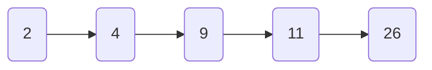

## SkipList

### 背景

> 跳表全称叫做跳跃表，简称跳表。跳表是一个随机化的数据结构，实质就是一种可以进行二分查找的有序链表。跳表在原有的有序链表上面增加了多级索引，通过索引来实现快速查找。跳表不仅能提高搜索性能，同时也可以提高插入和删除操作的性能。

Skip List(跳跃列表)这种随机的数据结构，可以看做是一个二叉树的变种，它在性能上与红黑树、AVL树很相近；但是Skip List(跳跃列表)的实现相比前两者要简单很多，目前Redis的zset实现采用了Skip List(跳跃列表)（其它还有LevelDB等也使用了跳跃列表）。

RBT红黑树与Skip List(跳跃列表)简单对比：

|  | RBT红黑树  | SkipList跳表  |
|---|---|---|
| 时间复杂度 | $O(logn)$ | $O(logn)$ |
| 实现复杂度 | 实现复杂，设计变色、左旋右旋平衡等操作 | 实现简单，链表结构 |
| 数据顺序 | 天然有序 | 天然有序 |
| 锁机制 | 需要加锁 | 无需加锁 |

### 跳表的优势

跳表的结构总的来说就是在原本链表不支持二分查找的基础上，利用空间换时间的方式，实现更快的插入与查找。

Search: $O(logn)$ time complexity on average.

Insertion: $O(logn)$ time complexity on average.

常见的链表结构如下：

```go
type Node struct {
  data int
  next *Node
}
NodeA.next=NodeB
```

有序单链表的查找需要进行遍历。如下图。



想要找到上图中的26这个元素，只能从头到尾遍历一遍整个链表。

那么有没有更加快速的查找方法？

一个朴素的想法就是借鉴数组查找中的二分查找的思想。用空间换时间。提取链表中的相应节点作为索引。通过检查索引的方式，优化查询过程。形成的跳表结构如下图所示：


这样减少了查找需要的次数，尤其在数据量很大的时候效果明显。但是数据量大的同时也会带来新的问题，就是索引的数量及其层数的选择尤为重要。

通常的做法是按照每两个节点之间选择一个节点作为索引的原则。每个子链表及其原始链表以一个哨兵节点作为开始。只有L0层的链表才是全部数据。在具体实现的时候，并不拘泥于必须要每两个节点之间生成一个索引节点，而是**按照二分之一的概念生成索引节点**。可以视为随机抛硬币，如果是正面（或者反面）则作为索引节点，并以$L_{n-1}$层作为基础，生成$L_n$层的索引节点。

### 复杂度分析

SkipList的时间复杂度受制于两个方面：查找过程中所经历的层高以及每层查找的次数。

假设严格按照每两个节点就回抽出一个节点作为上一级索引的节点。原始链表有n个节点，则一级索引有$n/2$个元素，二级索引有$n/4$个元素，则k级索引就有$n/{2^k}$个元素。最高层索引一般有两个元素，即最高级索引h满足$2=n/{2^h}$，即$h=log2n-1$。因此，总的层高就是$log2n$。

每层最多遍历节点个数为3个。

因此，整体的时间复杂度为$O(logn)$。

### 实现

```go
type Node struct{
  data int
  next *Node
}

type Element struct{
  data KV // 真正的数据
  levels []*Element // 存放节点
}
```

## BoltDB

## 参考文献

1. 掘金社区，[动图带你深入了解——跳跃列表](https://juejin.cn/post/7015396092351086622?utm_source=gold_browser_extension)，2021。
2. YouTube，[2-3: 跳跃列表 Skip List](https://www.youtube.com/watch?v=m6m0pnsOzN4)，2021。
3. GitHub，[2_Basic_3.pdf](https://github.com/wangshusen/AdvancedAlgorithms/blob/master/Slides/02_Basic_3.pdf)，2021。
