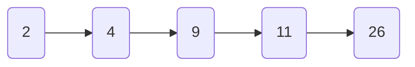

## SkipList

### 背景

> 跳表全称叫做跳跃表，简称跳表。跳表是一个随机化的数据结构，实质就是一种可以进行二分查找的有序链表。跳表在原有的有序链表上面增加了多级索引，通过索引来实现快速查找。跳表不仅能提高搜索性能，同时也可以提高插入和删除操作的性能。

Skip List(跳跃列表)这种随机的数据结构，可以看做是一个二叉树的变种，它在性能上与红黑树、AVL树很相近；但是Skip List(跳跃列表)的实现相比前两者要简单很多，目前Redis的zset实现采用了Skip List(跳跃列表)（其它还有LevelDB等也使用了跳跃列表）。

RBT红黑树与Skip List(跳跃列表)简单对比：

|  | RBT红黑树  | SkipList跳表  |
|---|---|---|
| 时间复杂度 | $O(logn)$ | $O(logn)$ |
| 实现复杂度 | 实现复杂，设计变色、左旋右旋平衡等操作 | 实现简单，链表结构 |
| 数据顺序 | 天然有序 | 天然有序 |
| 锁机制 | 需要加锁 | 无需加锁 |

### 跳表的优势

常见的链表结构如下：

```go
type Node struct {
  data int
  next *Node
}
NodeA.next=NodeB
```

有序单链表的查找需要进行遍历。如下图。



想要找到上图中的26这个元素，只能从头到尾遍历一边整个链表。


## BoltDB

## 参考文献

1. 掘金社区，[动图带你深入了解——跳跃列表](https://juejin.cn/post/7015396092351086622?utm_source=gold_browser_extension)，2021。

2. 