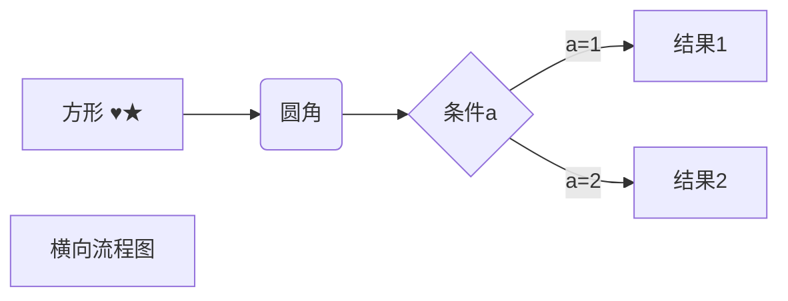
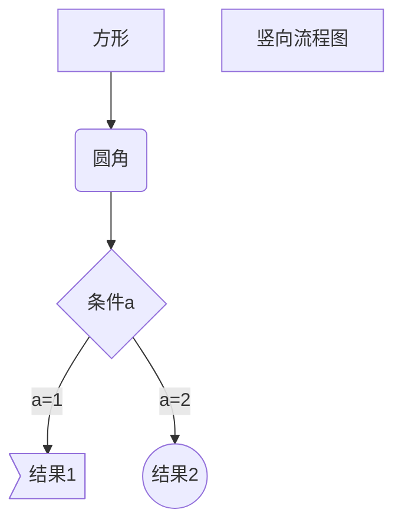
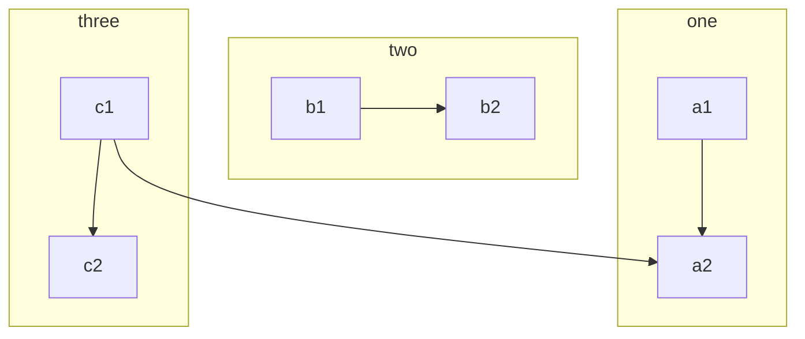
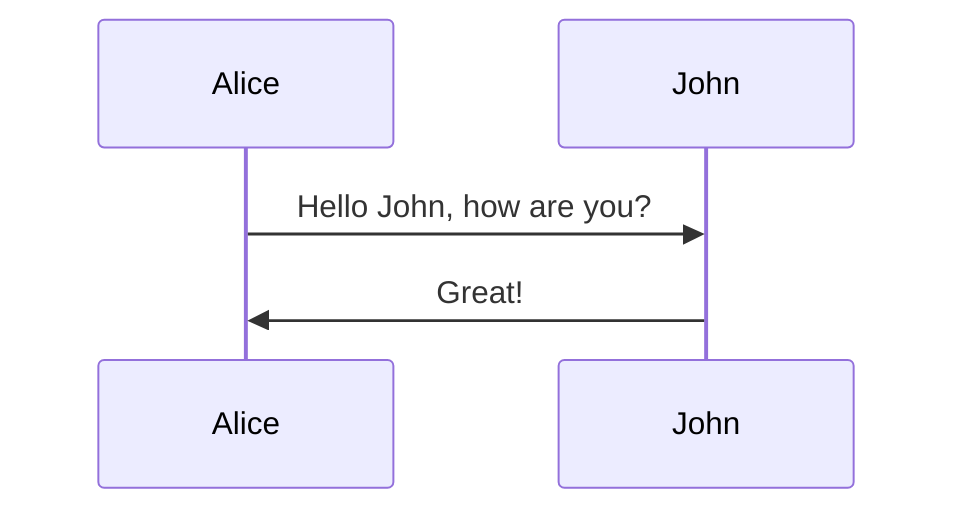
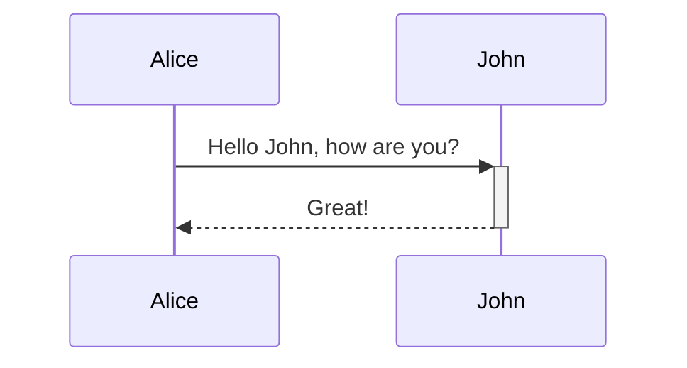
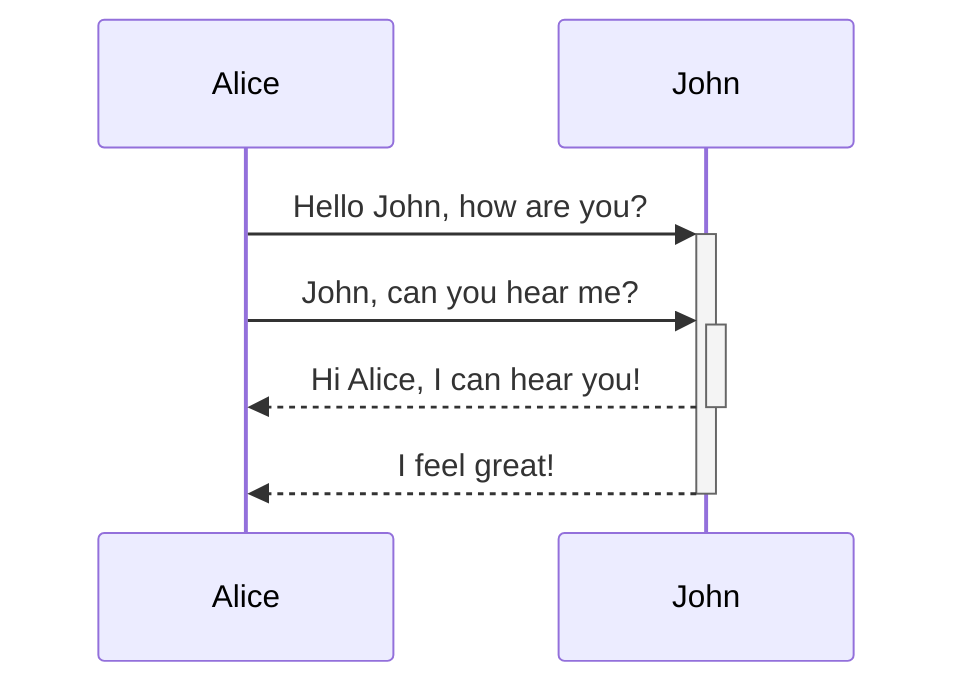
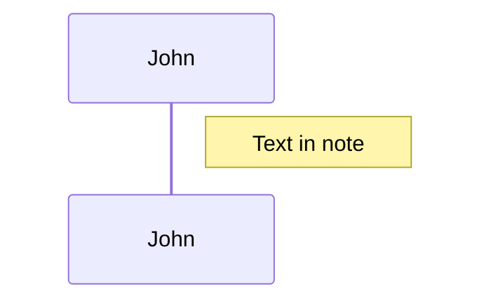
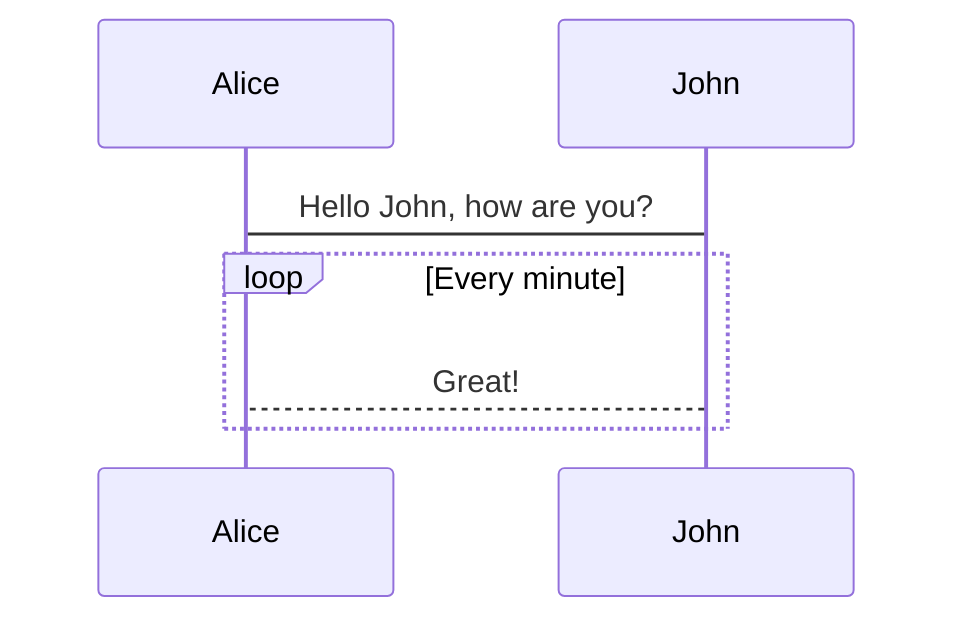
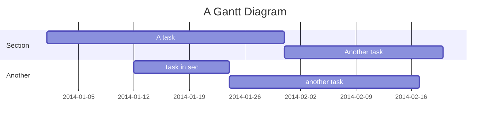
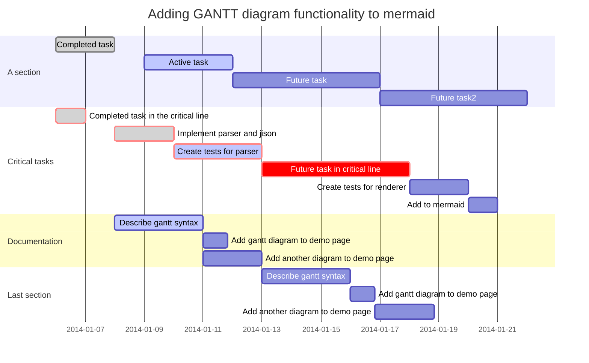

## 文字不如图

---

### 流程图

Markdown中的流程图都是通过代码实现的，即平时展示代码的地方写流程图代码，使用的语言是**mermaid**。

#### 连线选择
| 圆角 | 方形 | 条件 | 圆形 | 带箭头的连线 | 不带箭头的连线 |
| :--: | :--: | :--: | :--: | :----------: | :------------: |
|  ()  |  []  |  {}  | (()) |     -->      |      ---       |

| 虚线连线 | 带文字的虚线连线 | 粗连线 | 带文字的粗连线 |
| :------: | :--------------: | :----: | :------------: |
|   -.-    |    -. text .-    |  ==>   |  == text \==>  |

*连线上的文字在连线代码后用||包裹*

#### 横向流程图

#### 竖直流程图

#### 子图

---

### 序列图

或者使用

#### 连线选择
| 类型 |            描述            |
| :--: | :------------------------: |
|  ->  |       没有箭头的实线       |
| -->  |       没有箭头的虚线       |
| ->>  |        带箭头的实线        |
| -->> |        带箭头的虚线        |
|  -x  | 实线与末端的十字架（异步） |
| --x  | 最后用十字线的虚线（异步） |

#### 激活

#### 笔记

#### 循环

---

### 甘特图

