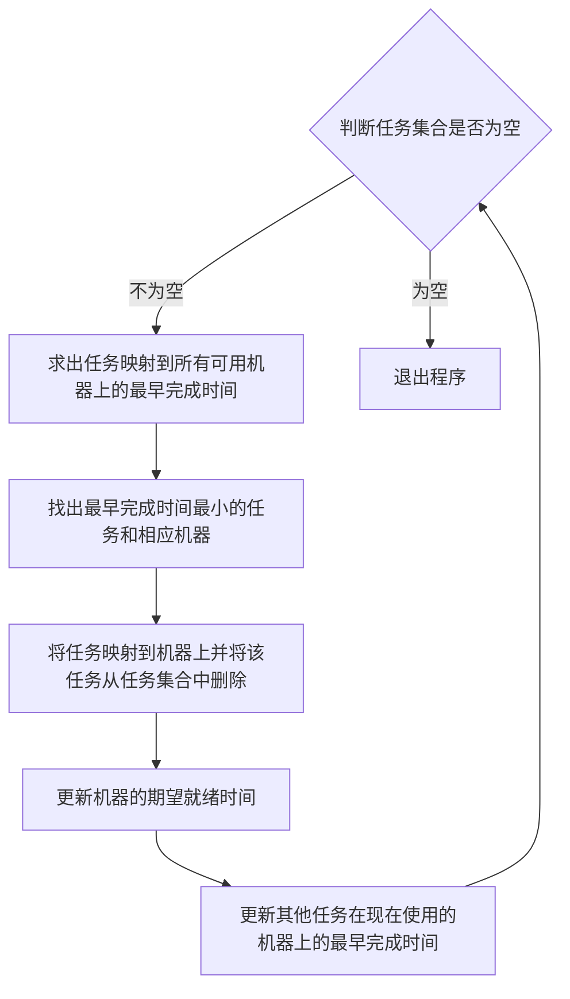
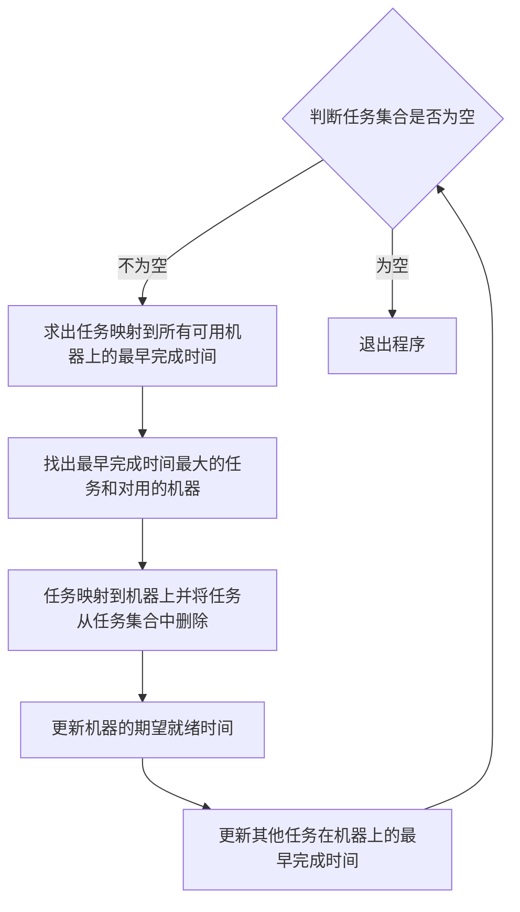

## 云任务调度算法

云环境下评价任务调度性能主要取决于三个性能指标：**完成时间、服务质量、资源利用率**。

云计算通常将一个大规模计算任务进行分布式并行计算。逻辑上将一个完整的任务（job）通过Map/Reduce模型拆分成若干个子任务（task），依赖不同的调度算法，将子任务分配到不同的资源节点上运行。当所有子任务处理结束，系统将每个子任务执行完毕的任务结果汇总到用户那。

云计算调度的总目标函数为：

$$f(x)=min \displaystyle \sum^{n}_{i=1} \displaystyle \sum^{m}_{j=1}makespan_{ij}cost_{ij}$$

其中$makespan_{ij}=ECT_{ij}+start(r_{j})$，表示的是任务$t_i$在处理节点$r_j$上执行的最早完成时间。其中$ECT_{ij}$表示任务$t_i$在处理节点$r_j$上执行的预期执行时间，可以通过n×m的矩阵表示。$start(r_j)$表示处理节点的最早可用时间。而$cost_{ij}=ECT*q_j$,$q_j$表示处理节点$q_j$在单位时间上被使用的价格。

### 基于网格计算的传统调度算法

#### Min-min算法

思想：**尽可能将需要调度的任务分配给最早可用且执行速度最快的资源，通过获取任务执行的两个最小值，即任务最早执行开始时间和最快执行速度来完成选择**

通俗化理解：选取完成时间最短的任务在运行速度最快的机器上运行。

缺点：1. 容易导致负载过度集中在能力较强的节点，导致资源不均衡产生的浪费。

​		   2. 长执行时间的任务得不到处理资源。

#### Max-min算法

思想：**将某个任务分配给可用的资源时，将具有最大最早完成时间的任务$t_i$指派给具有最早执行时间的计算资源$r_j$ ，然后更新资源的最早可用时间和任务集，直到全部任务调度完成。**

通俗化理解：将执行时间最长的任务放在运行速度最慢的机器上。

优点：具有较好的负载均衡性。

#### Sufferage算法

思想：**以任务最小完成时间为调度目标．在Sufferage算法中，将任务的最早完成时间与次早完成时间之间的差值定义为 Sufferage。Sufferage值反映了某个任务如果不分配到完成时间最早的资源上将造成的损失．所以，用该算法调度时总是将资源分配到估计执行损失最大的资源节点上，否则将会遭受最大的损失．当任务发生竞争关系时，先比较各任务的执行损失，再将候选资源分配给损失最大的任务，从而使得调度结果逼近最优解。**

缺点：负载的平衡性不高。

---

### Hadoop中的任务调度算法

Hadoop将云计算系统的用户、系统的主控节点、接收并完成计算任务的节点分别抽象为三个角色，即User、Master和Worker。

#### FIFO算法

思想：**根据用户提交作业的先后时间和优先级的高低来进行任务调度。当系统中有空闲Worker请求任务时，Master会选择一个*最早提交并且优先级最高的任务*分配给该Worker节点。**

优点：易于实现，可保证系统的调度开销小。

缺点：不能及时相应小作业的请求；不支持抢占。

#### 公平调度算法(fair scheduling)

思想：**尽可能满足不同需求的用户能够有平等的机会使用系统资源。当只有一个作业提交到系统后，整个系统的所有计算资源都会被这个作业独占．当有新作业提交时，原作业所占资源中已经完成任务的worker会被释放，供那些新提交的作业使用。**

公平调度算法中，系统通过为用户建立作业池来管理和维护作业，并保证作业调度的公平性。在每个作业池中，各个作业**平分**池内的资源。

$$公平调度\begin{cases}\text{作业池间的调度            ⇒     最小共享额度及公平共享额度}\\\text{作业池内资源槽的调度     ⇒   默认使用基于优先级的FIFO算法}\end{cases}$$

优点：支持抢占。保证小作业得到合理的响应。

缺点：不能保证多种类型服务质量需求的作业获得响应所需的资源。且达到较高的满意度。

#### 计算能力调度算法(capacity scheduling)

思想：**按照各个队列不同的需求将相应的资源分配出去，保证各个作业都能占用各自需要的资源．当作业被提交给系统后，按照配置文件由系统放入指定的队列，也通过配置文件将系统资源分配给每个队列，各个队列获得指定数量计算资源来运行任务。**

该算法通过建立作业队列来管理和维护作业，对于分配出去但未完成计算任务的资源，或者处于空闲状态的资源，允许各个队列占用。

$$计算能力调度\begin{cases}\text{队伍间的调度        ⇒    选择一个具有最多空闲空间的队列 }\\\text{队伍内的调度        ⇒     默认采用带有优先级的额FIFO}\end{cases}$$

缺点：不支持抢占；限制了用户占用资源的比例

优点：能够有效地处理各种类型的作业且考虑了一部分服务质量需求

---

### 智能化的任务调度算法

#### 遗传算法(genetic algorithm)

是一种基于生物遗传和进化机制、适合复杂系统优化的自适应概率优化技术。

思想：**在搜索过程中自动获取和积累有关搜索空间的知识，并自适应地控制搜索过程求得最优解。**

$$标准的遗传算法\begin{cases}\text{种群}\\\text{适应度函数♥   重要，直接影响收敛速度与最优解的查找}\\\text{遗传操作}\end{cases}$$

#### 粒子群算法(particle swarm optimization)

思想：**采用速度－位置搜索模型，每个粒子代表解空间的一个候选解，解的优劣程度由适应度函数决定**

优点：保留了种群的全局搜索策略；避免了复杂的遗传操作；它特有的记忆使其可以跟踪当前整个种群的最优粒子。

#### 蚁群算法(ant colony optimization)

思想：是一种群体智能的模拟进化算法 
