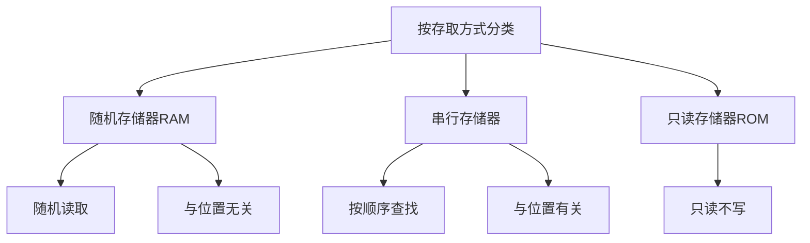

## 计算机组成

### 发展简史 


冯洛伊曼瓶颈：CPU和存储器速率之间的问题无法调和。CPU经常空转等待数据传输。


一条机器指令对应一个微程序，一个微程序对应一组微指令。

8bit=1Byte

硬盘商一般用10进位标记容量。

### 组成

$总线分类\begin{cases}片内总线 \\ 系统总线 \end{cases}$

#### 片内总线

高集成度芯片内部的信息传输线


#### 系统总线

CPU、主内存、IO设备、各组件之间的信息传输线。

- 数据总线：双向传输各个部件的数据信息，一般与CPU位数相同(32位,64位)，数据总线的位数(总线宽度)是数据总线的重要参数。
- 地址总线：地址总线位数=n，寻址范围：0~$2^n$。指定源数据或目的数据在内存中的地址。地址总线的位数与存储单元有关。
- 控制总线：用来发出各种控制信号的传输线，控制信号经由控制总线从一个组件发给另一个组件。控制总线可以监控不同组件之间的状态。(就绪/未就绪)

总线仲裁是为了解决总线使用权的冲突问题。

总线的仲裁方法：

- 链式查询

  

  好处：电路复杂度低，仲裁方式简单

  缺点：优先级低的设备难以获取总线使用权，对电路故障敏感。

- 计时器定时查询

  - 仲裁控制器对设备编号使用计数器累计计数
  - 接收到仲裁信号后，往所有设备发出计数值
  - 计数值与设备编号一致则获得总线使用权

- 独立请求

  - 每个设备均有总线独立连接仲裁器
  - 设备可单独想仲裁器发送请求和接收请求
  - 当同时收到多个请求信号，仲裁器有权按优先级分配使用权

  好处：响应速度快，优先顺序可动态改变

  缺点：设备连线多，总线控制复杂

#### 存储器



RAM通过电容存储数据，必须隔一段时间刷新一次。如果掉电，一段时间后将丢失所有数据。

##### 磁盘算法

- 先来先服务算法
- 最短寻道时间算法
- 扫描算法（电梯算法）：每次只往一个方向移动，到达一个方向需要服务的尽头再反方向移动。
- 循环扫描算法：区别于扫描算法在于扫描算法可以向两个方法移动，循环扫描算法只能一个方法。

字：指存放在一个存储单元中的二进制代码组合

字块：存储在连续的存储单元中而被看作是一个单元的一组字


字的地址=前m位指定字块的地址+后b位指定字在字块中的地址

$高速缓存的命中率=\frac{访问Cache次数}{访问Cache次数+访问主存次数}$

$访问Cache-主存系统平均时间t_a=ht_c+(1-h)t_m,t_m:访问主存时间,t_c:访问缓存时间$

$高速缓存的访问效率e=\frac{t_c}{t_a}=\frac{t_c}{ht_c+(1-h)t_m}$

##### 高速缓存

- 随机算法
- 先进先出算法(FIFO)
- 最不经常使用算法(LFU)
- 最近最少使用算法(LRU)

### 指令系统

#### 机器指令

机器指令=操作码字段+地址码字段

操作码指令指明所要完成的操作，操作码的位数反映了机器的操作类型。

地址码给出操作数或者操作数的地址。

##### 寻址方式

###### 指令寻址

- 顺序寻址
- 跳跃寻址

###### 数据寻址

- 立即寻址：指令直接获得操作数，无需访问存储器
- 直接寻址：直接给出操作数的地址
- 间接寻址：给出的是操作数的地址的地址

#### 数值的表现形式

小数的十进制转二进制采用重复相乘法。将小数换成分数形式，乘上2,看是否可以取出1,能则取1,不能取0,一直累成2,直至最后变成1。最后逆序。

##### 原码表示法

- 使用0表示正数，1表示负数
- 规定符号位位于数值第一位


## 操作系统

### 基本特征

1. 并发

    并发是指宏观上在一段时间内能同时运行多个程序，而并行则指同一时刻能运行多个指令。

    并行需要硬件支持，如多流水线、多核处理器或者分布式计算系统。

    操作系统通过引入进程和线程，使得程序能够并发运行。

2. 共享

    系统中的资源可以被多个并发进程共同使用。两种方式：互斥共享(同步机制来实现临界资源的互斥访问)和同时共享。

3. 虚拟

    将一个物理实体转换为多个逻辑实体。

    主要为时分复用(多个进程在同一处理器上并发执行)和空分复用(虚拟内存的页面置换)。

4. 异步

    不是一次性执行完毕，而是走走停停，以不可知的速度向前推进。

### 基本功能

1. 进程管理

    进程控制、进程通信、进程同步、处理机调度、死锁处理等

2. 内存管理

    内存分配、地址映射、内存保护和共享、虚拟内存等

3. 文件管理

    存储空间的管理、文件读写管理和保护、目录管理等

4. 设备管理

    完成IO请求，方便用户使用各种设备。

    主要包括缓冲管理、虚拟设备、设备分配、设备处理等

### 系统调用

如果一个进程在用户态需要使用内核态的功能，通过系统调用陷入内核态，由操作系统代为完成。

### 中断分类

- 外中断

    由CPU执行以外的事件引起。

- 异常

    由CPU执行指令的内部事件引起。

- 陷入

    在用户程序使用系统调用。

### 进程与线程

进程是资源分配的基本单位，线程不拥有资源，只能访问隶属于进程的资源。

进程控制块(PCB)描述进程的基本信息与运行状态。创建进程和撤销进程都是对PCB的操作。

线程是独立调度的基本单位。同一进程中的线程切换不会引起进程切换。不同进程之间的线程切换会导致进程切换。

一个进程可以有多个线程，共享进程资源。

进程的系统开销远大于线程的系统开销。

线程之间可以通过直接读写同一进程中的数据进行通信，但是进程通信需要借助IPC。

进程状态的切换中，主要有三种情况：就绪状态、运行状态、阻塞状态。只有就绪和运行之间可以相互切换（CPU时间片的切换），其他都是单向转换。

阻塞状态是缺少需要的资源由运行状态转换来的，但是其中的缺少的资源不包括CPU时间。

### 进程调度算法

#### 批处理系统

调度算法的目标是保证吞吐量和周转时间(从提交到终止的时间)。

---

## DB

$DBMS种类 \begin{cases} 层次数据库(HDB):使用树形结构进行表示 \\ 关系数据库(RDB):由行列组成的二维表 \\ 面向对象数据库(OODB):把数据以及对数据操作集合起来以对象为单位进行管理 \\  XML数据库 \\ 键值存储系统(KVS):单纯保存使用的主键和值 \end{cases}$

$SQl种类 \begin{cases} DDL 数据定义语言 \\ DML 数据操纵语言 \\ DCL数据控制语言 \end{cases}$

SQL书写规则：

- 以分号结尾
- SQL不区分关键词的大小写，插入到表中的数据区分大小写
- 推荐关键字大写，表名的首字母大写，其余(列名等)小写
- 常数用单引号进行包裹
- 单词之间需要使用半角空格或者换行符进行分隔

### 数据库管理

创建数据库：`CREATE DATABASE <数据库名称>;`

创建表：`CREATE TABLE <表名> (<列名> <数据类型> <该类所需约束>,...,<该表的约束1>，<该表的约束2>);`

删除表：`DROP TABLE <表名>;`

表定义的更新：

- 添加列：`ALTER TABLE <表名> ADD COLUMN <列名> <列类型>;` Oracle和SQL Server中不用写COLUMN。，Oracle可以`ALTER TABLE <表名> ADD （ <列名>， <列名>，……）；`
- 删除列：`ALTER TABLE <表名> DROP COLUMN <列名>;`Oracle的特殊同上。

只能使用半角英文字母（开头）、数字、下划线作为数据库、表、列的名称。

同一数据库表不能重名，同一个表里列也不能重名。

$数据类型 \begin{cases} INTEGER:整数，非小数 \\ CHAR（在括号中指定存储的字符串的最大长度，不同的
RDBSM中可能长度单位是字符个数也可能是字节长度）\\ VARCHAR：同CHAR，但是不是定长，需要给定长度,不会用半角的空格进行补位(Oracle中使用VARCHAR2) \\ DATE:存储日期 \end{cases}$

对于`Mysql`来说，时间类型如下：

| 时间类型  | 占用空间 |      日期格式       |       最小值        |       最大值        |      零值表示       |
| :-------: | :------: | :-----------------: | :-----------------: | :-----------------: | :-----------------: |
| DATETIME  | 8 bytes  | YYYY-MM-DD HH:MM:SS | 1000-01-01 00:00:00 | 9999-12-31 23:59:59 | 0000-00-00 00:00:00 |
| TIMESTAMP | 4 bytes  | YYYY-MM-DD HH:MM:SS |   19700101080001    |  2038 年的某个时刻  |   00000000000000    |
|   DATE    | 4 bytes  |     YYYY-MM-DD      |     1000-01-01      |     9999-12-31      |     0000-00-00      |
|   TIME    | 3 bytes  |      HH:MM:SS       |     -838:59:59      |      838:59:59      |      00:00:00       |
|   YEAR    | 1 bytes  |        YYYY         |        1901         |        2155         |        0000         |

一般建表时候，创建时间用datetime，更新时间用timestamp。

数据表重命名：

- Oracle、PostgreSQL：`ALTER TABLE <表名> RENAME TO <新的表名>`
- DB2：`RENAME TABLE <表名> TO <新的表名>`
- SQL SERVER:`sp_rename '表名','新的表名'`
- Mysql:`RENAME TABLE <表名> TO <新的表名>`

### SELECT语句

基本语法：`SELECT <列名>,... FROM <表名>`。列名之间用逗号分割。

使用`*`进行select无法设定列的显示顺序，按照CREATE TABLE语句的定义顺序。

插入空行会导致执行错误。

使用`AS`为列设置别名，格式如下：`SELECT <列名> AS <别名>...`。**别名可以使用中文，但是要用双引号包裹。**

可以在`SELECT`语句中书写常量，如下所示。这些常量会显示在每条查询出的结果的前面。

```sql
SELECT '商品' AS string, 38 AS number, '2009-02-24' AS date,
product_id, product_name
FROM Product;
```

在`SELECT`语句中删除重复行时，使用关键词`DISTINCT`。DISTINCT 关键字只能用在第一个列名之前。`SELECT DISTINCT <列名> FROM <表名>`。`NULL`也会被合并。

`SELECT`语句通过`WHERE`子句指定查询条件。WHERE子句要紧跟在FROM子句之后。

单行注释`--`，**Mysql需要在`--`之后加上一个半角空格**。多行注释使用`/* */`。

**所有包含NULL的运算，其结果都是NULL。**即使除零也还是NULL。

FROM子句在SELECT中并不是必不可少，例如`SELECT (100 + 200) * 3 AS calculation;`Oracle不允许省略FROM。可以使用`DUAL`临时表。

不等于`<>`，`!=`不被标准SQL承认。

比较运算符可以对字符、数值和日期等几乎所有数据类型的列和值进行比较。

使用比较运算符时一定要注意不等号和等号的位置。

对字符串类型的数据进行大小比较时，规则是按照字典顺序。**以相同字符开头的单词比不同字符开头的单词更相近**。该规则对定长字符串和可变长字
符串都适用。

**不能对NULL使用比较运算符。**专门用来判断是否为 NULL 的 IS NULL或 IS NOT NULL  运算符。

NOT运算符用来否定某一条件，但是不能滥用。

多个查询条件进行组合时，需要使用AND运算符或者OR运算符。

AND 运算符优先于 OR 运算符，可以使用`()`，改变优先级。

使用 AND 运算符进行的逻辑运算称为逻辑积，使用 OR 运算符进行的逻辑运算称为逻辑和。

SQL中除了真值和假值以外，存在第三种，即不确定NULL。即三值逻辑。

### 聚合和排序

通常，聚合函数会对NULL以外的对象进行汇总。但是只有COUNT函数例外，使用COUNT（*）可以查出包含NULL在内的全部数据的行数。

| 函数  |             用处             |
| :---: | :--------------------------: |
| COUNT |    计算表中的记录数(行数)    |
|  SUM  | 计算表中数值列中数据的合计值 |
|  AVG  | 计算表中数值列中数据的平均值 |
|  MAX  | 计算表中数值列中数据的最大值 |
|  MIN  | 计算表中数值列中数据的最小值 |

`*`是COUNT函数特有的参数，其它函数不能使用其作为参数。COUNT(*)返回包含NULL的数据行数，COUNT(列名)则返回不包含NULL的数据行数。

**使用聚合函数时，NULL的数据会被排除在外，不能简单的理解为等价于0。**

SUM和AVG函数只对数值类型的列使用，MAX和MIN函数适用于任何数据类型的列。

去掉重复值的聚合函数，格式形如`SELECT COUNT (DISTINCT product_type) FROM Product`。

DISTINCT关键字必须写在括号中。写在外面会优先执行聚合函数，然后才是DISTINCT。

使用GROUP BY子句进行汇总：

```sql
SELECT <列名1>,<列名2>,<列名3>,...FROM <表名> GROUP BY <列名1>,<列名2>,<列名3>,...；
```

在GROUP BY子句中指定的列称为聚合键或分组列。

GROUP BY子句必须写在FROM子句之后。如果有WHERE子句，需要卸载WHERE子句之后。

聚合键中包含NULL时，在结果中会以“不确定”行（空行）的形式表现出来。

使用 WHERE 子句进行汇总处理时，会先根据 WHERE 子句指定的条件进行过滤，然后再进行汇总处理。

**子句书写顺序：SELECT -> FROM -> WHERE -> GROUP BY -> HAVING -> OREDER BY**

**子句执行顺序：FROM -> WHERE -> GROUP BY -> HAVING -> SELECT -> OREDER BY**

与聚合函数和GROUP BY子句有关的常见错误：

- 在SELECT子句中书写了多余的列。使用聚合函数时，SELECT子句只能存在以下三种元素：**常数，聚合函数，GROUP BY子句中指定的列名(也就是聚合键)**，MYSQL支持在多列候补中只要有一列满足要求就可以，其他RDBMS都不支持。因为聚合键和另外的列名不一定是一对一关系。
- 在GROUP BY子句中写了列的别名。在MYSQL中不算错误，但是不标准，因为标准SQL的执行顺序的影响，GROUP BY 时还未执行SELECT，系统也就不知道列的别名。
- GROUP BY子句结果的显示是无序的。
- 只有在SELECT子句、HAVING子句和ORDER BY子句中能够使用COUNT等聚合函数。

使用COUNT函数等对表中数据进行汇总操作时，为其指定条件的不是WHERE子句，而是HAVING子句。

 HAVING子句要写在GROUP BY子句之后。

**WHERE子句用来指定数据行的条件， HAVING子句用来指定分组的条件。**

```sql
SELECT <列名1>, <列名2>, <列名3>, ……
FROM <表名>
GROUP BY <列名1>, <列名2>, <列名3>, ……
HAVING <分组结果对应的条件>
```

HAVING 子句中能够使用的 3 种要素:**常数、聚合函数、GROUP BY子句中指定的列名**。

在 WHERE 子句和 HAVING 子句中都可以使用的条件，最好写在 WHERE 子句中。WHERE在排序之前就删去了部分数据，且便于建立索引，执行速度也会更快。

若查询没有指定顺序，则返回的结果往往是随机的。

OREDER BY：

```sql
SELECT <列名1>, <列名2>, <列名3>, ……
FROM <表名>
ORDER BY <排序基准列1>, <排序基准列2>, ……
```

不论何种情况， ORDER BY 子句都需要写在 SELECT 语句的末尾。这是因为对数据行进行排序的操作必须在结果即将返回时执行。

OREDER BY默认是升序，也可以显式声明`ASC`，使用关键词`DESC`降序。

`OREDER BY`指定多个排序键时，优先使用左侧的键，相同情况下在参考右侧的键。

**排序键中包含NULL时，会在开头或末尾进行汇总。**

在ORDER BY子句中可以使用SELECT子句中定义的别名。但是GROUP BY不可以。**因为 SELECT 子句的执行顺序在 GROUP BY 子句之后， ORDER BY 子句之前**。

在ORDER BY子句中可以使用SELECT子句中未使用的列和聚合函数。


---

## 计算机网络

