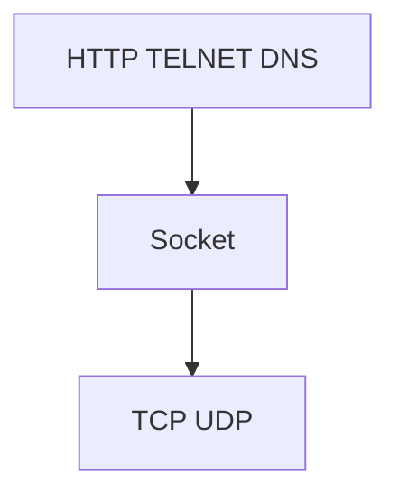

## 第一章 深入Web请求过程

### HTTP、Socket、TCP三者的区别

HTTP是传输层的协议，更加贴近用户端；TCP是传输层的协议；socket是从传输层上抽象出来的一个抽象层，**本质是接口**。

相应的，发起一个HTTP请求与建立一个Socket连接的区别不大，只不过是`outputStream.write`写的二进制字节数据格式要符合HTTP。Java可以使用HttpClient发起http请求。

使用`Ctrl+F5`请求非缓存页面，其会直接发起http请求，并添加两个属性在请求头中`Pragma:no-cache和Cache-Control:no-cache`

