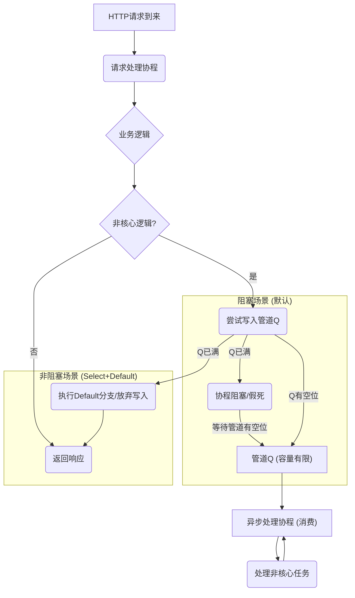

## 逃逸分析

Go编译器会根据变量是否被外部引用决定是否逃逸，而不能像Cpp那样使用`new`明确指定在堆上创建。其原则是：

- 如果变量在函数外部没有引用，则**优先放在栈上**-> 超过栈的存储能力就会创建在堆上
- 如果变量在函数外部存在引用，则**必定放在堆上**

Cpp中的程序堆栈其实是OS层面的概念，它通过Cpp语言的编译器和所在系统环境来共同决定。 在程序启动时，操作系统会自动维护一个启动程序消耗内存的地址空间，并自动将这个空间从逻辑上划分为堆内存空间和栈内存空间。这时，“栈”的概念是指程序运行时自动获得的一小块内存，而后续的函数调用所消耗的栈大小，会在编译期间由编译器决定，用于保存局部变量或者保存函数调用栈。如果在 Cpp中声明一个局部变量，则会执行逻辑上的压栈操作，在栈中记录局部变量。而当局部变量离开作用域之后，**所谓的自动释放本质上是该位置的内存在下一次函数调用压栈的过程中，可以被无条件的覆盖**；对于堆而言，每当程序通过系统调用向操作系统申请内存时，会将所需的空间从维护的堆内存地址空问中分配出去，而在归还时则会将归还的内存合并到所维护的地址空间中。

Go 程序也是运行在操作系统上的程序，自然同样拥有前面提及的堆和栈的概念。**但区别在于传统意义上的“栈”被 Go 语言的运行时全部消耗了，用于维护运行时各个组件之间的协调，例如调度器、垃圾回收、系统调用等**。而对于用户态的 Go 代码而言，它们所消耗的“堆和栈”，其实只是 **Go 运行时通过管理向操作系统申请的堆内存，构造的逻辑上的 “堆和栈”**，**它们的本质都是从操作系统申请而来的堆内存**。由于用户态 Go 程序的“栈空间”是由运行时管理堆内存得来，相较于只有 1MB 的 C/C++ 中的“栈” 而言，Go 程序拥有“几乎”无限的栈内存 (1GB)。更进一步，对于用户态 Go 代码消耗的栈，Go 语言运行时会为了防止内存碎片化，会在适当的时候对整个栈进行深拷贝，将其整个复制到另一块内存区域（当然，这个过程对用户态的代码是不可见的）也就是GC，这也是相较于传统意义上栈是一块固定分配好的内存所出现的另一处差异。也正是由于这个特点的存在，**指针的算术运算不再能奏效，因为在没有特殊说明的情况下，无法确定运算前后指针所指向的地址的内容是否己经被 Go 运行时移动。**

## Defer

**使用defer会有短暂延迟。对时间要求高的程序避免使用**。

Defer的入参支持函数参数和函数闭包。需要注意函数闭包是引用。

当是函数参数时，则是参数本身被压栈。如果是闭包或者引用，则值可能会发生变化。

return之后的defer函数不能被注册。

return关键字并不是一个原语操作，其中分为两步1）返回值=xxx 2）空的return。而有defer的场景会在其中多一步调用defer函数。

defer语句表达式的值在定义时就已经确定了。

闭包=函数+引用环境

闭包捕获的变量和常量是**引用传递，不是值传递**。
# 调度机制
## 协程和线程区别
- 内存消耗
	- goroutine创建时栈内存为2KB,按需扩容.linux操作系统一般分配1MB,不可扩容.
- 创建销毁:
	- 线程依据线程的实现方式,涉及用户态或内核态.goroutine都是在用户态.
- 切换
	- goroutine使用的寄存器比线程多.切换耗时goroutine小的多.
## 为什么要有P
早期GO语言中没有P,M从一个全局队列中获取G,锁代价大.所以拆分P,每个P维护一个处于Runable状态的G队列.
## GPM模型
含义:
- G:Goroutine.
- P:虚拟的Processor.
- M:内核线程.

- 全局队列被任意P消费，操作是互斥的
- P的本地队列存放不超过256个G。队满则移动本地队列中一半的G去全局队列
- P列表中所有
## Go为什么超时会返回502

### 核心问题与现象

• 在服务端开发中，Go 服务处理请求超时时，网关（如 Nginx）通常返回的状态码是 **502 Bad Gateway**，而非预期的 504 Gateway Time-out,。

### 导致502的原因

• **Go 服务主动关闭连接：** 即使配置了 `WriteTimeout`，Go 服务在检测到请求处理超时后，会在准备向客户端返回数据时，检测到连接已超时并**直接关闭 TCP 连接**,。

• **网关判定：** 网关 Nginx 在等待上游服务响应头时，检测到上游连接被过早关闭，因此判定为 Bad Gateway，返回 **502 状态码**,。

### 502的隐患

• 频繁出现 502/504 错误或超时时，网关 Nginx 可能会触发**被动健康检查**机制，将该 Go 服务节点临时摘除。

• 在极端情况下，所有上游服务节点可能被临时摘除，导致 Nginx 直接向客户端返回 502，从而影响核心业务功能。

### 解决方案：基于Context的超时控制

• 为了避免 502 状态码带来的隐患，建议在 Go 服务内部实现超时控制，并在超时时仍然返回 **200 OK** 状态码，将超时错误信息通过数据标识返回。

• 利用 Go 语言标准库 **context**（上下文），通过 **context.WithTimeout** 设置超时功能,。

• 请求处理逻辑在子协程中执行，主协程通过 `select` 监听子协程结果或上下文超时（`ctx.Done()`）。如果上下文先超时，服务将立即向客户端返回数据（如超时错误），状态码为 200，从而避免了 502 隐患

## Go服务假死与协程阻塞排查

核心现象：Go服务“假死”

Go 服务“假死”表现为服务仍在运行，但**大量 HTTP 请求无法获得响应**，通常难以在业务日志中找到原因。

核心原因：协程阻塞

“假死”的主要原因是请求处理协程（Goroutine）被无限期阻塞。

**典型场景：异步处理导致的管道阻塞**

1. **链路：** 请求处理协程（生产者，速度快）将数据写入队列（管道/Channel）。

2. **瓶颈：** 异步协程（消费者，速度慢或退出）从队列读取数据不足。

3. **阻塞：** 管道容量满载，导致后续请求处理协程在尝试向管道写入数据时被**阻塞**（卡住），无法返回响应。

排查工具：pprof

Go 语言提供 **pprof** **工具**，用于采集程序运行时数据（如协程栈），这是定位假死问题的关键。

• **操作：** 启用 `pprof` 功能，分析协程栈（Goroutine Stack）。

• **结果：** 快速定位到大量协程阻塞在特定的函数位置，例如等待管道的写操作。

解决方案：非阻塞写入

为避免请求处理协程因管道满载而阻塞，可使用 **select** **+** **default** **组合**实现非阻塞式管道操作。

• **原理：** 当管道不可写时（已满），`select` 语句执行 `default` 分支，从而避免协程被阻塞。

• **权衡：** 这种非阻塞写入方式可能会导致**数据丢失**（如果管道已满），需要通过其他方式（如记录日志或同步执行）进行弥补。

--------------------------------------------------------------------------------

阻塞机制图示（使用管道实现异步队列）

| 机制            | 管道状态 | 生产者协程行为                                       | 结果                  |
| ------------- | ---- | --------------------------------------------- | ------------------- |
| **阻塞模式 (假死)** | 满载   | 尝试写入 → 阻塞等待                                   | **服务无响应** (假死)      |
| **非阻塞模式**     | 满载   | 尝试写入 (通过 `select` + `default`) → 执行 `default` | **请求立即返回** (可能丢失数据) |
|               |      |                                               |                     |

流程示意图

## Tips

- `go build -gcflags '-m -l'`：`-m`输出编译的优化细节，`-N`关闭编译器优化，`-l`禁用内联优化。
- `go tool compile -S`：反汇编
