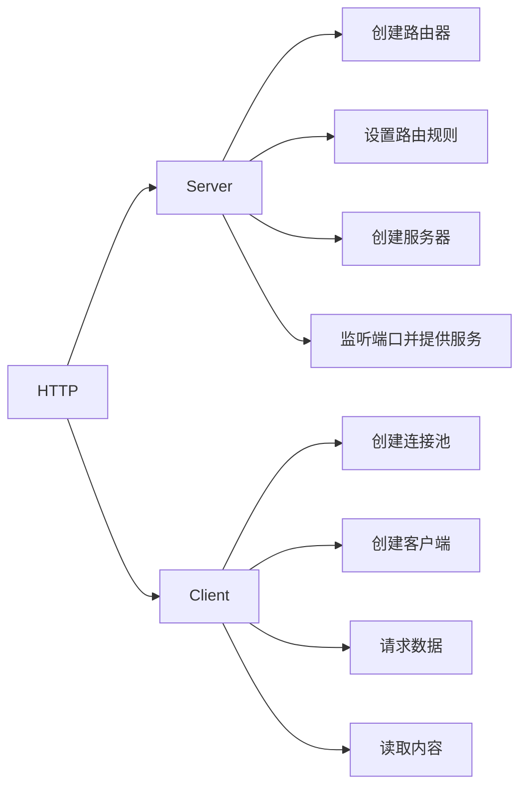

## 网络基础

### 协议模型


### TCP连接

**TCP的三次握手最主要目的是保证连接是双工的，可靠更多的是通过重传机制来保证。因为连接是全双工的，双方必须都收到对方的FIN包及确认才可关闭。**


MSL：Maximum Segment Lifetime,30秒到1分钟。

**TIME-WAIT等待2MSL是保证TCP协议的全双工连接能够可靠关闭。保证这次连接的重复数据段从网络中消失。**

大量出现close_wait的原因：

1. 一般出现在被动关闭方
2. 并发请求太多导致
3. 被动关闭方未及时释放端口资源导致

### TCP流量控制

由于通讯双方，网速不同。通讯方任一方发送过快都会导致对方消息处理不过来，所以就需要把数据放在缓冲区中。如果缓冲区满了，发送方还在发送，那接收方只能把数据包丢弃。因此需要控制发送速率。

缓冲区大小称之为接收端口，用变量win表示。如果win=0，则发送方停止发送。


### TCP拥塞控制

拥塞控制是调节网络的负载。接收方网络资源繁忙，因未及时响应ACK导致发送方重传大量数据，这样将会导致网络更加拥堵。**拥塞控制是动态调整win大小，不知是依赖缓冲区大小确定窗口大小**。

#### 慢开始和拥塞避免


#### 快速重传和快速恢复


### 粘包和拆包

发生的情况：

- 应用程序写入的数据大于套接字缓冲区大小，这将会发生拆包。
- 应用程序写入数据小于套接字缓冲区大小，网卡将应用多次写入的数据发送到网络上，这将会发生粘包。
- 进行MSS（最大报文长度）大小的TCP分段，当TCP报文长度-TCP头部长度>MSS的时候将会发生拆包。
- 接收方法不及时读取套接字缓冲区数据，这将发生粘包。

### 数据传输协议

- 使用带消息头的协议，头部写入包长度，然后再读取包内容
- 设置定长消息，每次读取定长内容，长度不够时空位补固定字段
- 设置消息边界，服务端从网络流中按消息边界分理出消息内容，一般使用`\n`
- 专有的协议：json，protobuf

### 网络代理和网络转发区别

- 网络代理
  - 用户不直接连接服务器，网络代理去连接。获取数据后返回给用户。
- 网络转发
  - 路由器对报文的转发操作，中间可能对数据包修改。

### 网络代理

#### 正向代理

是一种客户端的代理技术，帮助客户端访问无法访问的服务资源，可以隐藏用户真实IP。

#### 反向代理

是一种服务端的代理技术，帮助服务器做负载均衡、缓存、提供安全校验等，可以隐藏服务器真实IP。

## UDP创建过程

### Server

步骤：

1. 监听服务器
2. 循环读取消息（不创建socket）
3. 回复数据

### Client

步骤：

1. 连接服务器
2. 发送数据
3. 接收数据

## TCP创建过程

### Server

步骤：

1. 监听端口
2. 接受请求，创建套接字连接
3. 创建独立协程
4. 数据解码

### Client

步骤：

1. 连接服务器
2. 将信息写入套接字，数据编码

## HTTP创建过程




#### Server

主要结构体：

```go
type ServeMux struct {
	mu    sync.RWMutex
	m     map[string]muxEntry
	es    []muxEntry // slice of entries sorted from longest to shortest.
	hosts bool       // whether any patterns contain hostnames
}

type muxEntry struct {
	h       Handler
	pattern string
}

type Handler interface {
	ServeHTTP(ResponseWriter, *Request)
}
```

步骤：

1. 创建路由器 http.NewServeMux
2. 设置路由规则 http.HandleFunc->http.Handle
3. 创建服务器 http.Server
4. 监听端口并提供服务 http.Server.ListenAndServe->http.server.Serve->http.Accept()->http.newConn->go c.serve->mux.ServeHTTP0>mux.Handler(r)->mux.handler(r.host,r.URL.Path)->mux.match(path)->v,ok:=mux.m[path]

#### Client

主要结构体：
http.Client->Timeout && Transport
type RoundTripper interface

步骤：

1. 创建连接池 http.Transport
2. 创建客户端 http.Client
3. 请求数据 func(c *Client) Get(url string)->c.DO(req)->c.do(req)->c.send(req,deadline)->send(req,c.transport(),deadline)->resq,err=rt.RoundTrip(req)&&func(t *Transport)roundTrip(req *Request)
4. 读取数据

##### Transport

```go
type Transport struct {
	idleMu       sync.Mutex
	closeIdle    bool                                // user has requested to close all idle conns
	idleConn     map[connectMethodKey][]*persistConn // most recently used at end
	idleConnWait map[connectMethodKey]wantConnQueue  // waiting getConns
    ...
}

type connectMethodKey struct {
	proxy, scheme, addr string
	onlyH1              bool
}
```

##### persistConn

```go
type persistConn struct {
	br        *bufio.Reader       // from conn
	bw        *bufio.Writer       // to conn
	reqch     chan requestAndChan // written by roundTrip; read by readLoop
	writech   chan writeRequest   // written by roundTrip; read by writeLoop
	...
}
```

##### RoundTrip流程


#### 超时时间


```go
    // 创建连接池
	transport := &http.Transport{
		DialContext: (&net.Dialer{
			Timeout:   30 * time.Second, //连接超时
			KeepAlive: 30 * time.Second, //探活时间
		}).DialContext,
		MaxIdleConns:          100,              //最大空闲连接
		IdleConnTimeout:       90 * time.Second, //空闲超时时间
		TLSHandshakeTimeout:   10 * time.Second, //tls握手超时时间
		ExpectContinueTimeout: 1 * time.Second,  //100-continue状态码超时时间
	}
	// 创建客户端
	client := &http.Client{
		Timeout:   time.Second * 30, //请求超时时间
		Transport: transport,
	}
```

## 网络代理

网络代理 v.s 网络转发：

- 网络代理：用户不直接连接服务器，网络代理去连接。获取数据后返回给用户。
- 网络转发：是路由器对报文的转发操作，中间可能堆数据包修改。

### 正向代理

正向代理：是一种**客户端**的代理技术。帮助客户端访问无法访问的服务资源，可以隐藏用户真实IP。

1. 代理接收客户端请求，复制原请求对象，并根据数据配置新请求各种参数
2. 把新请求发送到真实服务端，并接收到服务器返回
3. 代理服务器相应做一些处理，然后返回给客户端

#### http代理

```go
import (
	"fmt"
	"io"
	"net"
	"net/http"
	"strings"
)

type Pxy struct{}

func (p *Pxy) ServeHTTP(rw http.ResponseWriter, req *http.Request) {
	fmt.Printf("Received request %s %s %s\n", req.Method, req.Host, req.RemoteAddr)
	transport := http.DefaultTransport
	// step 1，浅拷贝对象，然后就再新增属性数据
	outReq := new(http.Request)
	*outReq = *req
	if clientIP, _, err := net.SplitHostPort(req.RemoteAddr); err == nil {
		if prior, ok := outReq.Header["X-Forwarded-For"]; ok {
			clientIP = strings.Join(prior, ", ") + ", " + clientIP
		}
		outReq.Header.Set("X-Forwarded-For", clientIP)
	}
	
	// step 2, 请求下游
	res, err := transport.RoundTrip(outReq)
	if err != nil {
		rw.WriteHeader(http.StatusBadGateway)
		return
	}

	// step 3, 把下游请求内容返回给上游
	for key, value := range res.Header {
		for _, v := range value {
			rw.Header().Add(key, v)
		}
	}
	rw.WriteHeader(res.StatusCode)
	io.Copy(rw, res.Body)
	res.Body.Close()
}

func main() {
	fmt.Println("Serve on :8080")
	http.Handle("/", &Pxy{})
	http.ListenAndServe("0.0.0.0:8080", nil)
}
```

### sock5代理


### 反向代理

反向代理：是一种**服务端**的代理技术，帮助服务器做负载均衡、缓存、提供安全校验等，可以隐藏服务器真实IP。

1. 代理接受客户端请求，更改请求结构体信息
2. 通过一定的负载均衡算法获取下游服务地址
3. 把请求发送给下游服务器，并获取返回内容
4. 堆返回内容做一些处理，然后返回给客户端

#### http代理

Go内置了`httputil.ReverseProxy`类型。内置`httputil.NewSingleHostReverseProxy`。可以按照其实现自己实现。

简单版：

```go
import (
	"bufio"
	"log"
	"net/http"
	"net/url"
)

var (
	proxy_addr = "http://127.0.0.1:2003"
	port       = "2002"
)

func handler(w http.ResponseWriter, r *http.Request) {
	//step 1 解析代理地址，并更改请求体的协议和主机
	proxy, err := url.Parse(proxy_addr)
	r.URL.Scheme = proxy.Scheme
	r.URL.Host = proxy.Host

	//step 2 请求下游
	transport := http.DefaultTransport
	resp, err := transport.RoundTrip(r)
	if err != nil {
		log.Print(err)
		return
	}

	//step 3 把下游请求内容返回给上游
	for k, vv := range resp.Header {
		for _, v := range vv {
			w.Header().Add(k, v)
		}
	}
	defer resp.Body.Close()
	bufio.NewReader(resp.Body).WriteTo(w)
}

func main() {
	http.HandleFunc("/", handler)
	log.Println("Start serving on port " + port)
	err := http.ListenAndServe(":"+port, nil)
	if err != nil {
		log.Fatal(err)
	}
}
```

##### ReverseProxy的特殊StatusCode

- 100：目前一切正常，客户端可以继续请求
  - 客户端Post的数据大于1024字节的时候
  - 客户端需要先发送一个请求，包含一个`Expect:100-continue`，询问服务端是否愿意接收数据
  - 接收到服务端返回的100-continue应答之后，返回100状态，把数据Post到服务端
  - 相关策略
    - 客户端策略
      - 如果客户端有 post 数据要上传，可以考虑使用 100-continue 协议。在请求头中加入 {“Expect”:”100-continue”}
      - 如果没有 post 数据，不能使用 100-continue 协议，因为这会让服务端造成误解。
      - 并不是所有的 Server 都会正确实现 100-continue 协议，如果 Client 发送 Expect:100-continue 消息后，在 timeout 时间内无响应，Client 需要立马上传 post 数据。
      - 有些 Server 会错误实现 100-continue 协议，在不需要此协议时返回 100，此时客户端应该忽略。
    - 服务端策略
      - 正确情况下，收到请求后，返回 100 或错误码。
      - 如果在发送 100-continue 前收到了 post 数据（客户端提前发送 post 数据），则不发送 100 响应码(略去)。
- 101：服务端发送给客户端升级协议的请求

##### ReverseProxy的特殊Header头

- 特殊Header头
  - X-Forwarded-For
    - 记录最后直连实际服务器之前的整个代理过程
    - 可能被伪造
  - X-Real-IP
    - 请求实际服务器的IP
    - 每过一层代理都会被覆盖掉，只需第一代理设置转发
  - Connection
  - TE
  - Trailer
- 第一代理除去标准的逐段传输头

##### ReverseProxy

```go
type ReverseProxy struct {
	// 控制器必须是一个函数，函数内部可以堆请求进行修改
	Director func(*http.Request)

	// The transport used to perform proxy requests.
	// If nil, http.DefaultTransport is used.
    // 连接池
	Transport http.RoundTripper

	// FlushInterval specifies the flush interval
	// to flush to the client while copying the
	// response body.
	// If zero, no periodic flushing is done.
	// A negative value means to flush immediately
	// after each write to the client.
	// The FlushInterval is ignored when ReverseProxy
	// recognizes a response as a streaming response, or
	// if its ContentLength is -1; for such responses, writes
	// are flushed to the client immediately.
    // 刷新到客户端的刷新间隔
	FlushInterval time.Duration

	// ErrorLog specifies an optional logger for errors
	// that occur when attempting to proxy the request.
	// If nil, logging is done via the log package's standard logger.
    // 错误记录器
	ErrorLog *log.Logger

	// BufferPool optionally specifies a buffer pool to
	// get byte slices for use by io.CopyBuffer when
	// copying HTTP response bodies.
    // 定义缓冲池，在复制http响应时使用，用以提高请求效率
	BufferPool BufferPool

	// ModifyResponse is an optional function that modifies the
	// Response from the backend. It is called if the backend
	// returns a response at all, with any HTTP status code.
	// If the backend is unreachable, the optional ErrorHandler is
	// called without any call to ModifyResponse.
	//
	// If ModifyResponse returns an error, ErrorHandler is called
	// with its error value. If ErrorHandler is nil, its default
	// implementation is used.
    // 修改response函数
	ModifyResponse func(*http.Response) error

	// ErrorHandler is an optional function that handles errors
	// reaching the backend or errors from ModifyResponse.
	//
	// If nil, the default is to log the provided error and return
	// a 502 Status Bad Gateway response.
    // 错误处理回调函数，如果为nil时，则遇到错误会显示502
	ErrorHandler func(http.ResponseWriter, *http.Request, error)
}

func (p *ReverseProxy) ServeHTTP(rw http.ResponseWriter, req *http.Request) {
	transport := p.Transport
	if transport == nil {
		transport = http.DefaultTransport
	}
    // 验证请求是否终止
	ctx := req.Context()
	if ctx.Done() != nil {
		// CloseNotifier predates context.Context, and has been
		// entirely superseded by it. If the request contains
		// a Context that carries a cancellation signal, don't
		// bother spinning up a goroutine to watch the CloseNotify
		// channel (if any).
		//
		// If the request Context has a nil Done channel (which
		// means it is either context.Background, or a custom
		// Context implementation with no cancellation signal),
		// then consult the CloseNotifier if available.
	} else if cn, ok := rw.(http.CloseNotifier); ok {
		var cancel context.CancelFunc
		ctx, cancel = context.WithCancel(ctx)
		defer cancel()
		notifyChan := cn.CloseNotify()
		go func() {
			select {
			case <-notifyChan:
				cancel()
			case <-ctx.Done():
			}
		}()
	}
    // 设置请求ctx信息
	outreq := req.Clone(ctx)
	if req.ContentLength == 0 {
		outreq.Body = nil // Issue 16036: nil Body for http.Transport retries
	}
	if outreq.Body != nil {
		// Reading from the request body after returning from a handler is not
		// allowed, and the RoundTrip goroutine that reads the Body can outlive
		// this handler. This can lead to a crash if the handler panics (see
		// Issue 46866). Although calling Close doesn't guarantee there isn't
		// any Read in flight after the handle returns, in practice it's safe to
		// read after closing it.
		defer outreq.Body.Close()
	}
    // 深拷贝header
	if outreq.Header == nil {
		outreq.Header = make(http.Header) // Issue 33142: historical behavior was to always allocate
	}
	// 修改req
	p.Director(outreq)
	outreq.Close = false
	// Upgrade头的特殊处理
	reqUpType := upgradeType(outreq.Header)
	if !ascii.IsPrint(reqUpType) {
		p.getErrorHandler()(rw, req, fmt.Errorf("client tried to switch to invalid protocol %q", reqUpType))
		return
	}
	removeConnectionHeaders(outreq.Header)

	// Remove hop-by-hop headers to the backend. Especially
	// important is "Connection" because we want a persistent
	// connection, regardless of what the client sent to us.
    // 删除后端的逐段标题
	for _, h := range hopHeaders {
		outreq.Header.Del(h)
	}

	// Issue 21096: tell backend applications that care about trailer support
	// that we support trailers. (We do, but we don't go out of our way to
	// advertise that unless the incoming client request thought it was worth
	// mentioning.) Note that we look at req.Header, not outreq.Header, since
	// the latter has passed through removeConnectionHeaders.
	if httpguts.HeaderValuesContainsToken(req.Header["Te"], "trailers") {
		outreq.Header.Set("Te", "trailers")
	}

	// After stripping all the hop-by-hop connection headers above, add back any
	// necessary for protocol upgrades, such as for websockets.
	if reqUpType != "" {
		outreq.Header.Set("Connection", "Upgrade")
		outreq.Header.Set("Upgrade", reqUpType)
	}
	// 追加clint IP信息
	if clientIP, _, err := net.SplitHostPort(req.RemoteAddr); err == nil {
		// If we aren't the first proxy retain prior
		// X-Forwarded-For information as a comma+space
		// separated list and fold multiple headers into one.
		prior, ok := outreq.Header["X-Forwarded-For"]
		omit := ok && prior == nil // Issue 38079: nil now means don't populate the header
		if len(prior) > 0 {
			clientIP = strings.Join(prior, ", ") + ", " + clientIP
		}
		if !omit {
			outreq.Header.Set("X-Forwarded-For", clientIP)
		}
	}
	// 向下游请求数据
	res, err := transport.RoundTrip(outreq)
	if err != nil {
		p.getErrorHandler()(rw, outreq, err)
		return
	}

	// Deal with 101 Switching Protocols responses: (WebSocket, h2c, etc)
    // 处理升级协议请求
	if res.StatusCode == http.StatusSwitchingProtocols {
		if !p.modifyResponse(rw, res, outreq) {
			return
		}
		p.handleUpgradeResponse(rw, outreq, res)
		return
	}
	// 移除逐段头部
	removeConnectionHeaders(res.Header)

	for _, h := range hopHeaders {
		res.Header.Del(h)
	}
	// 修改返回数据
	if !p.modifyResponse(rw, res, outreq) {
		return
	}
	// 拷贝头部信息
	copyHeader(rw.Header(), res.Header)

	// The "Trailer" header isn't included in the Transport's response,
	// at least for *http.Transport. Build it up from Trailer.
	announcedTrailers := len(res.Trailer)
	if announcedTrailers > 0 {
		trailerKeys := make([]string, 0, len(res.Trailer))
		for k := range res.Trailer {
			trailerKeys = append(trailerKeys, k)
		}
		rw.Header().Add("Trailer", strings.Join(trailerKeys, ", "))
	}
	// 写入状态码
	rw.WriteHeader(res.StatusCode)
	// 周期刷新内容到response
	err = p.copyResponse(rw, res.Body, p.flushInterval(res))
	if err != nil {
		defer res.Body.Close()
		// Since we're streaming the response, if we run into an error all we can do
		// is abort the request. Issue 23643: ReverseProxy should use ErrAbortHandler
		// on read error while copying body.
		if !shouldPanicOnCopyError(req) {
			p.logf("suppressing panic for copyResponse error in test; copy error: %v", err)
			return
		}
		panic(http.ErrAbortHandler)
	}
	res.Body.Close() // close now, instead of defer, to populate res.Trailer

	if len(res.Trailer) > 0 {
		// Force chunking if we saw a response trailer.
		// This prevents net/http from calculating the length for short
		// bodies and adding a Content-Length.
		if fl, ok := rw.(http.Flusher); ok {
			fl.Flush()
		}
	}

	if len(res.Trailer) == announcedTrailers {
		copyHeader(rw.Header(), res.Trailer)
		return
	}

	for k, vv := range res.Trailer {
		k = http.TrailerPrefix + k
		for _, v := range vv {
			rw.Header().Add(k, v)
		}
	}
}
```

修改response后记得更新响应头中的 Content-Length以及响应体中ContentLength属性。

`func (p *ReverseProxy)ServerHTTP`主要步骤如下：

- 验证是否请求终止
- 设置请求ctx信息
- 深拷贝header
- 修改req
- Upgrade头的特殊处理
- 追加clientIp信息
- 向下游请求数据
- 处理升级协议请求
- 移除逐段头部
- 修改返回内容
- 拷贝头部的数据
- 写入状态码
- 周期刷新内容到response

##### Connection

- 标记请求发起方与**第一代理**的状态
- 决定当前事务完成后，是否会关闭网络
  - Connection：keep-alive 不关闭网络
  - Connection：close 关闭网络
  - Connection：upgrade 协议升级

##### TE

TE是requesy_header，表示希望使用的传输编码类型。

如：`TE:trailers,deflate;q=0.5`表示，期望在采用分块传输编码响应中接收挂载字段，zlib编码，0.5优先级排序。

##### Trailer

Trailer是response header，允许发送方在消息后面添加额外的元信息。

如：`Trailer:Expires`表示Expires将出现在分块信息的结尾。

##### 去除逐段传输头

代理过程中上述只发生在客户端和第一代理中。因此第一代理需要除去标准的逐段传输头（hop-by-hop）

- 逐段传输头都需要在Connection头中列出
- 第一代理必须处理它们且不转发
- 逐段传输头：`Keep-Alive,Transfer-Encoding,TE,Connection,Trailer,Upgrade,Proxy-Authorization,Proxy-Authenticate`

#### socks5代理

## 负载均衡

### 随机负载均衡

```go
import (
	"errors"
	"fmt"
	"math/rand"
	"strings"
)

type RandomBalance struct {
	curIndex int
	rss      []string
	//观察主体
	conf LoadBalanceConf
}

func (r *RandomBalance) Add(params ...string) error {
	if len(params) == 0 {
		return errors.New("param len 1 at least")
	}
	addr := params[0]
	r.rss = append(r.rss, addr)
	return nil
}

func (r *RandomBalance) Next() string {
	if len(r.rss) == 0 {
		return ""
	}
	r.curIndex = rand.Intn(len(r.rss))
	return r.rss[r.curIndex]
}

func (r *RandomBalance) Get(key string) (string, error) {
	return r.Next(), nil
}

func (r *RandomBalance) SetConf(conf LoadBalanceConf) {
	r.conf = conf
}

func (r *RandomBalance) Update() {
	if conf, ok := r.conf.(*LoadBalanceZkConf); ok {
		fmt.Println("Update get conf:", conf.GetConf())
		r.rss = []string{}
		for _, ip := range conf.GetConf() {
			r.Add(strings.Split(ip, ",")...)
		}
	}
	if conf, ok := r.conf.(*LoadBalanceCheckConf); ok {
		fmt.Println("Update get conf:", conf.GetConf())
		r.rss = nil
		for _, ip := range conf.GetConf() {
			r.Add(strings.Split(ip, ",")...)
		}
	}
}
```

###  轮询负载均衡

```go
import (
	"errors"
	"fmt"
	"strings"
)

type RoundRobinBalance struct {
	curIndex int
	rss      []string
	//观察主体
	conf LoadBalanceConf
}

func (r *RoundRobinBalance) Add(params ...string) error {
	if len(params) == 0 {
		return errors.New("param len 1 at least")
	}
	addr := params[0]
	r.rss = append(r.rss, addr)
	return nil
}

func (r *RoundRobinBalance) Next() string {
	if len(r.rss) == 0 {
		return ""
	}
	lens := len(r.rss) //5
	if r.curIndex >= lens {
		r.curIndex = 0
	}
	curAddr := r.rss[r.curIndex]
	r.curIndex = (r.curIndex + 1) % lens
	return curAddr
}

func (r *RoundRobinBalance) Get(key string) (string, error) {
	return r.Next(), nil
}

func (r *RoundRobinBalance) SetConf(conf LoadBalanceConf) {
	r.conf = conf
}

func (r *RoundRobinBalance) Update() {
	if conf, ok := r.conf.(*LoadBalanceZkConf); ok {
		fmt.Println("Update get conf:", conf.GetConf())
		r.rss = []string{}
		for _, ip := range conf.GetConf() {
			r.Add(strings.Split(ip, ",")...)
		}
	}
	if conf, ok := r.conf.(*LoadBalanceCheckConf); ok {
		fmt.Println("Update get conf:", conf.GetConf())
		r.rss = nil
		for _, ip := range conf.GetConf() {
			r.Add(strings.Split(ip, ",")...)
		}
	}
}
```

### 加权轮询负载均衡


注意这里没有考虑调用下游失败的情况，实际环境中会因为下游失败导致effectiveWeight减少。

```go
import (
	"errors"
	"fmt"
	"strconv"
	"strings"
)

type WeightRoundRobinBalance struct {
	curIndex int
	rss      []*WeightNode
	rsw      []int
	//观察主体
	conf LoadBalanceConf
}

type WeightNode struct {
	addr            string
	weight          int //权重值
	currentWeight   int //节点当前权重
	effectiveWeight int //有效权重
}

func (r *WeightRoundRobinBalance) Add(params ...string) error {
	if len(params) != 2 {
		return errors.New("param len need 2")
	}
	parInt, err := strconv.ParseInt(params[1], 10, 64)
	if err != nil {
		return err
	}
	node := &WeightNode{addr: params[0], weight: int(parInt)}
	node.effectiveWeight = node.weight
	r.rss = append(r.rss, node)
	return nil
}

func (r *WeightRoundRobinBalance) Next() string {
	total := 0
	var best *WeightNode
	for i := 0; i < len(r.rss); i++ {
		w := r.rss[i]
		//step 1 统计所有有效权重之和
		total += w.effectiveWeight
		//step 2 变更节点临时权重为的节点临时权重+节点有效权重
		w.currentWeight += w.effectiveWeight
		//step 3 有效权重默认与权重相同，通讯异常时-1, 通讯成功+1，直到恢复到weight大小
		if w.effectiveWeight < w.weight {
			w.effectiveWeight++
		}
		//step 4 选择最大临时权重点节点
		if best == nil || w.currentWeight > best.currentWeight {
			best = w
		}
	}
	if best == nil {
		return ""
	}
	//step 5 变更临时权重为 临时权重-有效权重之和
	best.currentWeight -= total
	return best.addr
}

func (r *WeightRoundRobinBalance) Get(key string) (string, error) {
	return r.Next(), nil
}

func (r *WeightRoundRobinBalance) SetConf(conf LoadBalanceConf) {
	r.conf = conf
}

func (r *WeightRoundRobinBalance) Update() {
	if conf, ok := r.conf.(*LoadBalanceZkConf); ok {
		fmt.Println("WeightRoundRobinBalance get conf:", conf.GetConf())
		r.rss = nil
		for _, ip := range conf.GetConf() {
			r.Add(strings.Split(ip, ",")...)
		}
	}
	if conf, ok := r.conf.(*LoadBalanceCheckConf); ok {
		fmt.Println("WeightRoundRobinBalance get conf:", conf.GetConf())
		r.rss = nil
		for _, ip := range conf.GetConf() {
			r.Add(strings.Split(ip, ",")...)
		}
	}
}
```

### 一致性负载均衡

```go
import (
	"errors"
	"fmt"
	"hash/crc32"
	"sort"
	"strconv"
	"strings"
	"sync"
)

type Hash func(data []byte) uint32

type UInt32Slice []uint32

func (s UInt32Slice) Len() int {
	return len(s)
}

func (s UInt32Slice) Less(i, j int) bool {
	return s[i] < s[j]
}

func (s UInt32Slice) Swap(i, j int) {
	s[i], s[j] = s[j], s[i]
}

type ConsistentHashBanlance struct {
	mux      sync.RWMutex
	hash     Hash
	replicas int               //复制因子
	keys     UInt32Slice       //已排序的节点hash切片
	hashMap  map[uint32]string //节点哈希和Key的map,键是hash值，值是节点key

	//观察主体
	conf LoadBalanceConf
}

func NewConsistentHashBanlance(replicas int, fn Hash) *ConsistentHashBanlance {
	m := &ConsistentHashBanlance{
		replicas: replicas,
		hash:     fn,
		hashMap:  make(map[uint32]string),
	}
	if m.hash == nil {
		//最多32位,保证是一个2^32-1环
		m.hash = crc32.ChecksumIEEE
	}
	return m
}

// 验证是否为空
func (c *ConsistentHashBanlance) IsEmpty() bool {
	return len(c.keys) == 0
}

// Add 方法用来添加缓存节点，参数为节点key，比如使用IP
func (c *ConsistentHashBanlance) Add(params ...string) error {
	if len(params) == 0 {
		return errors.New("param len 1 at least")
	}
	addr := params[0]
	c.mux.Lock()
	defer c.mux.Unlock()
	// 结合复制因子计算所有虚拟节点的hash值，并存入m.keys中，同时在m.hashMap中保存哈希值和key的映射
	for i := 0; i < c.replicas; i++ {
		hash := c.hash([]byte(strconv.Itoa(i) + addr))
		c.keys = append(c.keys, hash)
		c.hashMap[hash] = addr
	}
	// 对所有虚拟节点的哈希值进行排序，方便之后进行二分查找
	sort.Sort(c.keys)
	return nil
}

// Get 方法根据给定的对象获取最靠近它的那个节点
func (c *ConsistentHashBanlance) Get(key string) (string, error) {
	if c.IsEmpty() {
		return "", errors.New("node is empty")
	}
	hash := c.hash([]byte(key))

	// 通过二分查找获取最优节点，第一个"服务器hash"值大于"数据hash"值的就是最优"服务器节点"
	idx := sort.Search(len(c.keys), func(i int) bool { return c.keys[i] >= hash })

	// 如果查找结果 大于 服务器节点哈希数组的最大索引，表示此时该对象哈希值位于最后一个节点之后，那么放入第一个节点中
	if idx == len(c.keys) {
		idx = 0
	}
	c.mux.RLock()
	defer c.mux.RUnlock()
	return c.hashMap[c.keys[idx]], nil
}

func (c *ConsistentHashBanlance) SetConf(conf LoadBalanceConf) {
	c.conf = conf
}

func (c *ConsistentHashBanlance) Update() {
	if conf, ok := c.conf.(*LoadBalanceZkConf); ok {
		fmt.Println("Update get conf:", conf.GetConf())
		c.keys = nil
		c.hashMap = nil
		for _, ip := range conf.GetConf() {
			c.Add(strings.Split(ip, ",")...)
		}
	}
	if conf, ok := c.conf.(*LoadBalanceCheckConf); ok {
		fmt.Println("Update get conf:", conf.GetConf())
		c.keys = nil
		c.hashMap = map[uint32]string{}
		for _, ip := range conf.GetConf() {
			c.Add(strings.Split(ip, ",")...)
		}
	}
}
```

## Tip

代码中合理运用swagger可以快速生成对应的测试接口文档。

使用Validation和translations可以校验参数，针对特殊的校验可以在参数的结构体中添加自定义校验方法，并将方案实现在验证器中，对用路由注册时添加验证器中间件即可。
