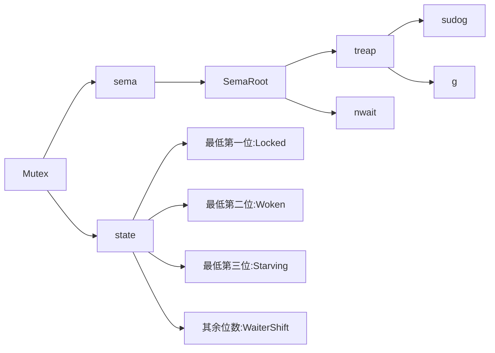

## 基本介绍

Go语言之父为罗伯特·格瑞史莫、罗伯·派克和肯·汤普逊.

- Rob Pike（罗伯·派克），早期贝尔实验室成员，参与了 Plan9 操作系统、C 编译器以及多种语言编译器的设计和实现，UTF-8 发明人之一。​
- Robert Griesemer（罗伯特·格瑞史莫），Java 的 HotSpot 虚拟机和 Chrome 浏览器的 JavaScript V8 引擎的设计者之一。​
- Ken Thompson（肯·汤普逊），图灵奖得主、Unix 之父以及 C 语言的发明人之一。

### 产生的原因

- 使用c++构建软件给程序员造成严重的心智负担​
- 使用c++编写大型项目,难以忍受过长的编译时间​
- c++对底层硬件的依赖以及编写并发/并行程序时的复杂性

三位大佬决定开发一门新的语言,解决c++在工程上的痛点打造一个以编译速度快,心智负担小,简洁的并行编程为目标的新语言。

### 特性

- 从csp主要继承channel的概念
- 从c主要继承基本的语法
- 从Pascal主要继承包管理特性
- 创造了defer,切片,map以及原生并发等特性


### 设计哲学

#### 简单-少即是多

1. 每种问题提供尽量少的答案
2. 隐藏复杂度在语言本身的设计之中
3. 对接口保永远的兼容

#### 组合-正交解耦

1. 通过类型嵌入,实现数据和算法的复用
2. 通过接口,实现两个实体之间的解耦
3. 通过channel,解耦两个并发实体之间的数据处理依赖

#### 并发-原生并发
1. 在语法层面提供一些关键字来实现并发程序的设计

#### 实用-面向工程

1. 实用且好用的标准库与工具链,似的开发,测试,调试,部署,运维等环节非常方便快捷
2. 非面向过程也非面向过程
3. 快速的写出简洁的代码却不易阅读

## Go语言的执行、编译

### 编译

1. 词法分析：将源代码翻译成Token（Token是代码中最小的语义结构）
2. 句法分析：Token序列经过处理，变成语法树（SST）
3. 语义分析：类型检查、类型推断、查看类型是否匹配、函数调用内联、逃逸分析
4. 中间码生成：为了处理不同平台的差异，生成中间代码（SSA）`export GOSSAFUNC=<指定的函数名>`然后执行go build
5. 代码优化：
6. 机器码生成：生成Plan9汇编代码->编译成机器码->输出.a的机器码，使用`go build -gcflags -S main.go`获取Plan9汇编
7. 链接：将各个包进行链接，包括runtime

go程序的入口不是main，应该是`runtime/rt0_XXX.s`

go程序执行的启动：

1. 读取命令行参数
2. 复制参数argc argv到栈上
3. 初始化g0执行栈（g0是为了调度协程的而产生的一个协程，是每一个Go程序的第一个协程）
4. 运行时检测
   1. 检查各种类型的长度
   2. 检查指针操作
   3. 检查结构体字段的偏移量
   4. 检查atomic原子操作
   5. 检查cas操作
   6. 检查栈大小是否是2的幂次
5. 参数初始化`runtime.args`
   1. 对命令行中的参数进行处理
   2. 参数数量赋值给argc int32
   3. 参数值赋值给argv **byte
6. 调度器初始化`runtime.schedinit`
   1. 全局栈空间内存分配
   2. 加载命令行参数到`os.Args`
   3. 堆内存空间的初始化
   4. 加载操作系统环境变量
   5. 初始化当前系统线程
   6. GC的参数初始化
   7. 算法初始化（map、hash）
   8. 设置process变量
7. 创建主协程
   1. 创建一个新的协程，执行`runtime.main`
   2. 放入调度器等待调度
8. 初始化M
   1. 初始化一个M，用来调度主协程
9. 主协程执行主函数
   1. 执行runtime包中的init方法
   2. 启动GC
   3. 执行用户包依赖的init方法
   4. 执行用户主函数的`main.main()`

### go文件的执行

go语言可以直接使用`go run + 相应go文件名`。

#### 应用程序入口

- 必须是main包
- 必须是main方法
- 文件名不一定是main.go

Go中main函数不支持任何返回值，只能使用`os.Exit(0)`这样进行返回。

main函数不支持传入参数，命令参数通过`os.Args`获取。

**go语言原生支持Unicode，可以处理全世界任何语言的文本。**

### go文件的编译

`go build + 相应go文件名`，生成相应二进制可执行文件，且是静态编译，无需担心在系统库更新的时候冲突。

---

## 程序结构

### 基础概念

`main`定义了一个独立可执行的程序，而不是一个库。main函数是整个程序执行时的入口函数。

| 函数 | 变量 | 常量  | 类型 |
| :--: | :--: | :---: | :--: |
| func | var  | const | type |

**go不需要语句或者声明的末尾添加分号，除非一行上有多条语句。编译器主动将特定符号后的换行符转换为分号。换行的位置会影响go代码的正确解析。**

不允许使用无用的局部变量。可以使用空标识符:`_`。用于语法需要变量名，但是程序逻辑不需要。

空表示`nil`。

函数和包级别的变量可以任意顺序声明，不影响调用。CPP需要提前申明。

go中的传值类似C++的引用传递。指针是另一个指针，但是内存指向同一块区域。

常量的值只能是数字、字符串、固定的布尔值。`const(变量名=值)`。

GO最有意思并且最新奇的特性就是对并发编程的支持。

Go中的指针类似C。但是不能对指针进行加减操作。`*p++`只改变变量的值，不改变指针值。

使用`godoc`工具可以在本地命令行阅读标准库中的文档。

```shell
go doc package
```

`golang.org/x/tools/cmd/goimports`导入工具，它可以根据需要自动添加或删除导入的包。

函数的右小括弧，即函数传参数是的参数列表的最后一位的右括号，可以另起一行缩进，并在最后一个参数的后面加上一个逗号，防止编译器在行尾自动插入分号而导致编译错误。例如：

```go
函数名(
    变量1，变量2，
    变量3，
)
```

**自增自减是语句，不能像C++中那样使用。且符号只能放在最后。**`x=i++`这样的语法是错误的。

### 定义变量和结构

变量没有显示初始化，则隐式初始化。数值为0，字符串为空。

var变量的时候，支持不同类型赋值，其赋值顺序为从左到右。

```go
var b, f, s = true, 2.3, "four" // bool, float64, string
```

#### 定义、创建变量

`var 变量名1,变量名2 变量类型`

变量定义的几种等价方式

```go
s := ""  //只能用在函数内部，不能用于包变量
var s string  //依赖字符串的默认初始化零值机制
var s = ""  //用于多变量声明
var s string = ""  //多变量多类型时使用
var ( //多个包变量的声明
 a=""
 b=""
)
```

简短变量声明对于已经在相同语法域中声明过的变量，简短变量声明只进行赋值操作。

**简短变量声明语句中必须至少要声明一个新的变量**。

**简短变量声明语句只有对已经在同级词法域声明过的变量才和赋值操作语句等价，如果变量是在外部词法域声明的，那么简短变量声明语句将会在当前词法域重新声明一个新的变量**。

**包级变量的初始化顺序并不完全取决于变量的声明顺序，而取决于调用关系。**

#### 定义struct

```go
type 类型名 struct {
    数据元素 类型
}
var 变量名 类型名
```

命名：一个名字以一个字母或者下划线开头。后面跟任意数量的字母、数字或下划线。大小写敏感。

在函数外部定义的包级名字，是以首字母大写命名的，则它将是导出的，可以被外部的包访问。包本身的名字一般总是用小写字母。

让一些聚合类型的零值具有意义，保证不管任何类型的变量总是有一个合理有效的零值状态。

在包级别声明的变量会在`main`入口函数执行前完成初始化，局部变量将在声明语句被执行到的时候完成初始化。

定义变量有两个方式：`var`和简短变量声明(`:=表达式`)。

简短变量声明被广泛用于大部分的局部变量的声明和初始化。 var形式的声明语句往往是用于需要显式指定变量类型地方， 或者因为变量稍后会被重新赋值而初始值无关紧要的地方。

简短变量声明语句中必须**至少**要声明一个新的变量。其中可以有不是全部的变量之前声明过，这里只是简单的赋值。

简短变量声明语句只有对已经在同级语法域声明过的变量才和赋值操作语句等价。变量是在外部语法域声明的，那么简短变量声明语句将在当前语法域重新声明一个新的变量。

#### new函数

使用new函数创建变量，表达式`new(类型名)`将创建一个T型的匿名变量，初始化为相应类型的零值，返回变量地址，返回类型为相应类型的指针。

类型的大小为0，有可能地址相同，例如`struct{}`和`[0]int`。

*请谨慎使用大小为0的类型。如果类型的大小为0，可能导致Go语言的自动垃圾回收机制有不同的行为。具体请查看`runtime.SetFinalizer`函数相关文档*

new函数只是一个预定义的函数，并不是一个关键字。可以将new名字重新定义为别的类型。**但是这样就会导致重定义new的空间内无法使用new函数。**

### 输入

```go
input := bufio.NewScanner(os.stdin)
input.Scan() //读入一行，并移除行末的换行符。读入一行返回true，否则false
input.Text() //获取一行输入。
```

### 输出

`fmt`package包含格式化输出、接收输入的函数。

```go
fmt.Printf() //格式化输出
fmt.PrintIn() //输出完后换行
```

|    %d    |                   十进制整数                    |
| :------: | :---------------------------------------------: |
| %x,%o,%b |          十六进制，八进制，二进制整数           |
| %f,%g,%e | 浮点数：3.141593 3.141592653589793 3.141593e+00 |
|    %t    |                      bool                       |
|    %c    |                   Unicode码点                   |
|    %s    |                     字符串                      |
|    %q    |         带双引号或单引号的字符或字符串          |
|    %v    |                 变量的自然形式                  |
|    %T    |                   变量的类型                    |
|    %%    |               字面上的百分号标志                |

通常Printf格式化字符串包含多个%参数时将会包含对应相同数量的额外操作数，但是%之后的`[1]`这样的副词告诉Printf函数再一次使用第一个操作数。%后的#副词告诉Printf在用%o、%x或%X输出时生成0、0x或0X前缀。

### 注释

使用`//`进行注释。

### 包和文件

**必须导入需要的package，缺少了必要的package或者导入了不需要的package，程序都无法编译通过。**

`import`语句必须要跟在文件的`package`声明之后。

当import的一个包路径包含多个单词时，通常只用最后的那个单词表示即可。

go语言通过package管理。一个package由单个目录下的一个或者多个.go源码组成。

每个go都以一条package声明语句开始。表明文件属于哪一个package。

每个包都对应一个独立的名字空间，要在外部使用函数，必须要显式声明包名。

如果一个名字是大写字母开头的，那么该名字是导出的。

包级别的常量名用大写字母开头。

每个源文件的包声明前的注释是包注释。通常，包注释的第一句是包功能的概要说明。如果一个文件有多个包注释，当前的文档工具会根据源文件名的先后顺序将它们链接成一个包注释。包注释很大时，通常会放到一个独立的doc.go文件中。

每个包都有一个全局唯一的导入路径。由构建工具进行解释。一个导入路径代表一个目录中一个或者多个Go源文件。

包名不一定要唯一。一个包的名字往往和包的导入路径的最后一个字段相同。

包的初始化首先解决包级变量的依赖顺序，然后按照包级变量声明出现的顺序依次进行初始化。如果包中含有多个源代码文件，它们将按照发给编译器的顺序进行初始化。Go语言的构建工具会首先将.go文件根据文件名排序，然后依次调用编译器编译。

包级别声明的变量，有初始化表达式用初始化表达式，没有的，可以创建`init`函数进行初始化工作。每个文件可以包含多个`init`函数。

`init`函数不能被调用或者引用。在每个文件中的`init`初始化函数，在程序开始执行时按照它们声明的顺序被自动调用。

每个包只会被初始化一次。

初始化工作自下而上进行，main包最后被初始化。确保在main函数执行之前，所有依赖的包都已经完成了初始化工作。

### 循环

#### for循环

注意**左大括号必须要和post语句在同一行**

```go
for i:=初始值;条件;post {
    //todo
}
```

#### range遍历

**python中的range是函数，而go中的range是关键词。**

```go
for a,b:=range 数组{
    //todo
}
```

range每次返回两个数值：索引和相应元素值，并强制处理。

### 选择判断

`if`可以在比较的时候进行简单语句的赋值行为，以下代码等价：

```go
if err:=r.ParseForm();err!=nil{
  log.Print(err)
 }
//等价于
err := r.ParseForm()
if err != nil {
log.Print(err)
}
```

**Go语言中条件语句不需要圆括号，但是分支中必须有大括号。**

Go语言不需要显式的在每一个`case`后写`break`，语言默认执行完`case`后的逻辑语句自动退出。如果需要*相邻几个`case`都执行同一逻辑时，需要自己显式的写上`fallthrough`来覆盖这种默认行为。*

switch不带操作对象时称为无tag switch，默认用true值代替， 然后将每个case的表达式和true值进行比较。等价switch true。

switch与其他语言的差异：

- 条件表达式不限制为常量或者整数
- 单个case中，可以出现多个结果选项，使用逗号分隔
- 与C语言相反，Go不需要break来显示退出case
- 可以不设定switch之后的表达式，在此种情况下，整个switch就是多个if else相同

`continue`和`break`可以使用在`for循环`，`switch`，`select`中。

### 生命周期

Go中返回函数中局部变量的地址是安全的。

一个变量的有效周期只取决于是否可达。

对于在包一级声明的变量来说，变量的生命周期和整个程序的运行周期是一致的。局部变量的生命周期是动态的。每次从创建一个新变量的声明语句开始，直到该变量不再被引用为止，然后变量的存储空间可能被回收。

编译器自动选择在栈还是堆上分配局部变量的存储空间，不取决于是var还是new，这点不同于C++。

当局部变量在函数退出后，依然可以通过包一级的变量找到，则称局部变量从函数中逃逸了。逃逸的变量需要额外分配内存，同时对性能的优化可能会产生细微的影响。

如果将执行那个短生命周期对象的指针保存到具有长生命周期的对象中，特别是保存到全局变量时，会阻止对短生命周期对象的垃圾回收，从而影响程序的性能.

### 元组赋值

元组赋值允许同时更新多个变量的值。赋值前，赋值语句右边的所有表达式会先进行求值，然后同意更新左边对应的变量值。例如，两值互换。

nil可以赋值给任何指针或引用类型的变量。

### 类型

一个类型声明语句创建了一个新的类型名称。即使和现有类型具有相同的底层结构，新命名的类型提供了一个方法，用来分隔不同概念的类型，它们底层类型相同也不兼容。

创造新的类型：`type 类型名字 底层类型`。

类型声明语句一般出现在包一级。**如果新创建的类型名字的首字符大写，则在外部包也可以使用**。

对于中文汉字，Unicode标志作为小写处理。因此中文的命名默认不能导出。

对于每一个类型T，都有一个对应的类型转换操作`T(x)`。如果T是指针类型，可能需要用小括弧包装T。前提是**两个类型的底层基础类型相同或二者都是指向相同底层结构的指针类型**。

比较运算符可以用来比较一个命名类型的变量和另一个有着相同类型的变量，或有着相同底层类型的*未命名*类型的值之间进行比较。如果这两个值有着不同的类型，则不能直接比较。

自定义类型的函数定义格式如下：

``` go
func (x 自定义类型)函数名() 返回类型{
    //pass
}
```

### 作用域

作用域不同于生命周期。声明语句的作用域对应的是一个源代码的文本区域；它是一个编译时的属性。一个变量的生命周期是指程序运行时变量存在的有效时间段，在此时间区域内它可以被程序的其他部分引用；是一个运行时概念。

### 一些常用的函数介绍

os包提供一些与操作系统交互的函数和变量。程序的命令行参数可以通过os包的Args变量获得，即：`os.Args`，返回字符串切片，语法类似python，区间左闭右开。`os.Args[0]`为命令本身名字。省略默认传入0或len()。**os.Args因为第一个参数为命令本身，因此其长度会在给定参数的数量上加一**

`gofmt`按照字母顺序对包名进行排列，从而格式化。

**在进行大量字符串拼接的时候使用运算符+会导致执行的代价高昂，推荐使用strings包的Join函数。**

```go
strings.Join(字符串数组,字符串拼接时的间隔符)
```

`map`存储了键值对的集合，对集合元素，提供常数时间的存取操作。键的选择只要能用`==`比较就行。值也可以是任意类型。例如:`map[键类型]值类型`。`make`函数创建空map，形如：`make(map[string]int)`。

map的迭代顺序不确定。

系统文件的指针：`*os.File`。

系统打开文件：`os.Open(路径)`，返回的第一个值是被打开的文件，其后被`Scanner`读取，返回的第二个值是内置的`error`类型的值。

文件关闭使用`文件.Close()`函数。

`io/ioutil`包中的`ReadFile(文件名)`函数读取指定文件的全部内容，返回的第一个参数是数据(byte slice)，返回的第二个是错误信息。`string.Split(string(数据),分割标志位)`函数将字符串分割成子串的切片。

http包：`net/http`。

`http.Get(url地址)`函数创建HTTP请求的函数。返回两个参数，包含访问得到的请求结果的结构体，是一个可读的服务器响应流。第二个是错误信息。`ioutil.ReadAll(数据)`可以读取返回的数据的相应信息，以及可能发生的错误信息。相应的流用相应的`Close()`函数进行关闭。

程序出现错误时使用`os.Exit(1)`。

获取现在系统时间，使用包`time`，`time.Now()`。

`ioutil.Discard`输出流是一个“垃圾桶”，可以向里面写入不需要的数据。

`io.Copy(拷贝目的地,拷贝源)`返回两个参数，第一个字节大小，第二个是错误信息。

在编写命令行程序时，调用`flag.变量`函数创建可选的命令行参数，例如`flag.Bool`或`flag.String`。有三个参数属性：1.命令行标志参数的名字。2.该标志位的默认值。3.该标志参数的对应的描述信息。返回指向对应命令行标志参数变量的指针，指向的是是否设置参数的bool或者替换的字符串。需要加上`*`间接引用。

*在使用标志参数对应的变量之前先调用flag.Parse函数，用于更新每个标志参数对应变量的值(之前是默认值)。*解析命令行参数时遇到错误，默认打印相关的提示信息。然后调用`os.Exit(2)`终止程序。

`flag.Args()`获取非标志参数的普通命令行参数，返回一个字符串类型的slice。

`strconv.ParseFloat()`函数可以进行字符串对浮点型数据的转换，还有类似的字符串转换函数在`strconv`包中。

`unicode`包提供了诸多处理rune字符相关功能的函数。

`unicode/utf8`包提供了用于rune字符序列的UTF-8编码和解码的功能。

`utf8.RuneCountInString(变量名)`返回字符串的Unicode字符数。

`utf8.DecodeRuneInString(变量名)`返回两个值，第一个是对应字符本身，另一个是对应字符采用UTF8编码后的编码字节数目。

`strings.LastIndex(字符串,需要寻找的字符串)`返回相应字符串的索引，未找到返回-1。

将一个整数转化为字符串，一种是用`fmt.Sprintf`返回一个格式化的字符串；另一个是用`strconv.Itoa()`。

`FormatInt`和`FormatUint`函数可以用不同进制来格式化数字。

`fmt.Sprintf()`函数的%b、%d、%o、%x等参数提供的功能比strconv包的Format函数方便很多，还可以添加额外信息。

将字符串解析为整数，相应的使用strconv包的Atoi或ParseInt函数，用于解析无符号整数的ParseUint函数。ParseInt函数的第三个参数用于制定整数的大小，16表示int16,0表示int。

使用`fmt.Scanf`解析输入的字符串和数字。

### 垃圾回收的基本思路

从每个包级的变量和每个当前运行函数的每一个局部变量开始，通过指针或引用的访问路径遍历，是否可以找到该变量。如果不存在这样的访问路径，则说明该变量是不可达的。即，它的存在并不会影响程序后续的计算结果。

## 基础数据类型

$$数据类型\begin{cases}\text{基础类型}\begin{cases}\text{数字}\\\text{字符串}\\\text{布尔值}\end{cases}\\\text{复合类型}\begin{cases}\text{结构体}\\\text{数组}\end{cases}\\\text{引用类型}\begin{cases}\text{指针}\\\text{切片}\\\text{字典}\\\text{函数}\\\text{通道}\end{cases}\\\text{接口类型}\end{cases}$$

- bool,string
- (u)int,(u)int8,(u)int16,(u)int32,(u)int64,uintptr
- byte,rune(32位，四字节，避免了c语言中char只有一字节导致的问题)
- float32,float64,complex64,com

### 整数

| int8  | int16  | int32  | int64  |
| ----- | ------ | ------ | :----: |
| uint8 | uint16 | uint32 | uint64 |

int和uint类型为32bit或者64bit。根据编译器的不同以及cpu平台的不同，并不一定。

Unicode字符rune类型是和int32等价的类型，通常用于表示一个Unicode码点。可以相互使用。

byte和uint8是等价类型。byte类型一般强调数值是一个原始的数据而不是小的整数。

uintptr是无符号的整数类型，没有指定具体的bit大小，但是足以容乃指针。底层编程用。

一个n-bit的有符号数的值域为$-2^{n-1}$到$2^{n-1}-1$。

一个n-bit的无符号数的值域为0到$2^{n}-1$。

二元运算符，在同一优先级下，使用左优先结合规则。也可以明确使用括号表示优先顺序。

%取模运算符的符号和被取模数的符号总是一致。

|  &   |  \|  |  ^   |   &^    |  <<  |  >>  |
| :--: | :--: | :--: | :-----: | :--: | :--: |
| AND  |  OR  | XOR  | AND NOT | 左移 | 右移 |

在遇到的每种类型，需要保证规则的一致性。

移位操作bit部分必须是无符号数。

左/右移运算用零填充右边空缺的bit位。

有符号数的右移运算会使用符号位的值填充左边空缺的bit位。

len函数返回值为int有符号类型，这样便于循环时，作为索引。否则循环语句使用--时，无符号数会直接变成最大的整数。

**数据类型之间的转换不存在隐式转换，只能显式转换。**

类型强制转换:`类型(需转换的变量名)`。

任何大小的整数字面值都可以用以0来头的八进制书写，或者以0x或者0X开头的十六进制格式书写。十六进制数字可以用大写或者小写字母。

### 浮点数

GO语言提供了两种精度的浮点数：`float32`(6个十进制的精度)和`float64`(15个十进制的精度)。

常量`math.MaxFloat32`表示float32能表示的最大数值，大约是3.4e38。

wi常量`math.MaxFloat64`表示float64能表示的最大数值，大约是1.8e308。

**通常优先使用float64，float32的累计计算误差易扩散，且能表示的正整数不是很大，当整数大于23bit能表示的范围时，float32的表示将出现误差。**例如：

```go
var f float32=16777216
fmt.Print(f==f+1) //"true"
```

小数点前后的数字都有可能被省略。所以**很大很小的数最好使用科学计数法，通过e或者E来指定指数部分。**

math包中提供IEEE754浮点数标准中定义的特殊值：正无穷和负无穷以及NaN。

`math.IsInf(检测数,int值)`：检查是否是无穷数，int值Wie正数，表示检测其是否是一个正无穷，同理负数，0表示是否是无穷，不论正负。

`math.IsNaN`：检测一个数是否是非数。

`math.NaN`：返回一个非数对应的值。可以用其表示一个非法的值，但是测试一个结果是否非数则*充满风险*。NaN既不大于自己，也不小于自己，也不等于自己。

浮点数的相等比较是*危险的*，需要小心处理精度问题。

**一个函数返回的浮点数结果可能失败，最好做单独的标志报告。**例如：

```go
func compute() (value float64,ok bool){
    //...
    if failed {
        return 0,false
    }
    return result,true
}
```

### 复数

Go语言提供两种精度的复数类型：`complex64`和`complex128`。对应float。内建的real和imag函数分别返回复数的实部和虚部。

复数的创建方法：`complex(实部,虚部)`。

如果一个浮点数或一个十进制整数后面有一个i，则构成一个实部为0的虚数。

### 布尔型

两种值：true和false。

&&的优先级高于ll。(&&对应逻辑乘法，||对应逻辑加法)。

字符的检验代码可以如下编写：

```go
if 'a'<=c && c<='z'||
'A'<=c&&c<='Z'||
'0'<=c&&c<='9'{
    //todo
}
```

布尔值不会隐式转换为数字值0或者1，反之亦然。必须使用一个显式的if语句辅助转换。或者自己包装成一个函数，如下：

```go
func btoi(b bool)int {
    if b{
        return 1
    }
    return 0
}
func itob(i int) bool {
    return i!=0
}
```

### 字符串

Go1.10之前推荐使用`bytes.Buffer`，之后推荐使用`strings.Builder`

一个字符串是一个**不可改变**的字节序列。

字符串可以包含任意数据，包括byte值0。

文本字符串通常被解释为采用UTF8编码的Unicode码点(rune)序列。

使用`utf8.RuneCountInString`获取字符数量。使用`[]byte`获取字节。

len函数返回一个字符串中的字节数目，**而不是字符数**，字节数目大于等于字节数目。

索引操作[i]返回第i个字节的字节值。

超出索引范围会导致panic异常。

**第i个字节并不一定是字符串的第i个字节，因为对于非ASCII字符的UTF8编码会要两个或多个字节。**

支持切片操作。

字符串进行运算符比较，比较结果是字符串自然编码的顺序。

尝试修改字符内部数据的操作是被禁止的。

不变形保证了两个字符串共享相同的底层数据的话是安全的，复制任意字符串代价是廉价的，字符串和对应的子字符串切片的操作也可以安全的共享相同的内存，这两种情况都没有必要分配新的内存。

| 转义符 | 含义       |
| ------ | ---------- |
| \a     | 响铃       |
| \b     | 退格       |
| \f     | 换页       |
| \n     | 换行       |
| \r     | 回车       |
| \t     | 制表符     |
| \v     | 垂直制表符 |
| \\'    | 单引号     |
| \\"    | 双引号     |
| \\\    | 反斜杠     |

一个十六进制的转义形式是`\xhh`，两个hh表示十六进制数字，不区分大小写。

一个八进制的转义形式是`\ooo`，o表示八进制数字，不能超过\377。

相应的十进制的范围应该是255。

字符串面值形式用``包裹，其中的字符串不进行转义操作。会删除回车保证所有平台上的值都是一样的。(Windows系统会把回车和换行一起放入文本文件中)。常用于编写正则表达式，HTML模板、JSON面值等。

可以将一个符文序列表示为一个int32序列。这种编码方式叫UTF-32或UCS-4。但是会浪费大量空间

UTF-8编码的每个符号编码后第一字节的高端bit位用于表示总共有多少编码个字节。UTF-8是变长编码，无法直接通过索引获取指定位置的字符。比较紧凑，完全兼容ASCII编码，可以自动同步，通过向前回溯最多两个字节就能确定当前字符编码的开始字节的位置，是前缀编码，不会出现任何歧义。没有任何字符的编码是其他字符编码的子串，或是其他编码序列的子串。与Unicode码点一致，没有嵌入NUL(0)字节，可以很好的兼容使用NUL作为字符串结尾的编程语言。

例如：

- 0xxxxxxx                                                 runes 0-127
- 110xxxxx 10xxxxxx                                  128-2047
- 1110xxxx 10xxxxxx 10xxxxxx                  2048-65535
- 11110xxx 10xxxxxx 10xxxxxx 10xxxxxx  65536-0x10ffff

对于小于256码点值可以写在一个十六进制转义字节中，但是对于更大的码点则必须使用\u或者\U转义形式。

判断一个字符串是否是另一个字符串的前缀/后缀：

```go
func HasPrefix(s,prefix string) bool {
    return len(s) >= len(prefix) && s[:len(prefix)]==prefix
}
func HasSuffix(s,suffic string) bool {
    return len(s) >= len(suffic) && s[len(s)-len(suffic):]==suffic
}
```

包含子串测试：

```go
func Contains(s,substr string) bool {
    for i:=0;i<len(s);i++{
        if HasPrefix(s[i:],substr){
            return true
        }
    }
    return false
}
```

Go语言的range循环在处理字符串的时候，会自动隐式解码UTF8字符串。

如果遇到一个错误的UTF8编码输入，将会生成一个特殊的Unicode字符`\uFFFD`，即�。

UTF8作为交换格式方便，rune序列支持数组索引且方便切割，rune的大小一致。rune序列的长度就是字符的数量，string类型的数量是字符占用的字节空间大小。

将string转换为rune序列：`rune序列名:=[]rune(string类型变量名)`。

构建字符串推荐使用`bytes.Buffer`。

[]byte()是一个字节数组，用于保存或者操作字符串数据。

bytes包提供了Buffer类型用于字节slice的缓存。一个Buffer开始是空的，但随着string、byte或[]byte等类型数据的写入可以动态增长。一个bytes.Buffer变量并不需要初始化，零值也是有效的。

数组转换成字符串数组：

```go
package main

import (
 "bytes"
 "fmt"
)

func intsToString(values []int)string{
	var buf bytes.Buffer
	buf.WriteByte('[')
	for i,v:=range values{
		if i>0{
			buf.WriteByte(',')
		}
		fmt.Fprintf(&buf,"%d",v)
	}
	buf.WriteByte(']')
	return buf.String()
}
func main() {
	fmt.Println(intsToString([]int{1,2,3}))
}
```

向bytes.Buffer添加任意字符的UTF8编码时，最好使用bytes.Buffer的WriteRune方法，如果仅仅是写入ASCII字符则可以使用WriteByte方法。

默认值是空字符串

string是数据类型，不是引用或指针类型

string是只读的byte slice ，len函数返回string对应的byte数

string的byte数组可以存放任意数据

string类型的大小都是16字节，原因是其底层结构为`runtime/string.go`中的`stringStruct`结构体，其中包含了一个指针，和一个int变量表示长度。

想看string内部的可以用反射变成反射的对应类型：`(*reflect.StringHeader)(unsafe.Pointer(&s))`

字符串切片：`s=string([]rune(s)[:3])`

### 常量

常量表达式的值在编译期计算。每种常量的潜在类型都是基础类型。

形式是：`const`

可以一次性声明多个常量。语法类似import。

批量声明常量，除了第一个以外，可以省略常量右边的初始化表达式，其值直接和上一个赋值的结果相同。

常量声明可以使用iota常量生成器初始化，用以生成一组以相似规则初始化的常量。在一个const声明语句中，在第一个声明的常量所在行iota会被置为0，然后在每一个有常量声明的行加一。类似其他语言的枚举类型。如果有想跳过一个数字，可以写一个`-`。也可写带有`iota`的表达式，之后的变量都会按照该表达式进行运算。

#### 无类型常量

无类型常量可以作为任意数据类型，可以简单理解为字符替换。

Go语言中有着无类型常量，编译器为这些没有明确的基础类型的数字常量提供比基础类型更高精度的算数运算，可以认为至少有256bit的运算精度。

$$无类型常量\begin{cases}无类型的布尔型\\无类型的整数\\无类型的字符\\无类型的浮点数\\无类型的复数\\无类型的字符串\end{cases}$$

通过延迟明确常量的具体类型，不仅可以提供更高的运算精度，还可以直接用于更多的表达式而不需要显示的类型转换。

无类型整数常量转换为int，内存大小不确定。但是无类型浮点数内存大小明确是float64，无类型复数内存大小为complex128。

当尝试将无类型的常量转为一个接口值时，要依靠它们明确接口对应的动态类型。

### 类型申明语句

语法：`type 类型名字 底层类型`

一个类型声明语句创建了一个新的类型名称，和现有类型具有相同的底层结构。新命名的类型提供了一个方法，用来分隔不同概念的类型，这样即使它们底层类型相同也是不兼容的。

类型声明语句一般出现在包一级，因此如果新创建的类型名字的首字符大写，则在包外部也可以使用。

自己创建的类型string方法可以如下申明方式：`func (c 类型名字) String() string { return 返回信息字段 }`

## 复合数据类型

数组是由同构的元素组成。结构体是由异构元素构成。都有着固定内存大小的数据结构。slice和map是动态数据结构，能根据需要进行增长。

### 数组

int类型的数组声明：

```go
var a [3]int = [3]int{1,2,3}
```

默认情况下，数组的每个元素都被初始化为元素类型对应的零值。

可以用索引位置和值来初始化数组`var a [3]int =[3]int {1:2}`，此时a有三个元素，a[1]为2,其他为0。

当数组的长度位置是`...`时，表明数组的长度是依据初始值的个数来计算的。例如`q:=[...]int{1,2,3}`。

**数组的长度是数组类型的一部分，不同长度的数组是不同的数组类型。**

可以指定数组中参数的初始化：

```go
r := [...]int{99: -1} //定义了一个包含100个元素的r数组，并将第100位元素初始化位-1，其他元素均为0
```

参数传递数组时，go传递的是数组的复本。当数组较大时，效率低下且无法修改到数组上。此时可以传入指针。

```go
func zreo(ptr *[32]byte){
    //下面的代码可以简化为*ptr=[32]byte{}
    for i:=range ptr{
        ptr[i]=0
    }
}
```

### Slice

$slice\begin{cases}指针:指向第一个slice元素对应的底层数组元素的地址，slice的第一个元素不一定是数组的第一个元素\\长度:slice中的元素数目，可以用len函数获取\\容量:从slice开始位置到底层数据的结尾位置，可以用cap函数获取\end{cases}$

多个slice可以共享底层数据，引用的数组部分区间可能重叠。

slice的追加

扩容是，编译时转为调用`runtime.growslice()`

- 如果期望容量大于当前容量的两倍就会使用期望容量
- 如果当前切片的长度小于1024，容量翻倍
- 如果当前切片的长度大于1024，每次增加25%
- 切片扩容时，**并发不安全**，切片并发需要加锁

slice支持切片`s[i:j]`，$0\leq i\leq j \leq cap(s)$，引用s的从第i个元素开始到第j-1个元素的子序列。i省略的话，默认为0。j省略为len(s)代替。

切片操作超过cap(s)的上限导致panic异常，超过len(s)表示拓展了slice

```go
//翻转数组
func reverse(s []int){
    for i,j:=0,len(s)-1;i<j;i,j=i+1,j-1{
        s[i],s[j]=s[j],s[i]
    }
}
```

一种将slice元素循环向左旋转n个元素的方法是三次调用reverse反转函数， 第一次是反转开头的n个元素， 然后是反转剩下的元素， 最后是反转整个slice的元素。 （ 如果是向右循环旋转，则将第三个函数调用移到第一个调用位置就可以了。 ）

数组能比较，slice不能比较。slice和数组在申明上的区别在于没有指明数组长度。

标准库提供了高度优化的bytes.Equal函数来判断两个字节型slice是否相等（ []byte）

slice唯一合法的比较是与nil进行比较。一个零值slice为nil，其没有底层数组，长度和容量为0。但是也有非nil值的slice长度和容量为0.

可以使用`[]int(nil)`类型转换表达式生成一个对应类型slice的nil值。

检查slice是否为空`len(s)==0`而不是`s==nil`。

所有go函数应该以相同的方式对待nil值的slice和0长度的slice。

`make`函数创建一个指定元素类型、长度和容量的slice。容量可以省略，默认等于长度。

```go
make([]T,len)
make([]T,len,cap)//same as make([]T,cap)[:len]
```

`append(slice名，需要添加的值)`向slice中添加元素。添加元素时如果超越cap，系统会重新分配更大的底层数组。

由于值传递的关系，必须接收append的返回值。

`copy(slice名，拷贝源)`

删除slice中的元素可以使用如下语法`s2=append(s2[:3],s2[4:]...)`。`...`表示这里是可变长度，不能省去。

### Map

`map`的声明如下:`map[K]V`，复合`map`如：`map[K1]map[K2]V`。如：

```go
m:=map[string]string {
    "hello":"world",
}
```

`map`是无序的。

最好不要用浮点数作为key，最坏情况会出现NaN和任何浮点数不相等的情况。

`map`中的value不可以通过取地址获取，以避免因为map扩容导致的地址迁移。

`map`中数据的返回是无序的，如果需要按照某种顺序输出，只能在外层将key进行排序后进行输出。

**`map`中没有的key对应的value是value类型的初始值。相应取值返回的第二个参数是false，如果有返回true。**

`delete(map名，key值)`删除元素。

`map`使用哈希表，key必须可以比较。除了`slice,map,function的内建类型`都可以作为key。`stuct`不包含上述字段也可作为key。

Go中没有set类型，但是可以通过`map[type]bool`的方式模拟set。

其底层是`runtime.hmap`


#### map使用make创建


#### map使用字面量创建

- 当元素少于25个时，直接转化为简单赋值，本身还是调用的make创建
- 当元素多于25个时，转化为循环赋值，本身还是调用的make创建

#### map扩容

当map溢出桶太多时会导致变成链表，进而严重的性能下降。

#### 总结

- go使用拉链实现了hashmap
- 每个桶中存储键哈希的前8位
- 桶超过8位，存储在溢出桶中

### 结构体

go的结构体没有构造函数，一般可以直接生成。如果一定要用函数进行构造，可以自己定义一个工厂函数，返回一个局部地址，但是不会出错。

针对函数体的函数形式如下：

```go
func (node *TreeNode) setValue(value int){
    
}
```


**go中的函数传递都是值传递，所以想对结构体中的数据进行写操作数时，需要传入的指针，而不能是值。**只有使用指针才可以改变结构内容。

当改变内容必须使用指针接收者，结构过大也考虑指针接收者，如果有指针接收者，最好都是指针接收者，保持一致性。


### JSON

### 文本和HTML模板


## 函数

go的函数可以返回两个值。返回值可以命名，这样可以直接写一个`return`就行，不用再写返回变量名，但是可读性差。短函数可以用。

函数可以作为参数传入函数。func 函数名_1(函数名_2 func(参数，参数)类型)

## 方法


## 接口

使用者来定义接口。

多态的使用只能是传入参数的指针或者说是引用，不能直接传入对象。

空接口可以表示任何类型。

通过断言来将空接口转换为指定类型

### 最佳实践

- 倾向于使用小的接口定义，很多接口只包含一个方法
- 较大的接口定义，可以由多个小接口定义组合而成
- 只依赖于必要功能的最小接口

## 包和工具

`go list | wc -l`查看标准包的具体数目。

Go语言的开源程序包可以在http://godoc.org检索。

名字一般使用CamelCase。

首字母大写表示`public`，首字母小写表示`private`。

每个目录一个包，main包包含可执行入口。

为结构定义的方法必须放在同一个包内。可以是不同的文件。

包就是一个目录，一个目录就是一个包，包名可以不和目录名相同，但是一个目录下只能有一个包。

go扩充系统类型或他人的类型使用两种方法：**定义别名或使用组合**

使用组合就是创建一个新的结构体，其中包含需要拓展的结构体指针作为数据成员。将结构体中的数据提取出来，创建为一个新的结构体，并对其进行操作。

有些go的第三方包因为国内网络环境的原因影响，可以使用第三方工具进行下载，而不是使用`go get`。方式如下：

```shell
go get -v github.com/gpmgo/gopm
gopm get -u -g -v 包的地址
go install 包地址
```

在`go.mod`中使用本地文件替代包地址，可以使用在`go.mod`中追加写`replace github.com/XXX/ => xxx/xxx`

`go vender`缓存到本地

```shell
go mod vendor #这是go mod的vendor，不是以前的vendor
go build -mod vendor
```

创建`go.mod`：`go mod init 你的仓库地址/仓库名`

## HTTP

### 路由规则

- URL分为两种：
  - 末尾是`/`：表示一个子树。后面可以跟其他子路径
  - 末尾不是`/`：表示一个叶子。固定的路径
- 采用最长匹配原则，如果有多个匹配，一定采用匹配路径最长的那个进行处理
- 如果没有找到任何匹配项，会返回404错误

## 锁

### 互斥锁

sync包的Mutex类型

使用互斥锁能够保证同一时间有且只有一个goroutine进入临界区，其他的goroutine则在等待锁；当互斥锁释放后，等待的goroutine才可以获取锁进入临界区，多个goroutine同时等待一个锁时，唤醒的策略是随机的。
但是，这种方式还是有问题的，读写都会等待，大大降低了程序效率。

```go
// 多个goroutine并发操作全局变量x
var x int64
var wg sync.WaitGroup
var lock sync.Mutex // 互斥锁

func add()  {
    for i :=0;i<1000;i++{
        lock.Lock()     // 加锁
        x = x + 1
        lock.Unlock()   // 解锁
    }
    wg.Done()
}
func main()  {
    wg.Add(2)
    go add()
    go add()
    wg.Wait()
    fmt.Println(x)
}
```

### 读写互斥锁

在大多数场景下，是读多写少的，，当我们并发的去读取一个资源不涉及资源修改的时候是没有必要加锁的。这种情况就可以使用读写互斥锁，Go语言中使用sync包中的RWMutex类型。
读写锁分为两种：读锁和写锁。当一个goroutine获取读锁之后，其他的goroutine如果是获取读锁会继续获得锁，如果是获取写锁就会等待；当一个goroutine获取写锁之后，其他的goroutine无论是获取读锁还是写锁都会等待。

```go
// 读写互斥锁
var (
    x int64
    lock sync.RWMutex
    wg  sync.WaitGroup
)
func read()  {
    lock.RLock()        // 读加锁
    time.Sleep(time.Millisecond)        // 读操作耗时1ms
    lock.RUnlock()  //解锁
    wg.Done()
}

func write()  {
    lock.RLock()        // 写加锁
    x += 1
    time.Sleep(time.Millisecond *2) // 写操作耗时2ms
    lock.RUnlock()
    wg.Done()
}
```


## Goroutines和Channels

`goroutine`是一种函数的并发执行方式，`channel`在`goroutine`之间进行参数传递。

`main`函数本身运行在一个`goroutine`中。

`go 函数名(参数)`表示创建一个新的`goroutine`，并在新的`goroutine`中运行这个函数。

`make(chan 传递的参数类型)`表示创建一个指定类型的`channel`。

当一个`goroutine`尝试在一个`channel`上做`send`或者`receive`操作时，这个`goroutine`会阻塞在调用处，直至另一个`goroutine`往这个`channel`里写入或者接收值，这样两个`goroutine`才会继续执行`channel`操作之后的逻辑。

每一个`fetch`函数往`channel`中输入数据(ch<-expression)，主函数接收`channel`中的数值(<-ch)。

```go
go func(<变量名> <变量类型>){
    // 逻辑操作
}(传入参数)
```

依赖于Go本身是通过值传递来实现，因此这样协程内使用的传参的值拷贝。但是如果协程内直接使用外部的变量，虽然协程内可以使用，但是此时的变量是所有协程共享的，需要注意。

**Go中不能直接杀死协程。**

### Thread vs Goroutine

1. 创建时默认的stack的大小
    - JDK5以后JAVA Thread stack默认为1M
    - Groutine的Stack初始化大小为2K
2. 和KSE（Kernel Space Entity）的对应关系
    - Java Thread是1:1
    - Goroutine是M:N

kernel entity由cpu进行调度，切换时会涉及内核上下文的切换。

### 声明共享变量

```go
var mu sync.Mutex
mu.Lock()
//操作
mu.Unlock()

func TestCounter(t *testing.T) {
	var mut sync.Mutex
	var wg sync.WaitGroup
	counter := 0
	for i := 0; i < 5000; i++ {
		wg.Add(1)
		go func() {
			defer func() {
				mut.Unlock()
			}()
			mut.Lock()
			counter++
			wg.Done()
		}()
	}
	wg.Wait()
	t.Log(counter)
}
```

### 多渠道选择

```go
select {
    case ret:=<-retCh1:
    	t.Logf("result %s",ret)
    case ret:=<-retCh2:
    	t.Logf("result %s",ret)
    default:
    t.Error("No one returned")
}
```

### 超时控制

```go
select {
    case ret:=<-retCh:
    	t.Logf("redult %s",ret)
    case <-time.After(time.Second*1)
    	t.Error("time out")
}
```

### channel 关闭

```go
close(<channel>)
```

- 向关闭的channel 发送数据，会导致panic。
- `v,ok<-ch;ok`为bool值，true表示正常接受，false表示通道关闭。
- 所有的channel接受者都会在channel关闭时，立即从阻塞线程等待中返回且上述ok值为false。这个广播机制被常利用，进行向多个订阅者同时发送信号。

### 多协程下只运行一次

单例模式在Go的实现：

```go
type SingletonObj struct{}
var once sync.Once
var obj *SingletonObj
func GetSingletonObj() *SingletonObj{
	once.Do(func ()  {
		fmt.Println("Create Singletom obj")
		obj=&SingletonObj{}
	})
	return obj
}
```

### 协程切换

- 主动挂起：`gopark()`
- 系统调用：`entresyscall()->系统调用->exitsyscall()`
- 基于协作的抢占：业务主动调用`morestack()`
- 基于信号的抢占：强制线程调用`doSigPreempt()`。通过发送GC发送SIGURG

### 协程太多的处理方案

- 优化业务逻辑
- 利用channel的缓存区，在go协程前增加`a:=make(chan struct{},3000);a<-struct{}{}`。在协程执行完成后`<-ch`
  - 启动协程前，向channle送入一个空结构体
  - 协程结束，取出一个空结构体
- 协程池
  - 预创建一定数量的协程
  - 将任务送入协程池队列
  - 协程池不断取出可用协程，执行任务
- 调整系统资源

不推荐使用协程池：

- Go语言的线程已经相当于池化
- 二级池化会增加系统复杂度
- Go语言的初衷是希望协程即用即毁，不要池化

### Atomic

- **Atomic机制需要在硬件级别加锁**
- 需要CPU硬件支持
- 不同平台的实现方案不同
- 保证操作一个变量的时候，其他协程/线程无法访问
- **只能用于简单变量的简单操作**

### sema锁

- 信号量锁/信号锁
- 核心是一个uint32值，含义是同时可并发的数量
- 每个sema锁都对应一个SemaRoot结构体
- SameRoot中有一个平衡二叉树用于协程排队

#### sema操作

- uint32>0

    - 获取锁：uint32减一，获取成功

    - 释放锁：uint32加一，释放成功

- uint32==0

    - 获取锁：协程休眠，进入堆树等待
    - 释放锁：从堆树中取出一个协程，唤醒
    - sema锁退化成一个专用休眠队列

sema可以直接配置成0，作为休眠队列。

### Mutex

`sync.Mutex`：`Lock()`与`Unlock()`




## 基于共享变量的并发

## 包和工具

需要将想用的GOPATH添加对应的项目地址以保证在GOPATH拼接完成import的字符后能够导入对应的包。

```go
import <包别名> "引用路径"
```

```shell
# 强制获取最新的包
go get -u <包名>
```

不要把src放在路径中，这样`go get`将获取不到。

## Context

- 根Context：通过`context.Background()`创建
- 创建子节点Context：
    - `func WithCancel(parent Context) (ctx Context, cancel CancelFunc)`
    - `func WithDeadline(parent Context, d time.Time) (Context, CancelFunc)`
    - `func WithTimeout(parent Context, timeout time.Duration) (Context, CancelFunc)`
    - `func WithValue(parent Context, key, val any) Context`


Context用于解决goroutine之间退出通知、元数据传递的功能的问题。

最佳实践：

- 不要将context放在结构体中，而是直接将context类型作为函数的第一参数，而且一般都命名为ctx
- 不要向函数内传出nil属性的context，不知传什么，用TODO函数
- 不要把本应该作为函数参数的属性塞进context，context存储的应该是一些共同的数据
- 同一个context可能会被传递到多个goroutine中，但是context并发安全

​	

## init方法

- 在main被执行前，所有依赖的package的init方法都会被执行
- 不同包的init函数按照包导入的依赖关系决定执行顺序
- 每个包可以有多个init函数
- 包的每个源文件也可以有多个init函数

## vendor路径

随着Go1.5的发布，vendor目录被添加到出路GOPATH和GOROOT之外的依赖目录查找的解决方案。在Go 1.6之前，需要手动的设置环境变量。

查找依赖包路径的解决方案如下：

1. 当前包下的vendor目录
2. 向上级目录查找，直到找到src下的vendor目录
3. 在GOPATH下面查找依赖包
4. 在GOROOT目录下查找

## 测试

源码文件以`_test`结尾：xxx_test.go

测试方法名以Test开头

`go test -v -cover`：显示执行过程中的输出，并且显示代码覆盖率

### 内置单元测试框架

- Fail,Error：该测试失败，该测试继续，其他测试继续执行
- FailNow,Fatel：该测试失败，该测试终止，其他测试继续执行

### 第三方测试框架

https://github.com/stretchr/testify

### BenchMark

测试代码性能可以在`*_test.go`文件中添加如下语法：

```go
func BenchmarkXxxx(b *testing.B) {
	//前置操作
	b.ResetTimer() // 清除前置操作的时间影响
	for i := 0; i < b.N; i++ {
		// 性能测试代码实现
	}
	b.StopTimer() // 结束性能测试计算
}
```

执行时使用命令`go test -bench=.` 这是执行所有benchMark。

单个benchMark可以使用`go -test -bench=<相关benchmark测试>`。

使用`-benchmem`可以获得benchmark过程中内存的情况。

### BDD

https://github.com/smartystreets/goconvey

## sync.Pool对象缓存

$$ Processor \begin{cases} 私有对象 <-协程安全 \\ 共享池 <-协程不安全 \end{cases}$$

### 对象的获取

- 尝试从私有对象获取
- 私有对象不存在时，尝试从当前Processor的共享池获取
- 如果当前Processor共享池也是空的，那么就尝试去其他Processor的共享池获取
- 如果当前Processor共享池也是空的，那么尝试去其他Processor的共享池获取
- 如果所有子池都是空的，那么就用用户指定的New函数产生一个新的对象返回

### 对象的存放

- 如果私有对象不存在则保存为私有对象
- 如果私有对象存在，放入当前Processor子池的共享池中

```go
func TestPool(t *testing.T) {
	pool := sync.Pool{
		New: func() any {
			return 0
		},
	}
	pool.Put(10)
	arry := pool.Get().(int)
	...
}
```

### 生命周期

- GC会清除sync.Pool缓存的对象，可以手动通过`runtime.GC()`进行实验
- 对象的缓存有效期为下一次GC之前

### 总结

- 适用于通过复用、降低复杂对象的创建和GC代价
- 协程安全，**会有锁的开销**
- 生命周期受GC影响，不适合做连接池等，需要自己管理生命周期的资源池化

## 反射

### reflect.TypeOf vs. reflect.ValueOf

- `reflect.TypeOf`返回类型`(reflect.Type)`
- `reflect.ValueOf`返回值`(reflect.Value)`
- 可以从`reflect.ValueOf().Type()`获得类型
- 通过kind来判断类型
- `reflect.ValueOf(*t).FieldByName("Name")`
- `reflect.ValueOf(t).MethodByName("UpdateAge").Call([]reflect.Value{reflect.ValueOf((1))})`
- 使用`Elem()`将指针提取出其指向的结构

## struct tag

代码形式如下：

```go
type Xxxx struct{
    Xx 
}
```

## Unsafe

可以利用unsafe实现类型的强制转换。

## Pipe-Filter模式

- 非常适合与数据处理及数据分析系统
- Filter封装数据处理的能力
- 松耦合：Filter只跟数据（格式）耦合
- Pipe用于连接FIlter传递数据或者在异步处理过程中缓冲数据流
- 进程内同步调用时，pipie演变成数据在方法调用间传递

## Micro Kernel

- 特点
  - 易于扩展
  - 错误隔离
  - 保持架构一致性
- 要点
  - 内核包含公共流程或通用逻辑
  - 将可变或可扩展部分规划为扩展点
  - 抽象扩展点行为，定义接口
  - 利用插件进行扩展

## 底层编程

## 错误处理

定义不同的错误变脸，以便于判断错误类型。

处理错误避免嵌套，优先处理错误，使得代码更加简洁。

### panic

- panic用于不可恢复的错误
- panic退出前会执行defer指定的内容
- os.Exit退出时不会调用defer指定的函数
- os.Exit退出时不输出当前调用栈信息

### recover

```go
defer func() {
    if err:=recover();err!=nil{
        //恢复错误
    }
}()
```

使用recover需要注意，没有处理好会形成僵尸服务进程，导致health check失效。

## CSP

### CSP vs Actor

- 和Actor的直接通讯不同，CSP通讯通过Channel进行通讯，松耦合。
- Go中channel是有容量限制并且独立于处理Goroutine。Erlang的Actor模式中的mailbox容量无限，接收进程也总是被动的处理消息。

## 性能分析

### graphviz

### go-torch

## GC

打开GC日志

在程序执行之前加上环境变量`GODEBUG=gctrace=1`

### go tool trace

- 普通程序输出trace信息

	```go
    import "runtime/trace"
    func TestTrace(t *testing.T){
    	f,err:=os.Create("trace.out")
    	if err!=nil{
    		panic(err)
    	}
    	defer f.Close()
    	err=trace.Start(f)
    	if err!=nil{
    		panic(err)
    	}
    	defer trace.Stop()
    }
  ```

- 测试程序输出trace信息：`go test -trace trace.out`

- 可视化trace信息：`go tool trace trace.out`

## runtime

- Go的runtime没有虚拟机的概念
- Runtime作为程序的一部分打包进二进制产物
- Runtime随用户程序一起运行
- Runtime与用户程序没有明显界限，直接通过函数调用
- 有一定屏蔽系统调用的能力
- go的某些关键字在runtime中实现

### 能力

- 内存管理能力
- GC
- 并发（协程调度）

## 内存对齐

非内存对齐：内存的原子性与效率受影响。cpu在内存中操作按照整8个字长进行获取，当内存不对齐时，需要读取至少两个区域做拼接才行。

### 对齐系数

- 为了方便内存对齐，Go提供了对齐系数`unsafe.Alignof()`
- 对齐系数的含义：变量的内存地址必须是被对齐系数整除
- 如果对齐系数为4，便是变量内存地址必须为4的倍数
- 内建类型对齐系数一般就是其sizeof的大小

### 结构体的内存对齐

结构体的内存对齐分为内部对齐和结构体之间对齐

- 内部对齐：考虑成员大小和成员的对其系数
  - 指的是结构体内部成员的相对位置（偏移量）
  - 每个成员的偏移量是**自身大小**与其**对齐系数**较小值的倍数
- 结构体长度填充：考虑自身对齐系数和系统字长。结构体通过增加长度，对齐系统字长
- 结构体长度是**最大成员长度**与**系统字长**较小的整数倍，这里的长度是结构体中分配长度的单位。

基于上述原理，可以通过**调节成员顺序**，以实现节约空间。

**结构体的对齐系数是其成员的最大对齐系数。**

空结构体不要放在结构体的最后，在结构体中时，只会分配一个地址，并不占用空间。但是出现在结构体末尾时，为了避免空结构体地址影响后面的元素，需要补齐字长。

## 系统设计

### 面向错误的设计

隔离错误

冗余

逻辑结构重用，部署结构隔离

限流

慢响应：给阻塞操作设置超时时间

错误传递：断路器+服务降级

熔断

### 面向恢复的设计

- 注意僵尸进程，健康检查
  - 池化资源耗尽
  - 死锁
- 拒绝单体系统
- 快速启动
- 无状态
- 在依赖服务不可用时，可以继续存活

## Tip

Go语言很特别，没有对象，没有继承多态，没有泛型，没有try/catch。相反，有接口，函数式编程，CSP并发模型(goroutine+channel)。

`go`语言仅支持封装，不支持继承和多态。没有`class`只有`struct`。面向对象使用接口来实现。

`GOROOT`表示源码包所在路径。

`GOPATH`表示开发者Go项目的默认路径。

### 依赖包下载网络配置

由于国内特殊的网络环境，Go模块可能无法下载，但可以通过模块代理进行下载。

```shell
go env -w GO111MODULE=on
go env -w GOPROXY=https://goproxy.cn,direct
```

或者基于系统的环境变量

```shell
# 一次性
$ export GO111MODULE=on
$ export GOPROXY=https://goproxy.cn
# 永久
$ echo "export GO111MODULE=on" >> ~/.profile
$ echo "export GOPROXY=https://goproxy.cn" >> ~/.profile
$ source ~/.profile
```

这里的`.profile`文件可以改成`.zshrc`。

### Linux安装Go

1. 去[官网](https://golang.org/dl/)下载最新的Go安装包。

2. `tar -zxvf <tar.gz包> -C /usr/local`该命令会在`/usr/local`路径下生成go文件夹

3. `sudo mkdir /usr/local/gopath && sudo chmod 777 /usr/local/gopath`这里存放go项目中的依赖

4. 修改环境变量

   ```shell
   # sudo vi /etc/profile
    export GOROOT=/usr/local/go
    export GOPATH=/usr/local/gopath
    export PATH=$GOPATH/bin:$GOROOT/bin:$PATH
   ```

5. `source /etc/profile`生效配置

### SOLID原则

在[程序设计](https://zh.wikipedia.org/wiki/程序设计)领域， **SOLID**（**单一功能、开闭原则、里氏替换、接口隔离**以及**依赖反转**）是由[罗伯特·C·马丁](https://zh.wikipedia.org/w/index.php?title=Robert_C._Martin&action=edit&redlink=1)在21世纪早期[[1\]](https://zh.wikipedia.org/wiki/SOLID_(面向对象设计)#cite_note-metz-presentation-2009-1) 引入的[记忆术](https://zh.wikipedia.org/wiki/记忆术)[首字母缩略字](https://zh.wikipedia.org/wiki/首字母缩略字)[[2\]](https://zh.wikipedia.org/wiki/SOLID_(面向对象设计)#cite_note-ub-old-web-solid-2)[[3\]](https://zh.wikipedia.org/wiki/SOLID_(面向对象设计)#cite_note-ub-solid-3)，指代了[面向对象编程](https://zh.wikipedia.org/wiki/面向对象编程)和[面向对象设计](https://zh.wikipedia.org/wiki/面向对象设计)的五个基本原则。当这些原则被一起应用时，它们使得一个[程序员](https://zh.wikipedia.org/wiki/程序员)开发一个容易进行[软件维护](https://zh.wikipedia.org/wiki/軟體維護)和扩展的系统变得更加可能。[[1\]](https://zh.wikipedia.org/wiki/SOLID_(面向对象设计)#cite_note-metz-presentation-2009-1) SOLID所包含的原则是通过引发编程者进行软件[源代码](https://zh.wikipedia.org/wiki/源代码)的[代码重构](https://zh.wikipedia.org/wiki/代码重构)进行软件的[代码异味](https://zh.wikipedia.org/wiki/代码异味)清扫，从而使得软件清晰可读以及可扩展时可以应用的指南。SOLID被典型的应用在[测试驱动开发](https://zh.wikipedia.org/wiki/测试驱动开发)上，并且是[敏捷开发](https://zh.wikipedia.org/wiki/敏捷开发)以及[自适应软件开发](https://zh.wikipedia.org/w/index.php?title=Adaptive_programming&action=edit&redlink=1)的基本原则的重要组成部分。

| 首字母 |                            指代                            |                             概念                             |
| :----: | :--------------------------------------------------------: | :----------------------------------------------------------: |
|   S    | [单一功能原则](https://zh.wikipedia.org/wiki/单一功能原则) | 认为“[对象](https://zh.wikipedia.org/wiki/对象_(计算机科学))应该仅具有一种单一功能”的概念。 |
|   O    |     [开闭原则](https://zh.wikipedia.org/wiki/开闭原则)     |  认为“软件应该是对于扩展开放的，但是对于修改封闭的”的概念。  |
|   L    | [里氏替换原则](https://zh.wikipedia.org/wiki/里氏替换原则) | 认为“程序中的对象应该是可以在不改变程序正确性的前提下被它的子类所替换的”的概念。参考[契约式设计](https://zh.wikipedia.org/wiki/契约式设计)。 |
|   I    | [接口隔离原则](https://zh.wikipedia.org/wiki/接口隔离原则) | 认为“多个特定客户端接口要好于一个宽泛用途的接口”[[5\]](https://zh.wikipedia.org/wiki/SOLID_(面向对象设计)#cite_note-martin-design-principles-5) 的概念。 |
|   D    | [依赖反转原则](https://zh.wikipedia.org/wiki/依赖反转原则) | 认为一个方法应该遵从“依赖于抽象而不是一个实例”[[5\]](https://zh.wikipedia.org/wiki/SOLID_(面向对象设计)#cite_note-martin-design-principles-5) 的概念。 [依赖注入](https://zh.wikipedia.org/wiki/依赖注入)是该原则的一种实现方式。 |

### make与new

Go语言中 new 和 make 是两个内置函数，主要用来创建并分配类型的内存。在我们定义变量的时候，可能会觉得有点迷惑，不知道应该使用哪个函数来声明变量，其实他们的规则很简单，new 只分配内存，而 make 只能用于 slice、map 和 channel 的初始化。

**make 函数只用于 map，slice 和 channel，并且不返回指针。如果想要获得一个显式的指针，可以使用 new 函数进行分配，或者显式地使用一个变量的地址。**

Go语言中的 new 和 make 主要区别如下：

- make 只能用来分配及初始化类型为 slice、map、chan 的数据。new 可以分配任意类型的数据；
- new 分配返回的是指针，即类型 *Type。make 返回引用，即 Type；
- new 分配的空间被清零。make 分配空间后，会进行初始化；

#### new

在源码中new的函数描述如下：

```go
// The new built-in function allocates memory. The first argument is a type,
// not a value, and the value returned is a pointer to a newly
// allocated zero value of that type.
func new(Type) *Type
```

由上可知，**new函数只接受类型这一个参数，返回一个指向该类型内存地址的指针。同时new函数会把分配的内存置为零，也就是类型的零值**。

内置函数 new 会在编译期的 SSA 代码生成阶段经过 callnew 函数的处理，如果请求创建的类型大小是 0，那么就会返回一个表示空指针的 zerobase 变量，在遇到其他情况时会将关键字转换成 newobject：

```go
func callnew(t *types.Type) *Node {
    if t.NotInHeap() {
        yyerror("%v is go:notinheap; heap allocation disallowed", t)
    }
    dowidth(t)
    if t.Size() == 0 {
        z := newname(Runtimepkg.Lookup("zerobase"))
        z.SetClass(PEXTERN)
        z.Type = t
        return typecheck(nod(OADDR, z, nil), ctxExpr)
    }
    fn := syslook("newobject")
    fn = substArgTypes(fn, t)
    v := mkcall1(fn, types.NewPtr(t), nil, typename(t))
    v.SetNonNil(true)
    return v
}
```

需要提到的是，哪怕当前变量是使用 var 进行初始化，在这一阶段也可能会被转换成 newobject 的函数调用并在堆上申请内存：

```go
func walkstmt(n *Node) *Node {
    switch n.Op {
    case ODCL:
        v := n.Left
        if v.Class() == PAUTOHEAP {
            if prealloc[v] == nil {
                prealloc[v] = callnew(v.Type)
            }
            nn := nod(OAS, v.Name.Param.Heapaddr, prealloc[v])
            nn.SetColas(true)
            nn = typecheck(nn, ctxStmt)
            return walkstmt(nn)
        }
    case ONEW:
        if n.Esc == EscNone {
            r := temp(n.Type.Elem())
            r = nod(OAS, r, nil)
            r = typecheck(r, ctxStmt)
            init.Append(r)
            r = nod(OADDR, r.Left, nil)
            r = typecheck(r, ctxExpr)
            n = r
        } else {
            n = callnew(n.Type.Elem())
        }
    }
}
```

当然这也不是绝对的，如果当前声明的变量或者参数不需要在当前作用域外生存，那么其实就不会被初始化在堆上，而是会初始化在当前函数的栈中并随着函数调用的结束而被销毁。

newobject 函数的工作就是获取传入类型的大小并调用 mallocgc 在堆上申请一片大小合适的内存空间并返回指向这片内存空间的指针：

```go
func newobject(typ *_type) unsafe.Pointer {
    return mallocgc(typ.size, typ, true)
}
```

#### make

make函数也是用于内存分配的函数，但是与new函数不同，**它只适用于chan、map、slice的内存创建，返回类型是这三个类型本身，而不是它们的指针类型**，因为这三种类型就是引用类型，没有鼻炎返回它们的指针。

在源码中make的函数描述如下：

```go
// The make built-in function allocates and initializes an object of type
// slice, map, or chan (only). Like new, the first argument is a type, not a
// value. Unlike new, make's return type is the same as the type of its
// argument, not a pointer to it. The specification of the result depends on
// the type:
// Slice: The size specifies the length. The capacity of the slice is
// equal to its length. A second integer argument may be provided to
// specify a different capacity; it must be no smaller than the
// length, so make([]int, 0, 10) allocates a slice of length 0 and
// capacity 10.
// Map: An empty map is allocated with enough space to hold the
// specified number of elements. The size may be omitted, in which case
// a small starting size is allocated.
// Channel: The channel's buffer is initialized with the specified
// buffer capacity. If zero, or the size is omitted, the channel is
// unbuffered.
func make(t Type, size ...IntegerType) Type
```

**通过上面的代码可以看出 make 函数的 t 参数必须是 chan（通道）、map（字典）、slice（切片）中的一个，并且返回值也是类型本身。**


在编译期的类型检查阶段，Go语言其实就将代表 make 关键字的 OMAKE 节点根据参数类型的不同转换成了 OMAKESLICE、OMAKEMAP 和 OMAKECHAN 三种不同类型的节点，这些节点最终也会调用不同的运行时函数来初始化数据结构。

### 空结构体

当结构体内部是空的时候，创建的对应大小为0，可以通过`unsafe.Sizeof()`查看大小。

在Go程序中所有的0-byte的地址都是用的同一个（不被包含在其他结构体中时），具体实现是对应了`malloc中的zerobase`变量。

这样的好处在于节约内存。

场景：

- 当使用map实现hashset时，只使用了key，而不需要value，所有value都是空结构体的话，都指向一个地址
- 空结构体与channel结合可以当纯信号，实现空通道
- 实现集合类型
- 实现方法接收者，将方法组合起来，代表一个“分组”

### GO环境变量

| 名称       | 作用                                                         | 值                                          |
| ---------- | ------------------------------------------------------------ | ------------------------------------------- |
| GOARCH     | 用于指示GO编译器生成代码所针对的平台CPU架构                  | 主要值是AMD64等，默认值是本机CPU架构        |
| GOOS       | 用于指示GO编译器生成代码所针对的操作系统                     | 主要值是Linux等，默认是本机的操作系统       |
| GO11MODULE | 决定了当前使用的构建模式是传统的GOPATH模式还是新引入的Go Module模式 | 在Go1.16版本Go Module构建模式默认开启，为on |
| GOCACHE    | 用于指示存储构建结果缓存的路径，这些缓存可能会被后续的构建所使用的 | 不同操作系统默认值不一样                    |
| GOMODCACHE | 用于指示存放Go Module的路径                                  | 在不同的操作系统上不一样                    |
| GOPROXY    | 用来配置GO Module proxy                                      | 默认值为“https://proxy,golang.org,direct”   |
| GOPATH     | 在传统GOPATH构建模式下，用于指示Go包搜索路径的环境变量       |                                             |
| GOROOT     | 指示Go安装路径                                               |                                             |

### 安装多个go版本

1. 在PATH环境变量中设置成`export PATH=$PATH:/user/local/go/bin:~/go/bin`
2. `go get golang.org/dl/go.1.15.13`
3. `go1.15.13 `

### 位运算

```go
x &^ 1 = 0
x &^ 0 = x
```

### vscode

在vscode中执行test的代码可能会打印对应的log。原因是默认执行的是`go test`，这样的输出没有log，需要增加`-t` 的tag。

mac可以在`/Users/didi/Library/Application Support/Code/User/setting.json`中添加如下字段：

```json
"go.testFlags": [
        "-v"
    ]
```


## 参考文献

1. [《The Go Programming Language》](http://gopl.io/)
2. 维基百科，[SOLID (面向对象设计)](https://zh.wikipedia.org/wiki/SOLID_(%E9%9D%A2%E5%90%91%E5%AF%B9%E8%B1%A1%E8%AE%BE%E8%AE%A1))，2021
3. [Go 语言设计与实现](https://draveness.me/golang)
4. [Go语言make和new关键字的区别及实现原理](http://c.biancheng.net/view/5722.html)
5. [大话图解golang map](https://www.jianshu.com/p/a530f506beac)
6. [如何设计并实现一个线程安全的 Map ?](https://halfrost.com/go_map_chapter_one/#toc-0)
7. [golang 系列：mutex 详解](https://segmentfault.com/a/1190000040473355)，2021