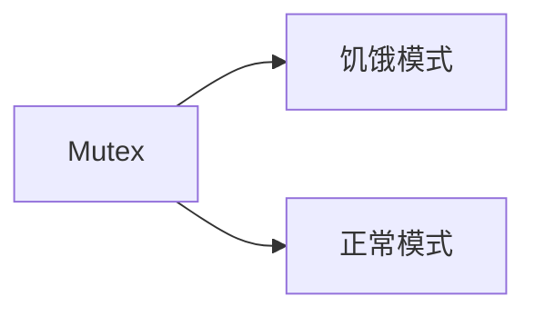

## 基本并发原语

### 互斥锁实现机制

共享资源在程序中的位置被称之为**临界区**，使用互斥锁可以限定临界区只能同时由一个线程所有。当临界区由一个线程持有的时候，其它线程如果想进入这个临界区，就会返回失败，或者是等待。直到持有的线程退出临界区，这些等待线程中的某一个才有机会接着持有这个临界区。

### 同步原语

同步原语就是解决并发问题的一个基础数据结构。

适用场景：

- 共享资源：并发地读写共享资源，会出现数据竞争（data race）的问题，所以需要 Mutex、RWMutex 这样的并发原语来保护。
- 任务编排：需要 goroutine 按照一定的规律执行，而 goroutine 之间有相互等待或者依赖的顺序关系，我们常常使用 WaitGroup 或者 Channel 来实现。
- 消息传递：信息交流以及不同的 goroutine 之间的线程安全的数据交流，常常使用 Channel 来实现。

### Locker接口

在 Go 的标准库中，package sync 提供了锁相关的一系列同步原语，这个 package 还定义了一个 Locker 的接口，Mutex 就实现了这个接口。

Locker 的接口定义了锁同步原语的方法集：

```go
type Locker interface {
    Lock()
    Unlock()
}
```

但是实际工程中一般直接使用具体的同步原语，而不是接口。

### Mutex

Mutex是使用最广泛的同步原语。

**互斥锁 Mutex 就提供两个方法 Lock 和 Unlock：进入临界区之前调用 Lock 方法，退出临界区的时候调用 Unlock 方法**。

```go
  func(m *Mutex)Lock()
  func(m *Mutex)Unlock()
```

**当一个 goroutine 通过调用 Lock 方法获得了这个锁的拥有权后， 其它请求锁的 goroutine 就会阻塞在 Lock 方法的调用上，直到锁被释放并且自己获取到了这个锁的拥有权。**

#### 使用

##### 直接使用

```go
  mu.Lock()
  count++
  mu.Unlock()
```

Mutex 的零值是还没有 goroutine 等待的未加锁的状态，所以你不需要额外的初始化，直接声明变量（如 var mu sync.Mutex）即可。

##### 嵌入struct

```go
type Counter struct {
    mu    sync.Mutex
    Count uint64
}
```

在初始化嵌入的 struct 时，也不必初始化这个 Mutex 字段，不会因为没有初始化出现空指针或者是无法获取到锁的情况。

##### 嵌入字段

```go
func main() {
    var counter Counter
    var wg sync.WaitGroup
    wg.Add(10)
    for i := 0; i < 10; i++ {
        go func() {
            defer wg.Done()
            for j := 0; j < 100000; j++ {
                counter.Lock()
                counter.Count++
                counter.Unlock()
            }
        }()
    }
    wg.Wait()
    fmt.Println(counter.Count)
}

type Counter struct {
    sync.Mutex
    Count uint64
}
```

**如果嵌入的 struct 有多个字段，我们一般会把 Mutex 放在要控制的字段上面，然后使用空格把字段分隔开来。**即使你不这样做，代码也可以正常编译，只不过，用这种风格去写的话，逻辑会更清晰，也更易于维护。

甚至，你还可以**把获取锁、释放锁、计数加一的逻辑封装成一个方法**，对外不需要暴露锁等逻辑。

```go
func main() {
    // 封装好的计数器
    var counter Counter

    var wg sync.WaitGroup
    wg.Add(10)

    // 启动10个goroutine
    for i := 0; i < 10; i++ {
        go func() {
            defer wg.Done()
            // 执行10万次累加
            for j := 0; j < 100000; j++ {
                counter.Incr() // 受到锁保护的方法
            }
        }()
    }
    wg.Wait()
    fmt.Println(counter.Count())
}

// 线程安全的计数器类型
type Counter struct {
    CounterType int
    Name        string

    mu    sync.Mutex
    count uint64
}

// 加1的方法，内部使用互斥锁保护
func (c *Counter) Incr() {
    c.mu.Lock()
    c.count++
    c.mu.Unlock()
}

// 得到计数器的值，也需要锁保护
func (c *Counter) Count() uint64 {
    c.mu.Lock()
    defer c.mu.Unlock()
    return c.count
}
```

#### 实现

Mutex的实现从原本简单的设计逐渐变得精密，以下分阶段描述Mutex实现。


#####  初版

uss Cox 在 2008 年提交的第一版 Mutex中的实现方式：可以通过一个 flag 变量，标记当前的锁是否被某个 goroutine 持有。如果这个 flag 的值是 1，就代表锁已经被持有，那么，其它竞争的 goroutine 只能等待；如果这个 flag 的值是 0，就可以通过 CAS（compare-and-swap，或者 compare-and-set）将这个 flag 设置为 1，标识锁被当前的这个 goroutine 持有了。

```go
   // CAS操作，当时还没有抽象出atomic包
    func cas(val *int32, old, new int32) bool
    func semacquire(*int32)
    func semrelease(*int32)
    // 互斥锁的结构，包含两个字段
    type Mutex struct {
        key  int32 // 锁是否被持有的标识
        sema int32 // 信号量专用，用以阻塞/唤醒goroutine
    }
    
    // 保证成功在val上增加delta的值
    func xadd(val *int32, delta int32) (new int32) {
        for {
            v := *val
            if cas(val, v, v+delta) {
                return v + delta
            }
        }
        panic("unreached")
    }
    
    // 请求锁
    func (m *Mutex) Lock() {
        if xadd(&m.key, 1) == 1 { //标识加1，如果等于1，成功获取到锁
            return
        }
        semacquire(&m.sema) // 否则阻塞等待
    }
    
    func (m *Mutex) Unlock() {
        if xadd(&m.key, -1) == 0 { // 将标识减去1，如果等于0，则没有其它等待者
            return
        }
        semrelease(&m.sema) // 唤醒其它阻塞的goroutine
    }    
```

CAS需要有3个操作数：内存地址V，旧的预期值A，即将要更新的目标值B。CAS 指令将**给定的值**和**一个内存地址中的值**进行比较，如果它们是同一个值，就使用新值替换内存地址中的值，这个操作是原子性的。

**原子性保证这个指令总是基于最新的值进行计算，如果同时有其它线程已经修改了这个值，那么，CAS 会返回失败**。


调用 Lock 请求锁的时候，通过 xadd 方法进行 CAS 操作（第 24 行），xadd 方法通过循环执行 CAS 操作直到成功，保证对 key 加 1 的操作成功完成。如果比较幸运，锁没有被别的 goroutine 持有，那么，Lock 方法成功地将 key 设置为 1，这个 goroutine 就持有了这个锁；如果锁已经被别的 goroutine 持有了，那么，当前的 goroutine 会把 key 加 1，而且还会调用 semacquire 方法（第 27 行），使用信号量将自己休眠，等锁释放的时候，信号量会将它唤醒。

持有锁的 goroutine 调用 Unlock 释放锁时，它会将 key 减 1（第 31 行）。如果当前没有其它等待这个锁的 goroutine，这个方法就返回了。但是，如果还有等待此锁的其它 goroutine，那么，它会调用 semrelease 方法（第 34 行），利用信号量唤醒等待锁的其它 goroutine 中的一个。

初版的 Mutex 利用 CAS 原子操作，对 key 这个标志量进行设置。key 不仅仅标识了锁是否被 goroutine 所持有，还记录了当前持有和等待获取锁的 goroutine 的数量。

**Unlock 方法可以被任意的 goroutine 调用释放锁，即使是没持有这个互斥锁的 goroutine，也可以进行这个操作。这是因为，Mutex 本身并没有包含持有这把锁的 goroutine 的信息，所以，Unlock 也不会对此进行检查。Mutex 的这个设计一直保持至今。**

所以，**在使用 Mutex 的时候，必须要保证 goroutine 尽可能不去释放自己未持有的锁**，一定要遵循“**谁申请，谁释放**”的原则。在真实的实践中，我们使用互斥锁的时候，很少在一个方法中单独申请锁，而在另外一个方法中单独释放锁，一般都会在同一个方法中获取锁和释放锁。

推荐写法

```go
func (f *Foo) Bar() {
    f.mu.Lock()
    defer f.mu.Unlock()

    if f.count < 1000 {
        f.count += 3
        return
    }

    f.count++
    return
}
```

如果临界区只是方法中的一部分，为了尽快释放锁，还是应该第一时间调用 Unlock，而不是一直等到方法返回时才释放。

但是，初版的 Mutex 实现有一个问题：请求锁的 goroutine 会排队等待获取互斥锁。虽然这貌似很公平，但是从性能上来看，却不是最优的。因为如果我们能够把锁交给正在占用 CPU 时间片的 goroutine 的话，那就不需要做上下文的切换，在高并发的情况下，可能会有更好的性能。因此进入下一个阶段：给新人机会。

##### 给新人机会

Go 开发者在 2011 年 6 月 30 日的 commit 中对 Mutex 做了一次大的调整，调整后的 Mutex 实现如下：

```go
   type Mutex struct {
        state int32
        sema  uint32
    }

    const (
        mutexLocked = 1 << iota // mutex is locked
        mutexWoken
        mutexWaiterShift = iota
    )
```

其中state字段是一个复合字段，一个字段包含多个意义，这样可以通过尽可能少的内存来实现互斥锁。这个字段的第一位（最小的一位）来表示这个锁是否被持有，第二位代表是否有唤醒的 goroutine，剩余的位数代表的是等待此锁的 goroutine 数。所以，state 这一个字段被分成了三部分，代表三个数据。


```go
   func (m *Mutex) Lock() {
        // Fast path: 幸运case，能够直接获取到锁
        if atomic.CompareAndSwapInt32(&m.state, 0, mutexLocked) {
            return
        }

        awoke := false
        for {
            old := m.state
            new := old | mutexLocked // 新状态加锁
            if old&mutexLocked != 0 {
                new = old + 1<<mutexWaiterShift //等待者数量加一
            }
            if awoke {
                // goroutine是被唤醒的，
                // 新状态清除唤醒标志
                new &^= mutexWoken
            }
            if atomic.CompareAndSwapInt32(&m.state, old, new) {//设置新状态
                if old&mutexLocked == 0 { // 锁原状态未加锁
                    break
                }
                runtime.Semacquire(&m.sema) // 请求信号量
                awoke = true
            }
        }
    }
```

首先是通过 CAS 检测 state 字段中的标志（第 3 行），如果没有 goroutine 持有锁，也没有等待持有锁的 gorutine，那么，当前的 goroutine 就很幸运，可以直接获得锁，这也是注释中的 Fast path 的意思。

如果不够幸运，state 不是零值，那么就通过一个循环进行检查。接下来的第 7 行到第 26 行这段代码虽然只有几行，但是理解起来却要费一番功夫，因为涉及到对 state 不同标志位的操作。这里的位操作以及操作后的结果和数值比较，并没有明确的解释，有时候你需要根据后续的处理进行推断。所以说，如果你充分理解了这段代码，那么对最新版的 Mutex 也会比较容易掌握了，因为你已经清楚了这些位操作的含义。

我们先前知道，如果想要获取锁的 goroutine 没有机会获取到锁，就会进行休眠，但是在锁释放唤醒之后，它并不能像先前一样直接获取到锁，还是要和正在请求锁的 goroutine 进行竞争。这会给后来请求锁的 goroutine 一个机会，也让 CPU 中正在执行的 goroutine 有更多的机会获取到锁，在一定程度上提高了程序的性能。

for 循环是不断尝试获取锁，如果获取不到，就通过 runtime.Semacquire(&m.sema) 休眠，休眠醒来之后 awoke 置为 true，尝试争抢锁。

代码中的第 10 行将当前的 flag 设置为加锁状态，如果能成功地通过 CAS 把这个新值赋予 state（第 19 行和第 20 行），就代表抢夺锁的操作成功了。

不过，需要注意的是，如果成功地设置了 state 的值，但是之前的 state 是有锁的状态，那么，state 只是清除 mutexWoken 标志或者增加一个 waiter 而已。

请求锁的 goroutine 有两类，一类是新来请求锁的 goroutine，另一类是被唤醒的等待请求锁的 goroutine。锁的状态也有两种：加锁和未加锁。我用一张表格，来说明一下 goroutine 不同来源不同状态下的处理逻辑。


上述是Lock操作，以下是Unlock操作：

```go
   func (m *Mutex) Unlock() {
        // Fast path: drop lock bit.
        new := atomic.AddInt32(&m.state, -mutexLocked) //去掉锁标志
        if (new+mutexLocked)&mutexLocked == 0 { //本来就没有加锁
            panic("sync: unlock of unlocked mutex")
        }
    
        old := new
        for {
            if old>>mutexWaiterShift == 0 || old&(mutexLocked|mutexWoken) != 0 { // 没有等待者，或者有唤醒的waiter，或者锁原来已加锁
                return
            }
            new = (old - 1<<mutexWaiterShift) | mutexWoken // 新状态，准备唤醒goroutine，并设置唤醒标志
            if atomic.CompareAndSwapInt32(&m.state, old, new) {
                runtime.Semrelease(&m.sema)
                return
            }
            old = m.state
        }
    }
```

第 3 行是尝试将持有锁的标识设置为未加锁的状态，这是通过减 1 而不是将标志位置零的方式实现。第 4 到 6 行还会检测原来锁的状态是否已经未加锁的状态，如果是 Unlock 一个未加锁的 Mutex 会直接 panic。

不过，即使将加锁置为未加锁的状态，这个方法也不能直接返回，还需要一些额外的操作，因为还可能有一些等待这个锁的 goroutine（有时候我也把它们称之为 waiter）需要通过信号量的方式唤醒它们中的一个。所以接下来的逻辑有两种情况。

第一种情况，如果没有其它的 waiter，说明对这个锁的竞争的 goroutine 只有一个，那就可以直接返回了；如果这个时候有唤醒的 goroutine，或者是又被别人加了锁，那么，无需我们操劳，其它 goroutine 自己干得都很好，当前的这个 goroutine 就可以放心返回了。

第二种情况，如果有等待者，并且没有唤醒的 waiter，那就需要唤醒一个等待的 waiter。在唤醒之前，需要将 waiter 数量减 1，并且将 mutexWoken 标志设置上，这样，Unlock 就可以返回了。

**这次的改动主要就是，新来的 goroutine 也有机会先获取到锁，甚至一个 goroutine 可能连续获取到锁，打破了先来先得的逻辑**

##### 多给些机会

首先介绍下什么是`自旋锁`

自旋锁是指当一个线程在获取锁的时候，如果锁已经被其他线程获取，那么该线程将循环等待，然后不断地判断是否能够被成功获取，知直到获取到锁才会退出循环。

获取锁的线程一直处于活跃状态，但是并没有执行任何有效的任务，使用这种锁会造成**busy-waiting**。

它是为实现保护共享资源而提出的一种锁机制。其实，自旋锁与互斥锁比较类似，它们都是为了解决某项资源的互斥使用。无论是互斥锁，还是自旋锁，在任何时刻，最多只能由一个保持者，也就说，在任何时刻最多只能有一个执行单元获得锁。但是两者在调度机制上略有不同。对于互斥锁，如果资源已经被占用，资源申请者只能进入睡眠状态。但是自旋锁不会引起调用者睡眠，如果自旋锁已经被别的执行单元保持，调用者就一直循环在那里看是否该自旋锁的保持者已经释放了锁，“自旋”一词就是因此而得名[^3]。

在 2015 年 2 月的改动中，如果新来的 goroutine 或者是被唤醒的 goroutine 首次获取不到锁，它们就会通过自旋（spin，通过循环不断尝试，spin 的逻辑是在[runtime](https://github.com/golang/go/blob/846dce9d05f19a1f53465e62a304dea21b99f910/src/runtime/proc.go#L5580)实现的）的方式，尝试检查锁是否被释放。在尝试一定的自旋次数后，再执行原来的逻辑。

```go
   func (m *Mutex) Lock() {
        // Fast path: 幸运之路，正好获取到锁
        if atomic.CompareAndSwapInt32(&m.state, 0, mutexLocked) {
            return
        }

        awoke := false
        iter := 0
        for { // 不管是新来的请求锁的goroutine, 还是被唤醒的goroutine，都不断尝试请求锁
            old := m.state // 先保存当前锁的状态
            new := old | mutexLocked // 新状态设置加锁标志
            if old&mutexLocked != 0 { // 锁还没被释放
                if runtime_canSpin(iter) { // 还可以自旋
                    if !awoke && old&mutexWoken == 0 && old>>mutexWaiterShift != 0 &&
                        atomic.CompareAndSwapInt32(&m.state, old, old|mutexWoken) {
                        awoke = true
                    }
                    runtime_doSpin()
                    iter++
                    continue // 自旋，再次尝试请求锁
                }
                new = old + 1<<mutexWaiterShift
            }
            if awoke { // 唤醒状态
                if new&mutexWoken == 0 {
                    panic("sync: inconsistent mutex state")
                }
                new &^= mutexWoken // 新状态清除唤醒标记
            }
            if atomic.CompareAndSwapInt32(&m.state, old, new) {
                if old&mutexLocked == 0 { // 旧状态锁已释放，新状态成功持有了锁，直接返回
                    break
                }
                runtime_Semacquire(&m.sema) // 阻塞等待
                awoke = true // 被唤醒
                iter = 0
            }
        }
    }
```

这次的优化，增加了第 13 行到 21 行、第 25 行到第 27 行以及第 36 行。我来解释一下主要的逻辑，也就是第 13 行到 21 行。

如果可以 spin 的话，第 9 行的 for 循环会重新检查锁是否释放。对于临界区代码执行非常短的场景来说，这是一个非常好的优化。因为临界区的代码耗时很短，锁很快就能释放，而抢夺锁的 goroutine 不用通过休眠唤醒方式等待调度，直接 spin 几次，可能就获得了锁。

##### 解决饥饿

在之前的改进中，新来的goroutine也可以直接参与竞争，这可能导致一种极端情况的发生，就是等待中的goroutine一直获取不到锁。这就是饥饿问题。

Mutex 不能容忍这种事情发生。所以，2016 年 Go 1.9 中 Mutex 增加了饥饿模式，让锁变得更公平，不公平的等待时间限制在 1 毫秒，并且修复了一个大 Bug：总是把唤醒的 goroutine 放在等待队列的尾部，会导致更加不公平的等待时间。

之后，2018 年，Go 开发者将 fast path 和 slow path 拆成独立的方法，以便内联，提高性能。2019 年也有一个 Mutex 的优化，虽然没有对 Mutex 做修改，但是，对于 Mutex 唤醒后持有锁的那个 waiter，调度器可以有更高的优先级去执行，这已经是很细致的性能优化了。

现在的Mutex已经变得相当复杂了，**Mutex 绝不容忍一个 goroutine 被落下，永远没有机会获取锁。不抛弃不放弃是它的宗旨，而且它也尽可能地让等待较长的 goroutine 更有机会获取到锁**。

以下给出现在state字段的设计示意图：


```go
   type Mutex struct {
        state int32
        sema  uint32
    }
    
    const (
        mutexLocked = 1 << iota // mutex is locked
        mutexWoken
        mutexStarving // 从state字段中分出一个饥饿标记
        mutexWaiterShift = iota
    
        starvationThresholdNs = 1e6 //饥饿模式的最大等待时间阈值设置成了 1 毫秒
    )
    
    func (m *Mutex) Lock() {
        // Fast path: 幸运之路，一下就获取到了锁
        if atomic.CompareAndSwapInt32(&m.state, 0, mutexLocked) {
            return
        }
        // Slow path：缓慢之路，尝试自旋竞争或饥饿状态下饥饿goroutine竞争
        m.lockSlow()
    }
    
    func (m *Mutex) lockSlow() {
        var waitStartTime int64
        starving := false // 此goroutine的饥饿标记
        awoke := false // 唤醒标记
        iter := 0 // 自旋次数
        old := m.state // 当前的锁的状态
        for {
            // 锁是非饥饿状态，锁还没被释放，尝试自旋
            if old&(mutexLocked|mutexStarving) == mutexLocked && runtime_canSpin(iter) {
                if !awoke && old&mutexWoken == 0 && old>>mutexWaiterShift != 0 &&
                    atomic.CompareAndSwapInt32(&m.state, old, old|mutexWoken) {
                    awoke = true
                }
                runtime_doSpin()
                iter++
                old = m.state // 再次获取锁的状态，之后会检查是否锁被释放了
                continue
            }
            new := old
            if old&mutexStarving == 0 {
                new |= mutexLocked // 非饥饿状态，加锁
            }
            if old&(mutexLocked|mutexStarving) != 0 {
                new += 1 << mutexWaiterShift // waiter数量加1
            }
            if starving && old&mutexLocked != 0 {
                new |= mutexStarving // 设置饥饿状态
            }
            if awoke {
                if new&mutexWoken == 0 {
                    throw("sync: inconsistent mutex state")
                }
                new &^= mutexWoken // 新状态清除唤醒标记
            }
            // 成功设置新状态
            if atomic.CompareAndSwapInt32(&m.state, old, new) {
                // 原来锁的状态已释放，并且不是饥饿状态，正常请求到了锁，返回
                if old&(mutexLocked|mutexStarving) == 0 {
                    break // locked the mutex with CAS
                }
                // 处理饥饿状态

                // 如果以前就在队列里面，加入到队列头
                queueLifo := waitStartTime != 0
                if waitStartTime == 0 {
                    waitStartTime = runtime_nanotime()
                }
                // 阻塞等待
                runtime_SemacquireMutex(&m.sema, queueLifo, 1)
                // 唤醒之后检查锁是否应该处于饥饿状态
                starving = starving || runtime_nanotime()-waitStartTime > starvationThresholdNs
                old = m.state
                // 如果锁已经处于饥饿状态，直接抢到锁，返回
                if old&mutexStarving != 0 {
                    if old&(mutexLocked|mutexWoken) != 0 || old>>mutexWaiterShift == 0 {
                        throw("sync: inconsistent mutex state")
                    }
                    // 有点绕，加锁并且将waiter数减1
                    delta := int32(mutexLocked - 1<<mutexWaiterShift)
                    if !starving || old>>mutexWaiterShift == 1 {
                        delta -= mutexStarving // 最后一个waiter或者已经不饥饿了，清除饥饿标记
                    }
                    atomic.AddInt32(&m.state, delta)
                    break
                }
                awoke = true
                iter = 0
            } else {
                old = m.state
            }
        }
    }
    
    func (m *Mutex) Unlock() {
        // Fast path: drop lock bit.
        new := atomic.AddInt32(&m.state, -mutexLocked)
        if new != 0 {
            m.unlockSlow(new)
        }
    }
    
    func (m *Mutex) unlockSlow(new int32) {
        if (new+mutexLocked)&mutexLocked == 0 {
            throw("sync: unlock of unlocked mutex")
        }
        if new&mutexStarving == 0 {
            old := new
            for {
                if old>>mutexWaiterShift == 0 || old&(mutexLocked|mutexWoken|mutexStarving) != 0 {
                    return
                }
                new = (old - 1<<mutexWaiterShift) | mutexWoken
                if atomic.CompareAndSwapInt32(&m.state, old, new) {
                    runtime_Semrelease(&m.sema, false, 1)
                    return
                }
                old = m.state
            }
        } else {
            runtime_Semrelease(&m.sema, true, 1)
        }
    }
```

当超过饥饿模式的最大等待时间阈值，优先让等待goroutine获得锁。通过加入饥饿模式，可以避免把机会全都留给新来的 goroutine，保证了请求锁的 goroutine 获取锁的公平性，对于我们使用锁的业务代码来说，不会有业务一直等待锁不被处理。

### 饥饿模式和正常模式




## 原子操作

## Channel

## 拓展并发原语

## 分布式并发原语

## Tip

### race detector

[race detector](https://go.dev/blog/race-detector)：一个检测并发访问资源是否有资源共享问题。[Go race detector](https://github.com/google/sanitizers) 是基于 Google 的 C/C++ sanitizers 技术实现的，编译器通过探测所有的内存访问，加入代码能监视对这些内存地址的访问（读还是写）。在代码运行的时候，race detector 就能监控到对共享变量的非同步访问，出现 race 的时候，就会打印出警告信息。

使用方式只需要在命令行参数后面加上`-race`即可。

缺点：

- 因为它的实现方式，**只能通过真正对实际地址进行读写访问的时候才能探测**，所以它并不能在编译的时候发现 data race 的问题。而且，在运行的时候，只有在触发了 data race 之后，才能检测到，如果碰巧没有触发是检测不出来的。
- 最好别部署到线上，影响性能。

### goroutine等待机制

等待的goroutine们是以FIFO排队的

- 当Mutex处于正常模式时，若此时没有新goroutine与队头goroutine竞争，则队头goroutine获得。若有新goroutine竞争大概率新goroutine获得。

- 当队头goroutine竞争锁失败1ms后，它会将Mutex调整为饥饿模式。进入饥饿模式后，锁的所有权会直接从解锁goroutine移交给队头goroutine，此时新来的goroutine直接放入队尾。

- 当一个goroutine获取锁后，如果发现自己满足下列条件中的任何一个

  1. 它是队列中最后一个

  2. 它等待锁的时间少于1ms，

     则将锁切换回正常模式

参考[mutex代码实现中的注释](https://go.dev/src/sync/mutex.go)。


## 参考文献

1. 极客时间，[Go并发变成实战课](https://time.geekbang.org/column/intro/100061801)

2. [Go源码](https://go.dev/src/)

3. [^3 ]:[golang 自旋锁](https://studygolang.com/articles/16480)
