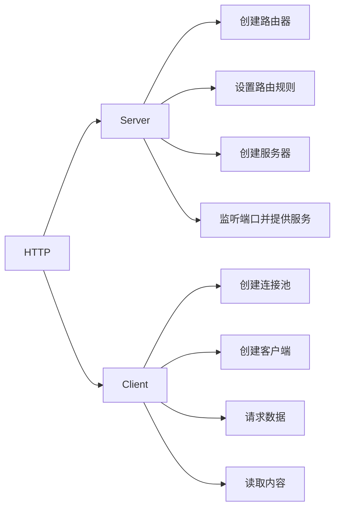

## 网络基础

### 协议模型


### TCP连接

**TCP的三次握手最主要目的是保证连接是双工的，可靠更多的是通过重传机制来保证。因为连接是全双工的，双方必须都收到对方的FIN包及确认才可关闭。**


MSL：Maximum Segment Lifetime,30秒到1分钟。

**TIME-WAIT等待2MSL是保证TCP协议的全双工连接能够可靠关闭。保证这次连接的重复数据段从网络中消失。**

大量出现close_wait的原因：

1. 一般出现在被动关闭方
2. 并发请求太多导致
3. 被动关闭方未及时释放端口资源导致

### TCP流量控制

由于通讯双方，网速不同。通讯方任一方发送过快都会导致对方消息处理不过来，所以就需要把数据放在缓冲区中。如果缓冲区满了，发送方还在发送，那接收方只能把数据包丢弃。因此需要控制发送速率。

缓冲区大小称之为接收端口，用变量win表示。如果win=0，则发送方停止发送。


### TCP拥塞控制

拥塞控制是调节网络的负载。接收方网络资源繁忙，因未及时响应ACK导致发送方重传大量数据，这样将会导致网络更加拥堵。**拥塞控制是动态调整win大小，不知是依赖缓冲区大小确定窗口大小**。

#### 慢开始和拥塞避免


#### 快速重传和快速恢复


### 粘包和拆包

发生的情况：

- 应用程序写入的数据大于套接字缓冲区大小，这将会发生拆包。
- 应用程序写入数据小于套接字缓冲区大小，网卡将应用多次写入的数据发送到网络上，这将会发生粘包。
- 进行MSS（最大报文长度）大小的TCP分段，当TCP报文长度-TCP头部长度>MSS的时候将会发生拆包。
- 接收方法不及时读取套接字缓冲区数据，这将发生粘包。

### 数据传输协议

- 使用带消息头的协议，头部写入包长度，然后再读取包内容
- 设置定长消息，每次读取定长内容，长度不够时空位补固定字段
- 设置消息边界，服务端从网络流中按消息边界分理出消息内容，一般使用`\n`
- 专有的协议：json，protobuf

## UDP创建过程

### Server

步骤：

1. 监听服务器
2. 循环读取消息（不创建socket）
3. 回复数据

### Client

步骤：

1. 连接服务器
2. 发送数据
3. 接收数据

## TCP创建过程

### Server

步骤：

1. 监听端口
2. 接受请求，创建套接字连接
3. 创建独立协程
4. 数据解码

### Client

步骤：

1. 连接服务器
2. 将信息写入套接字，数据编码

## HTTP创建过程




#### Server

主要结构体：

```go
type ServeMux struct {
	mu    sync.RWMutex
	m     map[string]muxEntry
	es    []muxEntry // slice of entries sorted from longest to shortest.
	hosts bool       // whether any patterns contain hostnames
}

type muxEntry struct {
	h       Handler
	pattern string
}

type Handler interface {
	ServeHTTP(ResponseWriter, *Request)
}
```

步骤：

1. 创建路由器 http.NewServeMux
2. 设置路由规则 http.HandleFunc->http.Handle
3. 创建服务器 http.Server
4. 监听端口并提供服务 http.Server.ListenAndServe->http.server.Serve->http.Accept()->http.newConn->go c.serve->mux.ServeHTTP0>mux.Handler(r)->mux.handler(r.host,r.URL.Path)->mux.match(path)->v,ok:=mux.m[path]

#### Client

主要结构体：
http.Client->Timeout && Transport
type RoundTripper interface

步骤：

1. 创建连接池 http.Transport
2. 创建客户端 http.Client
3. 请求数据 func(c *Client) Get(url string)->c.DO(req)->c.do(req)->c.send(req,deadline)->send(req,c.transport(),deadline)->resq,err=rt.RoundTrip(req)&&func(t *Transport)roundTrip(req *Request)
4. 读取数据

##### Transport

```go
type Transport struct {
	idleMu       sync.Mutex
	closeIdle    bool                                // user has requested to close all idle conns
	idleConn     map[connectMethodKey][]*persistConn // most recently used at end
	idleConnWait map[connectMethodKey]wantConnQueue  // waiting getConns
    ...
}

type connectMethodKey struct {
	proxy, scheme, addr string
	onlyH1              bool
}
```

##### persistConn

```go
type persistConn struct {
	br        *bufio.Reader       // from conn
	bw        *bufio.Writer       // to conn
	reqch     chan requestAndChan // written by roundTrip; read by readLoop
	writech   chan writeRequest   // written by roundTrip; read by writeLoop
	...
}
```

##### RoundTrip流程


#### 超时时间


```go
    // 创建连接池
	transport := &http.Transport{
		DialContext: (&net.Dialer{
			Timeout:   30 * time.Second, //连接超时
			KeepAlive: 30 * time.Second, //探活时间
		}).DialContext,
		MaxIdleConns:          100,              //最大空闲连接
		IdleConnTimeout:       90 * time.Second, //空闲超时时间
		TLSHandshakeTimeout:   10 * time.Second, //tls握手超时时间
		ExpectContinueTimeout: 1 * time.Second,  //100-continue状态码超时时间
	}
	// 创建客户端
	client := &http.Client{
		Timeout:   time.Second * 30, //请求超时时间
		Transport: transport,
	}
```


