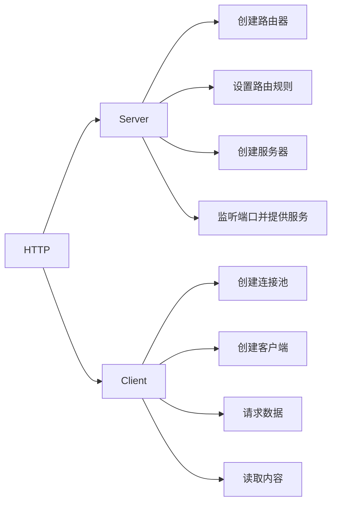

## 网络基础

### 协议模型


### TCP连接

**TCP的三次握手最主要目的是保证连接是双工的，可靠更多的是通过重传机制来保证。因为连接是全双工的，双方必须都收到对方的FIN包及确认才可关闭。**


MSL：Maximum Segment Lifetime,30秒到1分钟。

**TIME-WAIT等待2MSL是保证TCP协议的全双工连接能够可靠关闭。保证这次连接的重复数据段从网络中消失。**

大量出现close_wait的原因：

1. 一般出现在被动关闭方
2. 并发请求太多导致
3. 被动关闭方未及时释放端口资源导致

### TCP流量控制

由于通讯双方，网速不同。通讯方任一方发送过快都会导致对方消息处理不过来，所以就需要把数据放在缓冲区中。如果缓冲区满了，发送方还在发送，那接收方只能把数据包丢弃。因此需要控制发送速率。

缓冲区大小称之为接收端口，用变量win表示。如果win=0，则发送方停止发送。


### TCP拥塞控制

拥塞控制是调节网络的负载。接收方网络资源繁忙，因未及时响应ACK导致发送方重传大量数据，这样将会导致网络更加拥堵。**拥塞控制是动态调整win大小，不知是依赖缓冲区大小确定窗口大小**。

#### 慢开始和拥塞避免


#### 快速重传和快速恢复


### 粘包和拆包

发生的情况：

- 应用程序写入的数据大于套接字缓冲区大小，这将会发生拆包。
- 应用程序写入数据小于套接字缓冲区大小，网卡将应用多次写入的数据发送到网络上，这将会发生粘包。
- 进行MSS（最大报文长度）大小的TCP分段，当TCP报文长度-TCP头部长度>MSS的时候将会发生拆包。
- 接收方法不及时读取套接字缓冲区数据，这将发生粘包。

### 数据传输协议

- 使用带消息头的协议，头部写入包长度，然后再读取包内容
- 设置定长消息，每次读取定长内容，长度不够时空位补固定字段
- 设置消息边界，服务端从网络流中按消息边界分理出消息内容，一般使用`\n`
- 专有的协议：json，protobuf

### 网络代理和网络转发区别

- 网络代理
  - 用户不直接连接服务器，网络代理去连接。获取数据后返回给用户。
- 网络转发
  - 路由器对报文的转发操作，中间可能对数据包修改。

### 网络代理

#### 正向代理

是一种客户端的代理技术，帮助客户端访问无法访问的服务资源，可以隐藏用户真实IP。

#### 反向代理

是一种服务端的代理技术，帮助服务器做负载均衡、缓存、提供安全校验等，可以隐藏服务器真实IP。

## UDP创建过程

### Server

步骤：

1. 监听服务器
2. 循环读取消息（不创建socket）
3. 回复数据

### Client

步骤：

1. 连接服务器
2. 发送数据
3. 接收数据

## TCP创建过程

### Server

步骤：

1. 监听端口
2. 接受请求，创建套接字连接
3. 创建独立协程
4. 数据解码

### Client

步骤：

1. 连接服务器
2. 将信息写入套接字，数据编码

## HTTP创建过程




#### Server

主要结构体：

```go
type ServeMux struct {
	mu    sync.RWMutex
	m     map[string]muxEntry
	es    []muxEntry // slice of entries sorted from longest to shortest.
	hosts bool       // whether any patterns contain hostnames
}

type muxEntry struct {
	h       Handler
	pattern string
}

type Handler interface {
	ServeHTTP(ResponseWriter, *Request)
}
```

步骤：

1. 创建路由器 http.NewServeMux
2. 设置路由规则 http.HandleFunc->http.Handle
3. 创建服务器 http.Server
4. 监听端口并提供服务 http.Server.ListenAndServe->http.server.Serve->http.Accept()->http.newConn->go c.serve->mux.ServeHTTP0>mux.Handler(r)->mux.handler(r.host,r.URL.Path)->mux.match(path)->v,ok:=mux.m[path]

#### Client

主要结构体：
http.Client->Timeout && Transport
type RoundTripper interface

步骤：

1. 创建连接池 http.Transport
2. 创建客户端 http.Client
3. 请求数据 func(c *Client) Get(url string)->c.DO(req)->c.do(req)->c.send(req,deadline)->send(req,c.transport(),deadline)->resq,err=rt.RoundTrip(req)&&func(t *Transport)roundTrip(req *Request)
4. 读取数据

##### Transport

```go
type Transport struct {
	idleMu       sync.Mutex
	closeIdle    bool                                // user has requested to close all idle conns
	idleConn     map[connectMethodKey][]*persistConn // most recently used at end
	idleConnWait map[connectMethodKey]wantConnQueue  // waiting getConns
    ...
}

type connectMethodKey struct {
	proxy, scheme, addr string
	onlyH1              bool
}
```

##### persistConn

```go
type persistConn struct {
	br        *bufio.Reader       // from conn
	bw        *bufio.Writer       // to conn
	reqch     chan requestAndChan // written by roundTrip; read by readLoop
	writech   chan writeRequest   // written by roundTrip; read by writeLoop
	...
}
```

##### RoundTrip流程


#### 超时时间


```go
    // 创建连接池
	transport := &http.Transport{
		DialContext: (&net.Dialer{
			Timeout:   30 * time.Second, //连接超时
			KeepAlive: 30 * time.Second, //探活时间
		}).DialContext,
		MaxIdleConns:          100,              //最大空闲连接
		IdleConnTimeout:       90 * time.Second, //空闲超时时间
		TLSHandshakeTimeout:   10 * time.Second, //tls握手超时时间
		ExpectContinueTimeout: 1 * time.Second,  //100-continue状态码超时时间
	}
	// 创建客户端
	client := &http.Client{
		Timeout:   time.Second * 30, //请求超时时间
		Transport: transport,
	}
```

## 网络代理

网络代理 v.s 网络转发：

- 网络代理：用户不直接连接服务器，网络代理去连接。获取数据后返回给用户。
- 网络转发：是路由器对报文的转发操作，中间可能堆数据包修改。

### 正向代理

正向代理：是一种**客户端**的代理技术。帮助客户端访问无法访问的服务资源，可以隐藏用户真实IP。

1. 代理接收客户端请求，复制原请求对象，并根据数据配置新请求各种参数
2. 把新请求发送到真实服务端，并接收到服务器返回
3. 代理服务器相应做一些处理，然后返回给客户端

#### http代理

```go
import (
	"fmt"
	"io"
	"net"
	"net/http"
	"strings"
)

type Pxy struct{}

func (p *Pxy) ServeHTTP(rw http.ResponseWriter, req *http.Request) {
	fmt.Printf("Received request %s %s %s\n", req.Method, req.Host, req.RemoteAddr)
	transport := http.DefaultTransport
	// step 1，浅拷贝对象，然后就再新增属性数据
	outReq := new(http.Request)
	*outReq = *req
	if clientIP, _, err := net.SplitHostPort(req.RemoteAddr); err == nil {
		if prior, ok := outReq.Header["X-Forwarded-For"]; ok {
			clientIP = strings.Join(prior, ", ") + ", " + clientIP
		}
		outReq.Header.Set("X-Forwarded-For", clientIP)
	}
	
	// step 2, 请求下游
	res, err := transport.RoundTrip(outReq)
	if err != nil {
		rw.WriteHeader(http.StatusBadGateway)
		return
	}

	// step 3, 把下游请求内容返回给上游
	for key, value := range res.Header {
		for _, v := range value {
			rw.Header().Add(key, v)
		}
	}
	rw.WriteHeader(res.StatusCode)
	io.Copy(rw, res.Body)
	res.Body.Close()
}

func main() {
	fmt.Println("Serve on :8080")
	http.Handle("/", &Pxy{})
	http.ListenAndServe("0.0.0.0:8080", nil)
}
```

### 反向代理

反向代理：是一种**服务端**的代理技术，帮助服务器做负载均衡、缓存、提供安全校验等，可以隐藏服务器真实IP。

1. 代理接受客户端请求，更改请求结构体信息
2. 通过一定的负载均衡算法获取下游服务地址
3. 把请求发送给下游服务器，并获取返回内容
4. 堆返回内容做一些处理，然后返回给客户端

#### http代理

Go内置了`httputil.ReverseProxy`类型。内置`httputil.NewSingleHostReverseProxy`。可以按照其实现自己实现。

简单版：

```go
import (
	"bufio"
	"log"
	"net/http"
	"net/url"
)

var (
	proxy_addr = "http://127.0.0.1:2003"
	port       = "2002"
)

func handler(w http.ResponseWriter, r *http.Request) {
	//step 1 解析代理地址，并更改请求体的协议和主机
	proxy, err := url.Parse(proxy_addr)
	r.URL.Scheme = proxy.Scheme
	r.URL.Host = proxy.Host

	//step 2 请求下游
	transport := http.DefaultTransport
	resp, err := transport.RoundTrip(r)
	if err != nil {
		log.Print(err)
		return
	}

	//step 3 把下游请求内容返回给上游
	for k, vv := range resp.Header {
		for _, v := range vv {
			w.Header().Add(k, v)
		}
	}
	defer resp.Body.Close()
	bufio.NewReader(resp.Body).WriteTo(w)
}

func main() {
	http.HandleFunc("/", handler)
	log.Println("Start serving on port " + port)
	err := http.ListenAndServe(":"+port, nil)
	if err != nil {
		log.Fatal(err)
	}
}
```

##### ReverseProxy的特殊StatusCode

- 100：目前一切正常，客户端可以继续请求
  - 客户端Post的数据大于1024字节的时候
  - 客户端需要先发送一个请求，包含一个`Expect:100-continue`，询问服务端是否愿意接收数据
  - 接收到服务端返回的100-continue应答之后，返回100状态，把数据Post到服务端
  - 相关策略
    - 客户端策略
      - 如果客户端有 post 数据要上传，可以考虑使用 100-continue 协议。在请求头中加入 {“Expect”:”100-continue”}
      - 如果没有 post 数据，不能使用 100-continue 协议，因为这会让服务端造成误解。
      - 并不是所有的 Server 都会正确实现 100-continue 协议，如果 Client 发送 Expect:100-continue 消息后，在 timeout 时间内无响应，Client 需要立马上传 post 数据。
      - 有些 Server 会错误实现 100-continue 协议，在不需要此协议时返回 100，此时客户端应该忽略。
    - 服务端策略
      - 正确情况下，收到请求后，返回 100 或错误码。
      - 如果在发送 100-continue 前收到了 post 数据（客户端提前发送 post 数据），则不发送 100 响应码(略去)。
- 101：服务端发送给客户端升级协议的请求

##### ReverseProxy的特殊Header头

- 特殊Header头
  - X-Forwarded-For
    - 记录最后直连实际服务器之前的整个代理过程
    - 可能被伪造
  - X-Real-IP
    - 请求实际服务器的IP
    - 每过一层代理都会被覆盖掉，只需第一代理设置转发
  - Connection
  - TE
  - Trailer
- 第一代理除去标准的逐段传输头

##### Connection

- 标记请求发起方与第一代理的状态
- 决定当前事务完成后，是否会关闭网络
  - Connection：keep-alive 不关闭网络
  - Connection：close 关闭网络
  - Connection：upgrade 协议升级

##### TE

TE是requesy_header，表示希望使用的传输编码类型。

如：`TE:trailers,deflate;q=0.5`表示，期望在采用分块传输编码响应中接收挂载字段，zlib编码，0.5优先级排序。

##### Trailer

Trailer是response header，允许发送方在消息后面添加额外的元信息。

如：`Trailer:Expires`表示Expires将出现在分块信息的结尾。

##### 去除逐段传输头

代理过程中上述只发生在客户端和第一代理中。因此第一代理需要除去标准的逐段传输头（hop-by-hop）

- 逐段传输头都需要在Connection头中列出
- 第一代理必须处理它们且不转发
- 逐段传输头：`Keep-Alive,Transfer-Encoding,TE,Connection,Trailer,Upgrade,Proxy-Authorization,Proxy-Authenticate`

#### socks5代理

