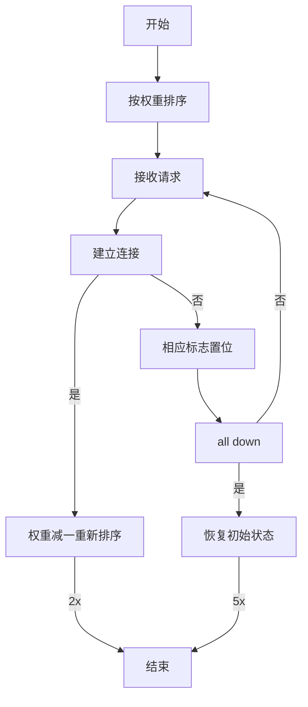
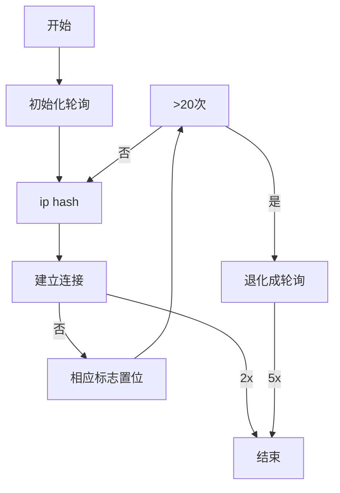

Nginx是一款轻量级的Web服务器、反向代理服务器，由于它的内存占用少，启动极快，高并发能力强，在互联网项目中广泛应用。

## 用途

### 反向代理

反向代理（Reverse Proxy）方式是指以代理服务器来接受Internet上的连接请求，然后将请求转发给内部网络上的服务器，并将从服务器上得到的结果返回给Internet上请求连接的客户端。简单来说就是真实的服务器不能直接被外部网络访问，想要访问必须通过代理。

### 动静分离

运用Nginx的反向代理功能分发请求：所有动态资源的请求交给应用服务器，而静态资源的请求（例如图片、视频、CSS、JavaScript文件等）则直接由Nginx返回到浏览器，这样能大大减轻应用服务器的压力。

### 负载均衡

当一台服务器的单位时间内的访问量越大时，服务器压力就越大，大到超过自身承受能力时，服务器就会崩溃。为了避免服务器崩溃，让用户有更好的体验，我们通过负载均衡的方式来分担服务器压力。我们可以建立很多很多服务器，组成一个服务器集群，当用户访问网站时，先访问一个中间服务器，再让这个中间服务器在服务器集群中选择一个压力较小的服务器，然后将该访问请求引入该服务器。如此以来，用户的每次访问，都会保证服务器集群中的每个服务器压力趋于平衡，分担了服务器压力，避免了服务器崩溃的情况。负载均衡配置一般都需要同时配置反向代理，通过反向代理跳转到负载均衡。

## 负载均衡

Nginx的负载均衡策略可以划分为两大类：内置策略和扩展策略。内置策略包含加权轮询和ip hash，在默认情况下这两种策略会编译进nginx内核，只需在nginx配置中指明参数即可。扩展策略有很多，如fair、通用hash、consistent hash等，默认不编译进nginx内核。

Nginx主要支持四种方式的分配：轮询、weight、ip_hash、fair（第三方）、url_hash（第三方）。

### 轮询（默认）

每个请求按时间顺序逐一分配到不同的后端服务器。如果后端服务器down掉，能自动剔除。

- 如果可以把加权轮询算法分为先深搜索和先广搜索，那么Nginx采用的是先深搜索算法，即将首先将请求都分给高权重的机器，直到该机器的权值降到了比其他机器低，才开始将请求分给下一个高权重的机器。
- 当所有后端机器都down掉时，nginx会立即将所有机器的标志位清成初始状态，以避免造成所有的机器都处在timeout的状态，从而导致整个前端被夯住。

### weight

指定轮询几率，weight和访问比率成正比，用于后端服务器性能不均的情况。

### ip_hash

每个请求按访问ip的hash结果分配，这样每个访客固定访问一个后端服务器，可以解决session的问题。

可以看到，hash值既与ip有关又与后端机器的数量有关。经测试，上述算法可以连续产生1045个互异的value，这是此算法硬限制。nginx使用了保护机制，当经过20次hash仍然找不到可用的机器时，算法退化成轮询。

因此，从本质上说，ip hash算法是一种变相的轮询算法，如果两个ip的初始hash值恰好相同，那么来自这两个ip的请求将永远落在同一台服务器上，这为均衡性埋下了较深隐患。

### fair

按后端服务器的响应时间来分配请求，响应时间短的优先分配。

fair策略是扩展策略，默认不被编译进nginx内核。它根据后端服务器的响应时间判断负载情况，从中选出负载最轻的机器进行分流。这种策略具有很强的自适应性，但是实际的网络环境往往不是那么简单，因此须慎用。

### url_hash

