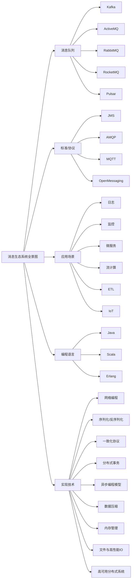

## 使用场景

消息队列是最古老的中间件之一，从系统之间有通信需求开始，就自然产生了消息队列。但是给消息队列下一个准确的定义却不太容易。我们知道，消息队列的主要功能就是收发消息，但是它的作用不仅仅只是解决应用之间的通信问题这么简单。以下介绍下消息队列的使用场景：

### 异步任务

将复杂的高并发任务拆分成了一个事务中最重要的部分，先返回给用户，并将后续数据传给消息队列，异步的进行后续的操作。在这个场景下，消息队列被用于实现服务的异步处理，其好处是：

- 用户可以更快的获取反馈
- 减少了等待时间，自然实现了步骤之间的并发，提高了系统总体的性能

当异步过程中判断超时，此时被后端处理的话并不会出现回滚的操作。遇到这种，往往是请求中带有时间戳参数，如果判断这个请求已经超时，则直接丢弃。

### 流量控制

一个设计健壮的程序有自我保护的能力，即应用应该在海量的请求下，在自身能力范围之内尽可能的处理请求，拒绝处理不了的请求保证自身的运行。往往**设计思路是使用消息队列隔离网关和后端服务，以达到流量控制和保护后端服务的目的。**

加入消息队列后，后端服务的处理流程变成：

1. 网关在收到用户的请求之后，将请求放入消息队列
2. 后端服务请求消息队列中的请求，完成相应的业务逻辑，返回结果

对于超时的请求可以选择直接丢弃，前端将超时无响应的请求自行进行处理。运维还可以在服务能力不足时水平扩展机器。这样设计的优点是能**根据下游的处理能力自动调节流量，达到“削峰填谷”**，但是这对导致**增加了系统调用环节，整体时延增加，而且服务从同步调用变成异步调用，增加了系统的复杂程度**。

#### 简单的流量控制方法

令牌桶+消息队列

令牌桶控制流量的原理是：单位时间内只发放固定数量的令牌到令牌桶中，规定服务在处理请求之前必须先从令牌桶中拿出一个令牌，如果令牌桶中没有令牌，则拒绝请求。这样就保证单位时间内，能处理的请求不超过发放令牌的数量，起到了流量控制的作用。

令牌桶可以简单地用一个有固定容量的消息队列加一个“令牌发生器”来实现：令牌发生器按照预估的处理能力，匀速生产令牌并放入令牌队列（如果队列满了则丢弃令牌），网关在收到请求时去令牌队列消费一个令牌，获取到令牌则继续调用后端服务，如果获取不到令牌则直接返回失败。

### 服务解耦

上游将生产的数据发送到指定主题的消息队列中，下游服务订阅这个主题，将上下游之间解耦。当上游服务的数据产出后，没有调用关系的下游服务们就可以并发的处理队列传来的数据，而不用在上游服务中同步调用下游的各项服务，这可以在下游服务有变化时，上游不用变更。

### 总结

除了上面三种场景之外，消息队列还被应用于：

- 作为发布/订阅系统实现一个微服务系统间的观察者模式
- 连接流计算任务和数据
- 用于将消息广播给大量接收者

## 技术选型

往往在选择消息队列的时候需要从以下几个角度进行考虑：

- 是否开源
- 必须是近年比较流行且有一定社区活跃度的产品
- 与周边生态系统有一个比较好的集成和兼容
- 消息的可靠传递：确保不丢消息
- Cluster：支持集群，确保不会因为某个节点宕机导致服务不可用，当然也不能丢消息
- 性能：具有足够的性能，能满足绝大多数场景的性能要求

### RabbitMQ

采用Erlang语言编写，它最早是为电信行业的可靠通信设计的，也是少数几个支持AMQP协议的消息队列之一。其特点是“轻量化、迅捷”，其相当轻量化的消息队列，非常容易部署和使用。

RabbitMQ支持非常灵活的路由配置，和其他消息队列不同的是：它在生产者和队列之间增加了一个Exchange模块。可以根据配置的路由规则来将生产者发出的消息分发到不同的队列中。路由的规则非常灵活，甚至支持自己实现路由规则。

RabbitMQ支持的编程语言最多。

接下来是RabbitMQ的一些问题：

- RabbitMQ对消息堆积的支持并不好。在它的设计理念里面，消息队列是一个管道，大量的消息积压是一种不正常的情况，应当尽量去避免。当大量消息积压的时候，会导致 RabbitMQ 的性能急剧下降。
- RabbitMQ 的性能是我们介绍的这几个消息队列中最差的，根据官方给出的测试数据综合我们日常使用的经验，依据硬件配置的不同，**它大概每秒钟可以处理几万到十几万条消息**。其实，这个性能也足够支撑绝大多数的应用场景了，不过，如果你的应用对消息队列的性能要求非常高，那不要选择 RabbitMQ。
- RabbitMQ 使用的编程语言 Erlang，这个编程语言不仅是非常小众的语言，更麻烦的是，这个语言的学习曲线非常陡峭。

### RocketMQ

RocketMQ 是阿里巴巴在 2012 年开源的消息队列产品，后来捐赠给 Apache 软件基金会，2017 正式毕业，成为 Apache 的顶级项目。阿里内部也是使用 RocketMQ 作为支撑其业务的消息队列，经历过多次“双十一”考验，它的性能、稳定性和可靠性都是值得信赖的。作为优秀的国产消息队列，近年来越来越多的被国内众多大厂使用。

RocketMQ 使用 Java 语言开发，它的贡献者大多数都是中国人，源代码相对也比较容易读懂，你很容易对 RocketMQ 进行扩展或者二次开发。

RocketMQ 对在线业务的响应时延做了很多的优化，大多数情况下可以做到毫秒级的响应，**如果你的应用场景很在意响应时延，那应该选择使用 RocketMQ。**

RocketMQ 的性能比 RabbitMQ 要高一个数量级，每秒钟大概能处理几十万条消息。

RocketMQ 的一个劣势是，作为国产的消息队列，相比国外的比较流行的同类产品，在国际上还没有那么流行，与周边生态系统的集成和兼容程度要略逊一筹。

### Kafka

Kafka 最早是由 LinkedIn 开发，目前也是 Apache 的顶级项目。Kafka 最初的设计目的是用于处理海量的日志。

在早期的版本中，为了获得极致的性能，在设计方面做了很多的牺牲，比如不保证消息的可靠性，可能会丢失消息，也不支持集群，功能上也比较简陋，这些牺牲对于处理海量日志这个特定的场景都是可以接受的。这个时期的 Kafka 甚至不能称之为一个合格的消息队列。

当下的 Kafka 已经发展为一个非常成熟的消息队列产品，无论在数据可靠性、稳定性和功能特性等方面都可以满足绝大多数场景的需求。

**Kafka 与周边生态系统的兼容性是最好的没有之一，尤其在大数据和流计算领域，几乎所有的相关开源软件系统都会优先支持 Kafka。**

Kafka 使用 Scala 和 Java 语言开发，设计上大量使用了批量和异步的思想，这种设计使得 Kafka 能做到超高的性能。**Kafka 的性能，尤其是异步收发的性能，是三者中最好的，但与 RocketMQ 并没有量级上的差异，大约每秒钟可以处理几十万条消息**。

但是 Kafka 这种异步批量的设计带来的问题是，它的同步收发消息的响应时延比较高，因为当客户端发送一条消息的时候，Kafka 并不会立即发送出去，而是要等一会儿攒一批再发送，在它的 Broker 中，很多地方都会使用这种“先攒一波再一起处理”的设计。当你的业务场景中，每秒钟消息数量没有那么多的时候，Kafka 的时延反而会比较高。所以，**Kafka 不太适合在线业务场景。**

### 其他

ActiveMQ：老牌MQ，性能不足，步入老年

ZeroMQ：一个基于消息队列的多线程网络库

Pulsar：采用存储和计算分离的新型MQ，使用的公司很多，可能是未来的方向

### 总结

如果说，消息队列并不是你将要构建系统的主角之一，你对消息队列功能和性能都没有很高的要求，只需要一个开箱即用易于维护的产品，我建议你使用 RabbitMQ。

如果你的系统使用消息队列主要场景是处理在线业务，比如在交易系统中用消息队列传递订单，那 RocketMQ 的低延迟和金融级的稳定性是你需要的。

如果你需要处理海量的消息，像收集日志、监控信息或是前端的埋点这类数据，或是你的应用场景大量使用了大数据、流计算相关的开源产品，那 Kafka 是最适合你的消息队列。

## 消息模型

### 队列模型

消息队列在早期就是队列的数据结构，生产者发消息就是入队，消费者收消息就是出队。

如果有多个生产者往同一个队列里面发送消息，这个队列中可以消费到的消息，就是这些生产者生产的所有消息的合集。消息的顺序就是这些生产者发送消息的自然顺序。如果有多个消费者接收同一个队列的消息，这些消费者之间实际上是竞争的关系，每个消费者只能收到队列中的一部分消息，也就是说任何一条消息只能被其中的一个消费者收到。

如果需要每一个消费者都能获得全量的信息，需要给每个消费者创建单独的队列，让生产者发送多份相同的数据。但这样违背了解耦的目的。因此演化出了下面的消息模型。

### 发布-订阅模型

在发布 - 订阅模型中，消息的发送方称为发布者（Publisher），消息的接收方称为订阅者（Subscriber），服务端存放消息的容器称为主题（Topic）。发布者将消息发送到主题中，订阅者在接收消息之前需要先“订阅主题”。“订阅”在这里既是一个动作，同时还可以认为是主题在消费时的一个逻辑副本，每份订阅中，订阅者都可以接收到主题的所有消息。

在消息队列很长的发展时间中，队列模型和发布-订阅模式相互并存。其实这两种模型的本质区别只是在于**一份数据能不能被消费多次的问题**。

### 增强的队列模型-RabbitMQ模型

RabbitMQ通过Exchange解决了传统队列模型中多次消费的问题。在原本的生产者与队列之间增加了Exchange模块，生产者将生产的数据给Exchange，Exchange依据配置的策略决定消息投递到哪些队列中。

如果同一份消息需要被多个消费者消费，则Exchange将消息发送到多个队列，每个队列中存放一份完整的数据信息。

### RocketMQ模型

RocketMQ采用标准的发布-订阅模型。但是不同的是，RocketMQ还有着一个队列的概念，这需要了解消息队列的消费机制。

几乎所有的消息队列产品都使用一种非常朴素的“请求 - 确认”机制，确保消息不会在传递过程中由于网络或服务器故障丢失。具体的做法也非常简单。在生产端，生产者先将消息发送给服务端，也就是 Broker，服务端在收到消息并将消息写入主题或者队列中后，会给生产者发送确认的响应。如果生产者没有收到服务端的确认或者收到失败的响应，则会重新发送消息；在消费端，消费者在收到消息并完成自己的消费业务逻辑（比如，将数据保存到数据库中）后，也会给服务端发送消费成功的确认，服务端只有收到消费确认后，才认为一条消息被成功消费，否则它会给消费者重新发送这条消息，直到收到对应的消费成功确认。

这种机制保证了消息传递过程的可靠性，但是这也导致了一个问题：为了保证消息的有序性，在某一条信息被成功消费之前，下一条消息不能被消费，否则会出现消息空洞，违背有序性。这导致消息队列在某一时刻至多能有一个消费者在消费，无法水平扩展消费者的数量。因此RocketMQ引入队列机制，即**通过每个主题维护多个队列的方式，通过这些队列实现多个实例并行生产和消费**。

**每个主题包含多个队列，通过多个队列来实现多实例并行生产和消费**。也就是说队列之间是无序的。需要注意的是，RocketMQ 只在队列上保证消息的有序性，主题层面是无法保证消息的严格顺序的。

RocketMQ中，订阅者的概念是通过消费组体现的。每个消费组都消费主题中的一份完成信息，不同消费组之间互不影响。

消费组中存在多个消费者，同一消费组中的消费者互为竞争关系。消息只能被其中一个消费者消费。

**大致逻辑是：生产者生产出消息，按照某种规则塞入队列中的一条队列。消息本身组合成不同的队列，队列中的消息有序，但是队列之间无序。每个队列上为每个消费组维护了一个消费位置，用来标记对应的消费组消费到了当前队列中的第几个消息，当前消费组每消费一条信息一次，消费位置向后移动一个。**

丢消息的原因大多是因为消费位置处理不当导致的。

### Kafka模型

Kafka采用的模型和RocketMQ一样，唯一的区别在于**RocketMQ中的队列的概念变成了分区**，含义和功能一样。Kafka和RocketMQ中模型的实现方式也是不一样的。

## 事务

消息队列中的“事务”，主要**解决的是消息生产者和消息消费者的数据完整性和一致性的问题**。

一个严格的事务实现需要具备四个属性：

- 原子性：一个事务操作不可分割
- 一致性：
- 隔离性
- 持久性

这四个属性称之为ACID特性。

## 参考资料

1. 极客时间，[消息队列高手课](https://time.geekbang.org/column/intro/100032301)
2. [RocketMQ 官方文档](https://rocketmq.apache.org/docs/quick-start/)
3. [Kafka 官方文档](http://kafka.apache.org/documentation/)
4. [RabbitMQ 官方文档](https://www.rabbitmq.com/documentation.html)
