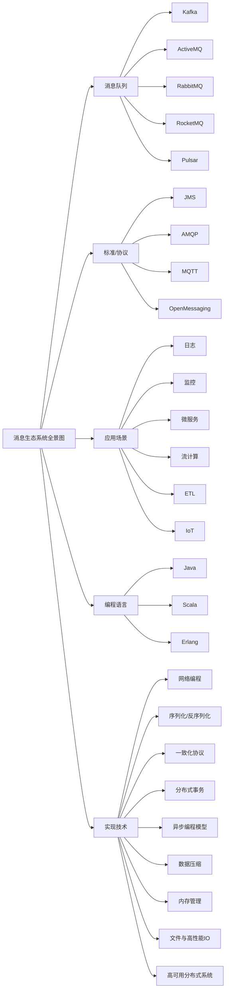

## 使用场景

消息队列是最古老的中间件之一，从系统之间有通信需求开始，就自然产生了消息队列。但是给消息队列下一个准确的定义却不太容易。我们知道，消息队列的主要功能就是收发消息，但是它的作用不仅仅只是解决应用之间的通信问题这么简单。以下介绍下消息队列的使用场景：

### 异步任务

将复杂的高并发任务拆分成了一个事务中最重要的部分，先返回给用户，并将后续数据传给消息队列，异步的进行后续的操作。在这个场景下，消息队列被用于实现服务的异步处理，其好处是：

- 用户可以更快的获取反馈
- 减少了等待时间，自然实现了步骤之间的并发，提高了系统总体的性能

当异步过程中判断超时，此时被后端处理的话并不会出现回滚的操作。遇到这种，往往是请求中带有时间戳参数，如果判断这个请求已经超时，则直接丢弃。

### 流量控制

一个设计健壮的程序有自我保护的能力，即应用应该在海量的请求下，在自身能力范围之内尽可能的处理请求，拒绝处理不了的请求保证自身的运行。往往**设计思路是使用消息队列隔离网关和后端服务，以达到流量控制和保护后端服务的目的。**

加入消息队列后，后端服务的处理流程变成：

1. 网关在收到用户的请求之后，将请求放入消息队列
2. 后端服务请求消息队列中的请求，完成相应的业务逻辑，返回结果

对于超时的请求可以选择直接丢弃，前端将超时无响应的请求自行进行处理。运维还可以在服务能力不足时水平扩展机器。这样设计的优点是能**根据下游的处理能力自动调节流量，达到“削峰填谷”**，但是这对导致**增加了系统调用环节，整体时延增加，而且服务从同步调用变成异步调用，增加了系统的复杂程度**。

#### 简单的流量控制方法

令牌桶+消息队列

令牌桶控制流量的原理是：单位时间内只发放固定数量的令牌到令牌桶中，规定服务在处理请求之前必须先从令牌桶中拿出一个令牌，如果令牌桶中没有令牌，则拒绝请求。这样就保证单位时间内，能处理的请求不超过发放令牌的数量，起到了流量控制的作用。

令牌桶可以简单地用一个有固定容量的消息队列加一个“令牌发生器”来实现：令牌发生器按照预估的处理能力，匀速生产令牌并放入令牌队列（如果队列满了则丢弃令牌），网关在收到请求时去令牌队列消费一个令牌，获取到令牌则继续调用后端服务，如果获取不到令牌则直接返回失败。

### 服务解耦

上游将生产的数据发送到指定主题的消息队列中，下游服务订阅这个主题，将上下游之间解耦。当上游服务的数据产出后，没有调用关系的下游服务们就可以并发的处理队列传来的数据，而不用在上游服务中同步调用下游的各项服务，这可以在下游服务有变化时，上游不用变更。

### 总结

除了上面三种场景之外，消息队列还被应用于：

- 作为发布/订阅系统实现一个微服务系统间的观察者模式
- 连接流计算任务和数据
- 用于将消息广播给大量接收者

## 技术选型

往往在选择消息队列的时候需要从以下几个角度进行考虑：

- 是否开源
- 必须是近年比较流行且有一定社区活跃度的产品
- 与周边生态系统有一个比较好的集成和兼容
- 消息的可靠传递：确保不丢消息
- Cluster：支持集群，确保不会因为某个节点宕机导致服务不可用，当然也不能丢消息
- 性能：具有足够的性能，能满足绝大多数场景的性能要求

### RabbitMQ

采用Erlang语言编写，它最早是为电信行业的可靠通信设计的，也是少数几个支持AMQP协议的消息队列之一。其特点是“轻量化、迅捷”，其相当轻量化的消息队列，非常容易部署和使用。

RabbitMQ支持非常灵活的路由配置，和其他消息队列不同的是：它在生产者和队列之间增加了一个Exchange模块。可以根据配置的路由规则来将生产者发出的消息分发到不同的队列中。路由的规则非常灵活，甚至支持自己实现路由规则。

RabbitMQ支持的编程语言最多。

接下来是RabbitMQ的一些问题：

- RabbitMQ对消息堆积的支持并不好。在它的设计理念里面，消息队列是一个管道，大量的消息积压是一种不正常的情况，应当尽量去避免。当大量消息积压的时候，会导致 RabbitMQ 的性能急剧下降。
- RabbitMQ 的性能是我们介绍的这几个消息队列中最差的，根据官方给出的测试数据综合我们日常使用的经验，依据硬件配置的不同，**它大概每秒钟可以处理几万到十几万条消息**。其实，这个性能也足够支撑绝大多数的应用场景了，不过，如果你的应用对消息队列的性能要求非常高，那不要选择 RabbitMQ。
- RabbitMQ 使用的编程语言 Erlang，这个编程语言不仅是非常小众的语言，更麻烦的是，这个语言的学习曲线非常陡峭。

### RocketMQ

RocketMQ 是阿里巴巴在 2012 年开源的消息队列产品，后来捐赠给 Apache 软件基金会，2017 正式毕业，成为 Apache 的顶级项目。阿里内部也是使用 RocketMQ 作为支撑其业务的消息队列，经历过多次“双十一”考验，它的性能、稳定性和可靠性都是值得信赖的。作为优秀的国产消息队列，近年来越来越多的被国内众多大厂使用。

RocketMQ 使用 Java 语言开发，它的贡献者大多数都是中国人，源代码相对也比较容易读懂，你很容易对 RocketMQ 进行扩展或者二次开发。

RocketMQ 对在线业务的响应时延做了很多的优化，大多数情况下可以做到毫秒级的响应，**如果你的应用场景很在意响应时延，那应该选择使用 RocketMQ。**

RocketMQ 的性能比 RabbitMQ 要高一个数量级，每秒钟大概能处理几十万条消息。

RocketMQ 的一个劣势是，作为国产的消息队列，相比国外的比较流行的同类产品，在国际上还没有那么流行，与周边生态系统的集成和兼容程度要略逊一筹。

### Kafka

Kafka 最早是由 LinkedIn 开发，目前也是 Apache 的顶级项目。Kafka 最初的设计目的是用于处理海量的日志。

在早期的版本中，为了获得极致的性能，在设计方面做了很多的牺牲，比如不保证消息的可靠性，可能会丢失消息，也不支持集群，功能上也比较简陋，这些牺牲对于处理海量日志这个特定的场景都是可以接受的。这个时期的 Kafka 甚至不能称之为一个合格的消息队列。

当下的 Kafka 已经发展为一个非常成熟的消息队列产品，无论在数据可靠性、稳定性和功能特性等方面都可以满足绝大多数场景的需求。

**Kafka 与周边生态系统的兼容性是最好的没有之一，尤其在大数据和流计算领域，几乎所有的相关开源软件系统都会优先支持 Kafka。**

Kafka 使用 Scala 和 Java 语言开发，设计上大量使用了批量和异步的思想，这种设计使得 Kafka 能做到超高的性能。**Kafka 的性能，尤其是异步收发的性能，是三者中最好的，但与 RocketMQ 并没有量级上的差异，大约每秒钟可以处理几十万条消息**。

但是 Kafka 这种异步批量的设计带来的问题是，它的同步收发消息的响应时延比较高，因为当客户端发送一条消息的时候，Kafka 并不会立即发送出去，而是要等一会儿攒一批再发送，在它的 Broker 中，很多地方都会使用这种“先攒一波再一起处理”的设计。当你的业务场景中，每秒钟消息数量没有那么多的时候，Kafka 的时延反而会比较高。所以，**Kafka 不太适合在线业务场景。**

### 其他

ActiveMQ：老牌MQ，性能不足，步入老年

ZeroMQ：一个基于消息队列的多线程网络库

Pulsar：采用存储和计算分离的新型MQ，使用的公司很多，可能是未来的方向

### 总结

如果说，消息队列并不是你将要构建系统的主角之一，你对消息队列功能和性能都没有很高的要求，只需要一个开箱即用易于维护的产品，我建议你使用 RabbitMQ。

如果你的系统使用消息队列主要场景是处理在线业务，比如在交易系统中用消息队列传递订单，那 RocketMQ 的低延迟和金融级的稳定性是你需要的。

如果你需要处理海量的消息，像收集日志、监控信息或是前端的埋点这类数据，或是你的应用场景大量使用了大数据、流计算相关的开源产品，那 Kafka 是最适合你的消息队列。

## 消息模型

### 概念描述

整个调用链可以抽象为下图所示：


由图可知：

首先生产者发送消息给队列或者Broker并没有指定的关系，**不用对应，随便发**。既可以给每个队列发送，也可以只给一个队列发送。

同一消费组中的消费者消费后，同组消费者不会重复消费。这个由每个消费组中的消费位置保证。

不同消费组之间互不影响。

**消费位置和消费者是没有关系的**。

### 队列模型

消息队列在早期就是队列的数据结构，生产者发消息就是入队，消费者收消息就是出队。

如果有多个生产者往同一个队列里面发送消息，这个队列中可以消费到的消息，就是这些生产者生产的所有消息的合集。消息的顺序就是这些生产者发送消息的自然顺序。如果有多个消费者接收同一个队列的消息，这些消费者之间实际上是竞争的关系，每个消费者只能收到队列中的一部分消息，也就是说任何一条消息只能被其中的一个消费者收到。

如果需要每一个消费者都能获得全量的信息，需要给每个消费者创建单独的队列，让生产者发送多份相同的数据。但这样违背了解耦的目的。因此演化出了下面的消息模型。

### 发布-订阅模型

在发布 - 订阅模型中，消息的发送方称为发布者（Publisher），消息的接收方称为订阅者（Subscriber），服务端存放消息的容器称为主题（Topic）。发布者将消息发送到主题中，订阅者在接收消息之前需要先“订阅主题”。“订阅”在这里既是一个动作，同时还可以认为是主题在消费时的一个逻辑副本，每份订阅中，订阅者都可以接收到主题的所有消息。


在消息队列很长的发展时间中，队列模型和发布-订阅模式相互并存。其实这两种模型的本质区别只是在于**一份数据能不能被消费多次的问题**。

### 增强的队列模型-RabbitMQ模型

RabbitMQ通过Exchange解决了传统队列模型中多次消费的问题。在原本的生产者与队列之间增加了Exchange模块，生产者将生产的数据给Exchange，Exchange依据配置的策略决定消息投递到哪些队列中。

如果同一份消息需要被多个消费者消费，则Exchange将消息发送到多个队列，每个队列中存放一份完整的数据信息。


### RocketMQ模型

RocketMQ采用标准的发布-订阅模型。但是不同的是，RocketMQ还有着一个队列的概念，这需要了解消息队列的消费机制。

几乎所有的消息队列产品都使用一种非常朴素的“请求 - 确认”机制，确保消息不会在传递过程中由于网络或服务器故障丢失。具体的做法也非常简单。在生产端，生产者先将消息发送给服务端，也就是 Broker，服务端在收到消息并将消息写入主题或者队列中后，会给生产者发送确认的响应。如果生产者没有收到服务端的确认或者收到失败的响应，则会重新发送消息；在消费端，消费者在收到消息并完成自己的消费业务逻辑（比如，将数据保存到数据库中）后，也会给服务端发送消费成功的确认，服务端只有收到消费确认后，才认为一条消息被成功消费，否则它会给消费者重新发送这条消息，直到收到对应的消费成功确认。

这种机制保证了消息传递过程的可靠性，但是这也导致了一个问题：为了保证消息的有序性，在某一条信息被成功消费之前，下一条消息不能被消费，否则会出现消息空洞，违背有序性。这导致消息队列在某一时刻至多能有一个消费者在消费，无法水平扩展消费者的数量。因此RocketMQ引入队列机制，即**通过每个主题维护多个队列的方式，通过这些队列实现多个实例并行生产和消费**。

**每个主题包含多个队列，通过多个队列来实现多实例并行生产和消费**。也就是说队列之间是无序的。需要注意的是，RocketMQ 只在队列上保证消息的有序性，主题层面是无法保证消息的严格顺序的。

RocketMQ中，订阅者的概念是通过消费组体现的。每个消费组都消费主题中的一份完成信息，不同消费组之间互不影响。

消费组中存在多个消费者，同一消费组中的消费者互为竞争关系。消息只能被其中一个消费者消费。

**大致逻辑是：生产者生产出消息，按照某种规则塞入队列中的一条队列。消息本身组合成不同的队列，队列中的消息有序，但是队列之间无序。每个队列上为每个消费组维护了一个消费位置，用来标记对应的消费组消费到了当前队列中的第几个消息，当前消费组每消费一条信息一次，消费位置向后移动一个。**

这里可以理解为一个用户的操作需要保证其有序性，因此生产者生产后将该用户的一些系列操作都发送到一个队列中。

丢消息的原因大多是因为消费位置处理不当导致的。


### Kafka模型

Kafka采用的模型和RocketMQ一样，唯一的区别在于**RocketMQ中的队列的概念变成了分区**，含义和功能一样。Kafka和RocketMQ中模型的实现方式也是不一样的。

## 事务

消息队列中的“事务”，主要**解决的是消息生产者和消息消费者的数据完整性和一致性的问题**。

一个严格的事务实现需要具备四个属性：

- 原子性：一个事务操作不可分割，其中的所有操作只有全部完成或者全部不完成两种状态
- 一致性：一个事务在执行前后，都处于正确的状态
- 隔离性：一个事务的执行不被其他事务干扰
- 持久性：事务处理结束后，对数据的修改就是永久的，即使系统故障也不会丢失。后续操作不会对事务的结果有任何影响

这四个属性称之为ACID特性。

但是实现严格ACID在分布式系统中代价太大，因此**现在的分布式系统中更多的是都不完整的事务实现**。每种实现都有特定的使用场景，也有各自的问题，并不是完美的解决方案。

**事务消息适用的场景主要是那些需要异步更新的数据，并对数据实时性要求不高**。

为了实现分布式事务，消息队列采用了一种“半消息”的方式实现，即先给核心服务发送完整的消息，但是**对于这个消息在核心服务返回结果前，对于其他消费者不可见**。只有核心服务提交或者回滚之后，消息队列才会投递消息。


针对上图中第四步可能因为各种原因出现失败时，RocketMQ和Kafka的处理方式不同。

- Kafka

  - 直接抛出异常，在业务代码中反复重试提交，直到提交成功，或者删除之前创建的订单进行补偿。

- RocketMQ

  - 增加了事务反差的机制。在Broke没收到提交或回滚请求时，会定期去Producer上反差这个事务对应的本地事务状态，根据反差结果继续后面的操作。需要自己实现一个反差的接口，告知RocketMQ事务的执行状态。
  - 反差事务的实现应当不依赖具体执行事务的机器，而是查询整个系统中数据的执行情况，保证事物的完整性。

  

## 消息的可靠传递

### 检测消息丢失的方法

通常利用分布式链路追踪系统来检查消息有没有丢失的情况。详情见[分布式链路追踪系统笔记](https://buerlog.top/2022/05/15/cheng-xu-she-ji/fen-bu-shi-lian-lu-zhui-zong-bi-ji/)。

这里记录一个比较简单的方法，来检查消息有没有丢失，即**通过消息队列的有序性**。大体就是在Producer端给给个连续发出的消息附加上一个连续增加的序号，然后再Consumer端来检查这个序号的连续性。如果中间丢失了消息，则必然不连续但是这个方法在工程侧基本不可用，只作为学习了解之用。

大多数消息列表的客户端都支持拦截器机制。上述的逻辑可以交给拦截器去实现，避免对业务代码的侵入。即，在Producer发送消息之前的拦截器中实现序号注入，在Consumer收到消息的拦截器中检测序号的连续性。待系统稳定后，删去这部分检测的逻辑。

这里详细说一下这个方案的问题：

- 像Kafka和RocketMQ这样的消息队列，**不保证在Topic上的严格有序**，只能保证分区上的消息有序。因此在发送消息的时候需要指定分区，并且在每个分区单独检测消息序号的连续性。
- 如果存在多个Producer，需要每个Producer生成各自的消息序号，并加上Producer标识。在Consumer端按照每个Producer分别来检测序号的有序性。
- Consumer实例的数量最好与分区数量一致，便于在Consumer中检测消息序号的有序性。

### 可能丢失消息的错误点及其经验


一条消息从生产到消费大致可以分成三个阶段：

- 生产阶段：代码调用发消息函数，MQ的客户端会把消息发送到Broker。Broker收到消息之后会给客服端返回一个确认相应，表示消息收到，这可以保证消息在生产阶段不会丢失。长时间没有响应会自动重试，再不行程序自行处理。因此，只需要**正确处理返回值或异常，就可以保证这个阶段的信息不会丢失**。

  ```java
  // 同步发送
  try {
      RecordMetadata metadata = producer.send(record).get();
      System.out.println(" 消息发送成功。");
  } catch (Throwable e) {
      System.out.println(" 消息发送失败！");
      System.out.println(e);
  }
  // 异步发送,需要注意异步发送要在回调中检查发送结果
  producer.send(record, (metadata, exception) -> {
      if (metadata != null) {
          System.out.println(" 消息发送成功。");
      } else {
          System.out.println(" 消息发送失败！");
          System.out.println(exception);
      }
  });
  ```

- 存储阶段：消息在Broker存储，在集群上这个阶段会复制到其他副本上。**需要配置Broker参数避免宕机造成的丢消息**。

  - 对于单个节点的 Broker，需要配置 Broker 参数，在收到消息后，将消息写入磁盘后再给 Producer 返回确认响应，这样即使发生宕机，由于消息已经被写入磁盘，就不会丢失消息，恢复后还可以继续消费。例如，在 RocketMQ 中，需要将刷盘方式 flushDiskType 配置为 SYNC_FLUSH 同步刷盘。
  - 如果是 Broker 是由多个节点组成的集群，需要将 Broker 集群配置成：至少将消息发送到 2 个以上的节点，再给客户端回复发送确认响应。这样当某个 Broker 宕机时，其他的 Broker 可以替代宕机的 Broker，也不会发生消息丢失。

- 消费阶段：Consumer从Broker上拉取消息，发送到Consumer。消费阶段采用和生产阶段类似的确认机制来保证消息的可靠传递，客户端从 Broker 拉取消息后，执行用户的消费业务逻辑，成功后，才会给 Broker 发送消费确认响应。如果 Broker 没有收到消费确认响应，下次拉消息的时候还会返回同一条消息，确保消息不会在网络传输过程中丢失，也不会因为客户端在执行消费逻辑中出错导致丢失。**不要在收到消息后就立即发送消费确认，而是应该在执行完所有消费业务逻辑之后，再发送消费确认**。

  ```python
  # 消费RabbitMQ消息
  def callback(ch, method, properties, body):
      print(" [x] 收到消息 %r" % body)
      # 在这儿处理收到的消息
      database.save(body)
      print(" [x] 消费完成 ")
      # 完成消费业务逻辑后发送消费确认响应
      ch.basic_ack(delivery_tag = method.delivery_tag)
   
  channel.basic_consume(queue='hello', on_message_callback=callback)
  ```

**注意如果确认信息在网络传输过程中丢失，则会进行重传，需要做好消息的幂等性处理**。

## 消息去重

### SLA

消息在传递过程中一般提供三种服务质量标准：

- At most once：至多一次。消息传递时，最多被送达一次，无可靠性保证，允许丢消息。适用于可靠性要求不高的监控场景。
- At least once：至少一次。不允许丢消息，允许少量重复消息出现。
- Exactly once：恰好一次。不允许丢失也不允许重复。

绝大多数消息队列都是至少一次的水平，比如RabbitMQ、RocketMQ、Kafka。**消息队列很难保证消息不重复。**Kafka中支持的恰好一次和事务和这里的概念不一致。之所以消息队列不实现成恰好一次的水平是因为，首先保证恰好一次会降低消息消费速度，导致信息积压。再就是需要业务端去实现，若一个消息长时间未返回ack，消息队列需要回调看消费结果，增加业务端的压力。

### 幂等性处理消息重复

#### 幂等性定义

幂等性在数学上的概念是：

> 如果一个函数 f(x) 满足：f(f(x)) = f(x)，则函数 f(x) 满足幂等性。

一个幂等操作的特点是，**其任意多次执行所产生的影响均与一次执行的影响相同。**

#### 设计幂等操作

由上可知：At least once+ 幂等=Exactly once

幂等性可以在两个地方实现：

1. 业务本身就是幂等操作
2. 业务逻辑处理支持幂等

- 利用数据库的唯一约束：查询相同数据是否之前操作过，或者相关数据组成唯一主键标识这次操作。
- 为更新的数据设置前置条件：如果满足条件就更新数据，否则拒绝更新数据，在更新数据的时候，同时变更前置条件中需要判断的数据。这样，重复执行这个操作时，由于第一次更新数据的时候已经变更了前置条件中需要判断的数据，不满足前置条件，则不会重复执行更新数据操作。最简单的判断条件就是设置消息的版本号。
- **记录并检查操作**：此方法通用性最强，适用范围最广，Token或GUID（全局唯一ID）机制。但是需要注意怎么生成GUID，以及**检查消息状态，然后更新数据并设置消费状态需要是原子操作**。

**另外需要注意，当处于分布式环境中，两个服务都收到了同一个消息，需要保证只被执行一次需要使用分布式事务或者分布式锁。**

## 消息积压

消息积压的直接原因是系统中某个模块出现了问题，来不及处理上游发送的消息。因此分成两部分：避免消息积压和消息积压后的解决方案。

### 避免消息积压

通常性能瓶颈在业务处理的节点上，消息队列本身可以做到每秒处理几万至几十万条消息的水平，还可以通过水平扩展Broker的实例成倍的提升处理能力。因此重点往往在发送端和消费端。

#### 发送端性能优化

代码发送消息的性能上不去，需要优先检查一下，是不是发消息之前的业务逻辑耗时太多导致的。

**对于发送消息的业务逻辑，只需要注意设置合适的并发和批量大小，就可以达到很好的发送性能。**

这里还可以细分成两个场景：

- 针对在线服务，注重延迟。这里推荐通过并发提升发送性能。
- 针对离线分析系统，注重整个系统吞吐，通过批量发送，用少量并发就能获得较高的吞吐，

#### 消费端性能优化

大多数消息积压的问题都是发生在消费端。当消费的速度跟不上发送端生产的速度就会造成消息积压。

所以在设计系统时，**一定要保证消费端的消费性能要高于生产端的发送性能，这样系统才能健康运行**。

消费端的性能优化除了优化消费业务逻辑以外，也可以通过水平扩容，增加消费端的并发数来提升总体的消费性能。特别需要注意的一点是，**在扩容 Consumer 的实例数量的同时，必须同步扩容主题中的分区（也叫队列）数量，确保 Consumer 的实例数和分区数量是相等的。**如果 Consumer 的实例数量超过分区数量，这样的扩容实际上是没有效果的。原因我们之前讲过，因为对于消费者来说，在每个分区上实际上只能支持单线程消费。**对于一个Consumer而言，数量多余分区或者少于分区都没有意义**。

如果为了增加消费端的性能，选择消费端只负责接收消息并不处理，将处理逻辑转交给消费端后对应的多台机器，需要保证，中途宕机导致的消息丢失问题。**因此这种方法并不可取。**


### 消息挤压后的解决方案

如果突然之间消息积压了，可以利用以下思路寻找问题根因。

最粗粒度：发送快了或者消费慢了。大多数消费队列都安装了监控功能，可以利用监控数据断定。

最简单的方法就是水平增加Consumer的实例数量。

实在不行，进行服务降级，关闭不重要的业务，最低限度保证系统的正常运转。

如果通过监控发现，消费端和生产端并没有什么变化。需要检查是不是消费端出现消费失败后重复消费导致的。

消费变慢可以检查消费实例，分析原因。检查日志是否有大量错误的消费日志。没有的话检查是不是消费线程卡在什么位置，比如死活或者资源等待。

## 参考资料

1. 极客时间，[消息队列高手课](https://time.geekbang.org/column/intro/100032301)
2. [RocketMQ 官方文档](https://rocketmq.apache.org/docs/quick-start/)
3. [Kafka 官方文档](http://kafka.apache.org/documentation/)
4. [RabbitMQ 官方文档](https://www.rabbitmq.com/documentation.html)
