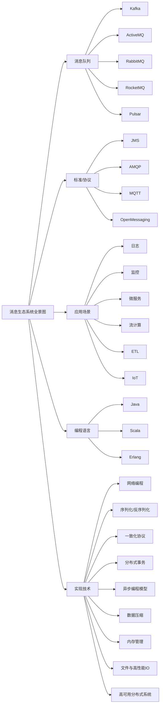

```mermaid
flowchart LR
消息生态系统全景图-->消息队列
消息生态系统全景图-->标准/协议
消息生态系统全景图-->应用场景
消息生态系统全景图-->编程语言
消息生态系统全景图-->实现技术
消息队列-->Kafka
消息队列-->ActiveMQ
消息队列-->RabbitMQ
消息队列-->RocketMQ
消息队列-->Pulsar
标准/协议-->JMS
标准/协议-->AMQP
标准/协议-->MQTT
标准/协议-->OpenMessaging
应用场景-->日志
应用场景-->监控
应用场景-->微服务
应用场景-->流计算
应用场景-->ETL
应用场景-->IoT
编程语言-->Java
编程语言-->Scala
编程语言-->Erlang
实现技术-->网络编程
实现技术-->序列化/反序列化
实现技术-->一致化协议
实现技术-->分布式事务
实现技术-->异步编程模型
实现技术-->数据压缩
实现技术-->内存管理
实现技术-->文件与高性能IO
实现技术-->高可用分布式系统
```

