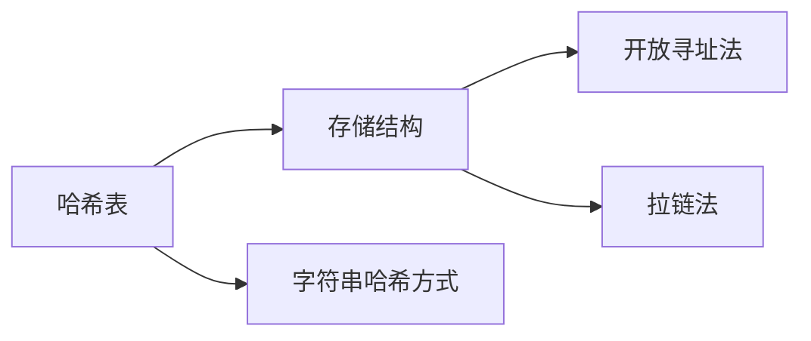

## 总览

```mermaid
graph LR
  data[数据结构与算法]
  data-->CA[复杂度分析]
  data-->BA[基础算法]
  data-->Sort[排序]
  data-->Search[搜索]
  data-->Find[查找]
  data-->Match[字符串匹配]
  data-->Other[其他]
  data-->Link[线性表]
  data-->Hash[散列表]
  data-->Tree[树]
  data-->Graph[图]

  CA-->空间复杂度
  CA-->时间复杂度
  时间复杂度-->最好
  时间复杂度-->最坏
  时间复杂度-->平均
  时间复杂度-->均摊

  BA-->贪心
  BA-->分治
  BA-->动态规划
  BA-->回溯
  BA-->枚举

  Sort-->n2[&#79&#40&#110&#94&#50&#41]
  Sort-->nlogn[&#79&#40&#110&#108&#111&#103&#110&#41]
  Sort-->n[&#79&#40&#110&#41]
  
  n2-->冒泡排序
  n2-->插入排序
  n2-->选择排序
  n2-->希尔排序
  
  nlogn-->归并排序
  nlogn-->快速排序
  nlogn-->堆排序
  
  n-->计数排序
  n-->基数排序
  n-->桶排序
  
  Search-->深度优先搜索
  Search-->广度优先搜索
  Search-->A*启发式搜索
  
  Find-->线性表查找
  Find-->树结构查找
  Find-->散列表查找
  
  Match-->朴素
  Match-->KMP
  Match-->Robin-Karp
  Match-->Boyer-Moore
  Match-->AC自动机
  Match-->Trie
  Match-->后缀数组
  
  Other-->数论
  Other-->计算几何
  Other-->概率分析
  Other-->并查集
  Other-->拓扑网络
  Other-->矩阵运算
  Other-->线性规划
  
  Link-->数组
  Link-->链表
  Link-->栈
  Link-->队列
  
  链表-->单链表
  链表-->双向链表
  链表-->循环链表
  链表-->双向循环链表
  链表-->静态链表
  
  栈-->顺序栈
  栈-->链式栈
  
  队列-->普通队列
  队列-->双端队列
  队列-->阻塞队列
  队列-->并发队列
  队列-->阻塞并发队列
  
  Hash-->散列表
  Hash-->冲突解决
  Hash-->动态扩容
  Hash-->位图
  
  冲突解决-->链表法
  冲突解决-->开放寻址
  冲突解决-->1[其他]
  
  Tree-->二叉树
  Tree-->多路查找树
  Tree-->堆
  Tree-->2[其他]
  
  二叉树-->平衡二叉树
  二叉树-->二叉查找树
  二叉树-->平衡二叉查找树
  二叉树-->完全二叉树
  二叉树-->满二叉树
  
  平衡二叉查找树-->AVL树
  平衡二叉查找树-->红黑树
  
  多路查找树-->B树
  多路查找树-->B+树
  多路查找树-->2-3树
  多路查找树-->2-3-4树
  
  堆-->大顶堆
  堆-->小顶堆
  堆-->优先级队列
  堆-->斐波那契堆
  堆-->二项堆
  
  2-->树状数组
  2-->线段树
  
  Graph-->图的存储
  Graph-->拓扑排序
  Graph-->最短路径
  Graph-->关键路径
  Graph-->最小生成树
  Graph-->二分图
  Graph-->最大流
  
  图的存储-->邻接矩阵
  图的存储-->邻接表
```



## 基础算法

### 快速排序

基本流程：

1. 确定分界点：通常随机选取q[l],q[(l+r)/2],q[r]
2. **调整区间，左边区间$\leq x$，右边区间$\geq x$。**
3. 递归处理左右区间。

时间复杂度：$O(nlogn)$

**随机取点时，不推荐使用边界点。**当给定的序列有序时，如果每次选择区间左端点进行划分，每次会将区间[L, R]划分成[L, L]和[L + 1, R]，那么相当于每次递归右半部分的区间长度只会减少1，所以就需要递归n-1次了，时间复杂度会达到 $n^2$。但每次选择区间中点或者随机值时，划分的两个子区间长度会比较均匀，那么期望只会递归$logn$层。

```cpp
const int N = 1e6 + 10;
int n;
int q[N];

void quick_sort(int n[], int l, int r) {
    //判断是否有元素
    if (l >= r) return;
    //因为这里为了递归，在每次都直接将数组的指针进行加一，所以这里在声明的时候将范围左右各扩展一个
    //这里x也不能取到n[r]，理由和下面的类似
    int x = q[(l+r)/2], i = l - 1, j = r + 1;
    while (i < j) {
        do i++; while (n[i] < x);
        do j--; while (n[j] > x);
        if (i < j) std::swap(n[i], n[j]);
    }
    quick_sort(n, l, j);
    quick_sort(n, j + 1, r);
}
```

```cpp
void quick_sort(int n[], int l, int r) {
    //判断是否有元素
    if (l >= r) return;
    //因为这里为了递归，在每次都直接将数组的指针进行加一，所以这里在声明的时候将范围左右各扩展一个
    //这里初值位置修改成这样是因为当下面递归使用i时，防止出现右边界死循环，用j的时候不会发生这个问题
    int x = n[(l+r+1)/2], i = l - 1, j = r + 1;
    while (i < j) {
        do i++; while (n[i] < x);
        do j--; while (n[j] > x);
        if (i < j) std::swap(q[i], q[j]);
    }
    quick_sort(n, l, i-1);
    quick_sort(n, j, r);
}
```

~~要是觉得快排是不稳定的算法，可以将所有元素都变成二元组。这样每个元素都是不一样的了，就不涉及稳不稳定的问题了。~~归并排序是稳定的。

### 归并排序

基本流程：

1. 确定分界点：$mid=(l+r)/2$
2. 递归排序左右区间
3. **归并，合二为一**

时间复杂度：$O(nlogn)$，且需要一个额外的辅助数组空间。

```cpp
int q[N], temp[N];
void merge_sort(int p[], int l, int r) {
    if (l >= r)return;
    //这里也可以写成l+r>>1
    int mid = (l + r) / 2;
    //递归处理
    merge_sort(p, l, mid);
    merge_sort(p, mid + 1, r);
    //这里的k记录tmp数组中的位置
    int k = 0, i = l, j = mid + 1;
    while (i <= mid && j <= r) {
        if (p[i] <= p[j]) temp[k++] = p[i++];
        else temp[k++] = p[j++];
    }
    //如果还有没有处理的元素，进行处理
    while (i <= mid) temp[k++] = p[i++];
    while (j <= r) temp[k++] = p[j++];
    //将tmp数组中的数组转移到原本的数组中,注意这里的i使用l初始化
    for (i = l, j = 0; i <= r; i++, j++) {
        p[i] = temp[j];
    }
}
```

#### 逆序对的数量

最直接的方法的时间复杂度是$O(n^2)$，可以使用归并排序计算逆序对数量。

$逆序对数量=左区间的逆序对数量+右区间的逆序对数量+合并部分的逆序对数量$

若i是左区间的遍历索引，j为右区间的遍历索引。当数组[i]大于[j]时，此时逆序对数量为$mid-i+1$。进行累加即可。

对于测试数量级较大时，逆序对数量用long long 比较好。

```cpp
#include <iostream>
using namespace std;

const int N=100010;
int q[N],tmp[N];
int n;
long long x=0;
void merge_sort(int q[],int l,int r){
    if(l>=r) return;
    int mid=(l+r)/2;
    
    merge_sort(q,l,mid);
    merge_sort(q,mid+1,r);
    int k=0,i=l,j=mid+1;
    while(i<=mid&&j<=r){
        if(q[i]<=q[j]) tmp[k++]=q[i++];
        else {
            x+=mid-i+1;
            tmp[k++]=q[j++];
        }
    }
    while(i<=mid) tmp[k++]=q[i++];
    while(j<=r) tmp[k++]=q[j++];
    for(i=l,j=0;i<=r;i++,j++) q[i]=tmp[j];
}
int main(){
    scanf("%d",&n);
    for(int i=0;i < n;i++) scanf("%d",&q[i]);
    merge_sort(q,0,n-1);
    //for(int i=0;i < n;i++) printf("%d ",q[i]);
    printf("%ld",x);
}
```

### 二分搜索

**二分的本质不是单调性，有单调性一定可以二分，但是没单调性也不一定不能使用二分。对于整数二分而言，是边界，即一侧区间满足某种性质，另一侧不满足某种性质。**

#### 整数二分

将一个域划分为两个相反区间。

整数二分中没有交点。

- 区间[l,r]被划分为[l,mid]和[mid+1,r]

- $mid={\frac{l+r+1}{2}}$

    $if (check(mid)) \begin{cases} true& \text {[mid,r]=>l=mid} \\ false& \text {[l,mid+1]=>r=mid-1} \end{cases} $

- 区间[l,r]被划分为[l,mid-1]和[mid,r]

- $mid=\frac{l+r}{2}$

    $if(check(mid))\begin{cases}true \quad[l,mid]=>r=mid \\ false \quad [mid+1,r]=>l=mid+1\end{cases}$

**这里的mid是否加一,取决于当为true时是l=mid还是r=mid.如果是l=mid,默认的除法是下取整,在l和r之间只相差一个的时候导致一直是l=l,进而导致死循环.**写程序的时候先写成`l+r>>1`，之后再根据l和r，选择是否+1。

需要考虑如果找不到的情况，二分出来的结果就是最靠近的那个元素。

```cpp
bool check(double x) {/* ... */} // 检查x是否满足某种性质
//区间[l,r]被划分为[l,mid]和[mid+1,l]时使用
int bsearch_1(int l,int r){
    while(l<r){
        int mid=l+r>>1;
        if(check(mid)) r=mid;
        else l=mid+1;
    }
    return l;
}

//区间[l,r]被划分为[l,mid-1]和[mid,r]时使用
int bsearch_2(int l, int r){
    while(l<r){
        int mid=l+r+1>>1;
        if(check(mid))l=mid;
        else r=mid-1;
    }
    return l;
}
```

#### 浮点数二分

浮点数二分不需要处理边界，所以相对简单。

下面是一个开方的函数,就是利用了浮点数的二分.如果精度要求是四位小数le-6,五位精度le-7类推.

```cpp
int kaifang(double x) {
    double l = 0, r = x;
    while (r - l > 1e-8) {
        double mid = (l + r) / 2;
        if (mid * mid >= x)r = mid;
        else l = mid;
    }
    return l;
}
```


### 大整数计算

#### 两数相加

这里的选择使用数组存储大整数，这里第0位存个位数，最高位放在数组最后面。这样当发生进位的时候，容易处理。

```cpp
#include <iostream>
#include <vector>
using namespace std;

vector<int> add(const vector<int> &A,const vector<int> &B){
    vector<int> C;
    //t为当前操作位
    int t=0;
    for (int i = 0; i < A.size()|| i < B.size() ; ++i) {
        if (i<A.size()) t+=A[i];
        if (i<B.size()) t+=B[i];
        C.push_back(t%10);
        t/=10;
    }
    //注意，最后进位不为0的话需要进一
    if (t) C.push_back(1);
    return C;
}

int main(){
    string a,b;
    cin>>a>>b;
    vector<int> A,B;
    //注意下面的i是从size()-1开始，size()出没有值
    for(int i=a.size()-1;i>=0;i--) A.push_back(a[i]-'0');
    for(int i=b.size()-1;i>=0;i--) B.push_back(b[i]-'0');
    auto C=add(A,B);
    for(int i=C.size()-1;i>=0;i--) printf("%d",C[i]);
    return 0;
}
```

这个算法的第零位存放的是数字的个位。

#### 两数相减

```cpp
//当结果的位数>1时，去掉结果高位的无用0
void trimZero(vector<int> &A){
    while (A.back()==0&&A.size()>1) A.pop_back();
}
//C=A-B
vector<int> sub(vector<int> &A,vector<int> &B){
    vector<int> C;
    int t=0;
    for (int i=0;i<A.size();i++){
        t=A[i]-t;
        if (i<B.size()) t-=B[i];
        C.push_back((t+10)%10);
        if (t<0) t=1;
        else t=0;
    }
    trimZero(C);
    return C;
}

//是否A>=b
bool cmp(vector<int> &A,vector<int> &B){
    if (A.size()!=B.size()) return A.size()>=B.size();
    for (int i = A.size()-1 ; i >= 0 ; --i) {
        if (A[i]!=B[i])
            return A[i]>B[i];
    }
    return true;
}

int main(){
    string a,b;
    cin>>a>>b;
    vector<int> A,B;
    //读入的数字存放进vector
    for(int i=a.size()-1;i>=0;i--) A.push_back(a[i]-'0');
    for(int i=b.size()-1;i>=0;i--) B.push_back(b[i]-'0');
    vector<int> C;
    if (cmp(A,B)){
        C= sub(A,B);
    } else{
        printf("-");
        C= sub(B,A);
    }
    for(int i=C.size()-1;i>=0;i--) printf("%d",C[i]);
    return 0;
}
```

这个算法需要注意要去除多余的0。

#### 两数相乘

```c++
//A是大正整数，B是相对小的正整数(直接定义为int型)
vector<int> mul(vector<int> &A,int B){
        vector<int> C;
        int t=0;
        for (int i = 0; i < A.size()||t; ++i) {
            t+=A[i]*B;
            C.push_back(t%10);
            t/=10;
        }
        // 去除前导0
        while(C.back()==0&&C.size()>1) C.pop_back();
        return C;
    }
```

#### 两数相除

```cpp
#include <algorithm>
//A是被除数，B是除数，C是商，r是余数。注意这里的r需要被调用，记得加引用
vector<int> div(vector<int> &A, int B, int &r) {
    vector<int> C;
    r = 0;
    for (int i = A.size() - 1; i >= 0; --i) {
        r = r * 10 + A[i];
        C.push_back(r / B);
        r = r % B;
    }
    reverse(C.begin(), C.end());
    while (C.back() == 0 && C.size() > 1)C.pop_back();
    return C;
}
```

### 前缀与差分

##### 前缀和

前缀和一定要从1开始。

**a[]和s[]数组的第0位都放0，之后进行存储运算从第1位开始。这样在进行计算s[]的时候可以直接用-1**

前缀和与差分是逆运算。

差分与前缀和可以使得一个数组区间加减一个数的时间复杂度从$O(n)$降低至$O(1)$。原本执行流程是遍历所有情况后

###### 一维前缀和

int a[N],s[N]，其中a[i]表示真实数组中第i个元素的值，s[N]表示前i个元素的和。前缀和公式为$s=s[r]-s[l-1]$。

```cpp
int main(){
    ios::sync_with_stdio(false);
    scanf("%d%d",&n,&m);
    for (int i = 1; i <=n ; ++i) {
        scanf("%d",&a[i]);
    }
    for (int i = 0; i <= n; ++i) {
        s[i]=s[i-1]+a[i];
    }
    while (m--){
        int l,r;
        scanf("%d%d",&l,&r);
        printf("%d\n",s[r]-s[l-1]);
    }
    return 0;
}
```

###### 二维前缀和

结构原理同上，公式为$s=s[x_2][y_2]-s[x_1-1][y_2]-s[x_2][y_1-1]+s[x_1-1][y_1-1]$和$s[i][j]=s[i-1][j]+s[i][j-1]-s[i-1][j-1]+a[i][j]$。

```cpp
int main() {
    ios::sync_with_stdio(false);

    scanf("%d%d%d", &n, &m, &q);
    for (int i = 1; i <= n; ++i) {
        for (int j = 1; j <= m; ++j) {
            scanf("%d", &a[i][j]);
        }
    }
    for (int i = 1; i <= n; ++i) {
        for (int j = 1; j <= m; ++j) {
            s[i][j]=s[i-1][j]+s[i][j-1]-s[i-1][j-1]+a[i][j];
        }
    }
    while (q--){
        int x1,y1,x2,y2;
        scanf("%d%d%d%d",&x1,&y1,&x2,&y2);
        printf("%d\n",s[x2][y2]-s[x1-1][y2]-s[x2][y1-1]+s[x1-1][y1-1]);
    }
    return 0;
}
```

###### 应用

**一阶差分**

给定a[]数组，求一段区间内元素加上某一数值的和。

思路：假定前缀和数组a[]每个元素都是从0开始，差分数组b[]相应的也都是0。然后获取a[]每个元素的过程视为a[i]=(i,i)区间内加上$a_i$的值。

使用前缀和计算原数组：$b[i]+=c \&\& b[i+1]-=c$，前缀和就是$b[i]+=b[i-1]$的累加。

```cpp
const int N=100010;
int a[N],b[N];
void insert(int l,int r, int c){
    b[l]+=c;
    b[r+1]-=c;
}

int main(){
    int n,m;
    scanf("%d%d",&n,&m);
    for (int i = 1; i <=n; ++i) {
        scanf("%d",&a[i]);
    }
    for (int i = 1; i <=n; ++i) {
        insert(i,i,a[i]);
    }
    while (m--){
        int l,r,c;
        scanf("%d%d%d",&l,&r,&c);
        insert(l,r,c);
    }
    for (int i = 1; i <=n ; ++i) {
        b[i]+=b[i-1];
    }
    for (int i = 1; i <=n ; ++i) {
        printf("%d ",b[i]);
    }
    return 0;
}
```

**二阶差分**

```cpp
const int N = 1010;
int a[N][N], b[N][N];

void insert(int x1, int y1, int x2, int y2, int c) {
    b[x1][y1] += c;
    b[x2 + 1][y1] -= c;
    b[x1][y2 + 1] -= c;
    b[x2 + 1][y2 + 1] += c;
}

int main() {
    int n, m, q;
    scanf("%d%d%d", &n, &m, &q);
    for (int i = 1; i <= n; ++i) {
        for (int j = 1; j <= m; ++j) {
            scanf("%d", &a[i][j]);
        }
    }
    for (int i = 1; i <= n; ++i) {
        for (int j = 1; j <= m; ++j) {
            insert(i, j, i, j, a[i][j]);
        }
    }
    while (q--){
        int x1,y1,x2,y2,c;
        scanf("%d%d%d%d%d",&x1,&y1,&x2,&y2,&c);
        insert(x1,y1,x2,y2,c);
    }
    for (int i = 1; i <= n; ++i) {
        for (int j = 1; j <= m; ++j) {
            b[i][j]+=b[i-1][j]+b[i][j-1]-b[i-1][j-1];
        }
    }
    for(int i=1;i<=n;i++){
        for(int j=1;j<=m;j++){
            printf("%d ",b[i][j]);
        }
        puts("");
    }
    return 0;
}
```

### 双指针算法

双指针算法大致可以分成两种，即两个指针指向不同的两个空间和两个指针指向同一空间的不同区间。

双指针算法的核心是将朴素算法中的两层及其以上的嵌套循环优化到O(n)。

双指针的模板的大都类似这样：

```cpp
for(int i=0,j=0;i<n;i++){
    while(j<i&&check(i,j))j++;
    //每道题目的具体逻辑
}
```

在`最长连续不重复子序列`中朴素的算法如下：

```cpp
for (int i=0;i<n;i++){
    for(int j=0;j<=i;j++){
        if(check(j,i)){
            res=max(res,j-i+1);
        }
    }
}
```

这种算法的时间复杂度在$O(n^2)$。

采用双指针算法时间复杂度能降低至$O(n+n)=O(2n)=O(n)$。

```cpp
for(int i=0,j=0;i<=n;i++){
    while(j<=i&&check(j,i)) j++;
    res=max(res,j-i+1);
}
```

这里i是终点，j是往右最远的距离就是答案。本题中j的移动是单调的。所以只有有重复的必然是b[a[i]]所带来的，将j右移,b[a[j]]--。

下面是双指针实现的最长连续不重复子序列：

```cpp
const int N=100010;
int a[N],b[N];

int main(){
    int n;
    int ans=0;
    scanf("%d",&n);
    for(int i=0;i<n;i++){
        scanf("%d",&a[i]);
    }
    for(int i=0,j=0;i<n;i++){
        b[a[i]]++;
        while(b[a[i]]>1){
            b[a[j]]--;
            j++;
        }
        ans=max(ans,i-j+1);
    }
    printf("%d",ans);
    return 0;
}
```

### 位运算

一般用于计算n的二进制表示第k位是什么。`n>>k&1`

`lowbit(x)`：返回x的最后一位1。实现的原理是基于C++中负数是原数取反+1，所以x&-x即x&(~x+1)。、取反后最后一位1是0之后都是1，加1之后全部变成0,最后一位再次变成1,前面的还是取反状态与运算0。

##### 二进制中1的个数

```cpp
#include <iostream>

int lowbit(int x){
    return x&-x;
}

int main(){
    int n;
    scanf("%d",&n);
    int x,t=0;
    while(n--){
        scanf("%d",&x);
        while(x){
            x-=lowbit(x);
            t++;
        }
        printf("%d ",t);
        t=0;
    }
    return 0;
}
```

### 整数离散化

难点：

- 数组中可能有重复元素，**去重**。
- 如何找出相应数对应的下标，**二分**。

C++中的`unique(容器.begin(),容器.end())`函数将所有重复元素放置到容器的尾部，并返回指向第一个重复元素的迭代器。

离散化模板：

```cpp
vector<int> alls;//存储所有待离散化的值
sort(alls.begin(),alls.end());//将所有值排序
alls.erase(unique(alls.begin(),alls.end()),alls.end());//去重
//二分求出x对应的离散化的值，找出第一个大于等于x的位置
int find(int x){
    int l=0,r=alls.size()-1;
    while(l<r){
        int mid=l+r>>1;
        if(alls[mid]>=x)r=mid;
        else l=mid+1;
    }
    return r+1;//映射到1,2..，不加一就是不映射
}
```

针对范围很大，但是其中使用到的元素很少的情况，使用离散化是一个不错的选择。 

求区间和：假定有一个无限长的数轴，数轴上每个坐标上的数都是0。现在，我们首先进行 n 次操作，每次操作将某一位置x上的数加c。接下来，进行 m 次询问，每个询问包含两个整数l和r，你需要求出在区间[l, r]之间的所有数的和。

```cpp
#include <iostream>
#include <vector>
#include <algorithm>
using namespace std;
//坐标x的数量上限为1e5，两个坐标l,r的数量上限也为1e5,所以加起来为3*le5
const int N=300010;
typedef pair<int,int> PII;
vector<PII> add,query;
vector<int> alls;
int q[N],s[N];
int find(int x){
    int l=0,r=alls.size()-1;
    while(l<r){
        int mid=l+r>>1;
        if(alls[mid]>=x) r=mid;
        else l=mid+1;
    }
    //因为后续要使用前缀和，所以返回的坐标要加上1
    return r+1;
}
//unique的自己实现
vector<int> unique(vector<int> &A){
	int j=0;
	for(int i=0;i<A.size();i++){
		if(!i||A[i]!=A[i-1]) A[j++]=A[i];
	}
    return A.begin()+j;
}
int main(){
    int n,m;
    scanf("%d %d",&n,&m);
    int x,c;
    //一次性读取所有添加和查询的坐标，以便进行离散化
    for(int i=0;i<n;i++){
        scanf("%d %d",&x,&c);
        add.push_back({x,c});
        alls.push_back(x);
    }
    int l,r;
    for(int i=0;i<m;i++){
        scanf("%d %d",&l,&r);
        query.push_back({l,r});
        alls.push_back(l);
        alls.push_back(r);
    }
    //排序去重
    sort(alls.begin(),alls.end());
    alls.erase(unique(alls.begin(),alls.end()),alls.end());
    //处理加入，构建原数组
    for(auto item:add){
        q[find(item.first)]+=item.second;
    }
    //计算前缀和
    for(int i=1;i<=alls.size();i++) s[i]=s[i-1]+q[i];
    //查询
    for(auto item:query){
        printf("%d\n",s[find(item.second)]-s[find(item.first)-1]);
    }
    return 0;
}
```

### 区间合并

```cpp
#include <iostream>
#include <vector>
#include <algorithm>
using namespace std;
typedef pair<int,int> PII;
vector<PII> seg;
void merge(vector<PII> a){
    vector<PII> res;
    //按左端点排序
    sort(seg.begin(),seg.end());
    int st=-2e9,ed=-2e9;
    for(auto item:seg){
        //情况1：两个区间无法合并
        if(ed<item.first){
            //区间1放进res数组
            if(st!=-2e9)res.push_back({st,ed});
            //维护区间2
            st=item.first;
            ed=item.second;
        }else{
            ed=max(item.second,ed);
        }
    }
    //剩下还有一个序列，但循环中没有放进res数组，因为它是序列中的最后一个序列
    if(st!=-2e9) res.push_back({st,ed});
    seg=res;
}
int main(){
    int n;
    scanf("%d",&n);
    int l,r;
    while(n--){
        scanf("%d %d",&l,&r);
        seg.push_back({l,r});
    }
    merge(seg);
    printf("%d",seg.size());
    return 0;
}
```

### 启发式合并

### manacher算法

### 最小表示法

### 构造

### 打表

## 数据结构

在笔试与面试的时候，直接生成节点的结构体在new的时候会花费大量时间。因此，需要使用数组来模拟链表，优化执行时间。

### 链表与邻接表

单链表最大的用途是写邻接表，而邻接表最大的用途是存储图和树。邻接表的实现就是一堆单链表的集合。

双链表来优化某些问题。

使用两个数组记录一个链表，在算法题目中大多使用这种形式的链表，避免了new和delete过程所花费的时间。

#### 单链表数组实现

```cpp
#include <iostream>

const int N = 100010;
//va[i]表示i的数值，ne[i]表示节点i中的next指针是多少
int va[N], ne[N];
//head表示头节点的下标，idx存储当前已经用到了哪个点
int head, idx;

void init() {
    head = -1;
    idx=0;
}

void insert_head(int key){
    va[idx]=key;
    ne[idx]=head;
    head=idx;
    idx++;
}

void insert(int key,int value){
    va[idx]=value;
    ne[idx]=ne[key];
    ne[key]=idx;
    idx++;
}

void remove(int key){
    ne[key]=ne[ne[key]];
}

int main() {
    int n;
    scanf("%d", &n);
    init();
    char op;
    int key, value;
    while (n--) {
        getchar();
        scanf("%c", &op);
        if (op == 'H') {
            scanf("%d", &key);
            insert_head(key);
        }
        if (op == 'D') {
            scanf("%d", &key);
            //如果删除的是头节点，将头指针设置为头指针指向的下一个
            if(!key) head=ne[head];
            //注意下标
            else remove(key-1);
        }
        if (op == 'I') {
            scanf("%d %d", &key, &value);
             //注意下标
            insert(key-1,value);
        }
    }
    for (int i = head; i !=-1 ; i=ne[i]) {
        printf("%d ",va[i]);
    }
    return 0;
}
```

#### 双链表数组实现

双链表不同于单链表在于其拥有左节点和右节点的信息。因此基础的数据为`e[i],l[i],r[i],idx`。索引0固定为起始节点，索引1固定为结束节点，因此初始化可以设置为`r[0]=1,l[1]=0,idx=2`。

```cpp
#include <iostream>

using namespace std;
const int N = 1e6 + 10;
int l[N], r[N], e[N];
int idx;

void init() {
    //0代表起始端点，1代表结束端点
    //真实数字从idx==2开始存放
    idx = 2;
    l[1] = 0;
    r[0] = 1;
}

//此函数的逻辑是插入k的右侧节点
//若需要实现插入k的左侧节点只需传入l[k]即可
void add(int k, int v) {
    e[idx] = v;
    l[idx] = k;
    r[idx] = r[k];
    l[r[k]] = idx;
    r[k] = idx;
    ++idx;
}

void remove(int k) {
    r[l[k]] = r[k];
    l[r[k]] = l[k];
}

int main() {
    int n;
    init();
    scanf("%d", &n);
    while (n--) {
        char op[3];
        int x, y;
        scanf("%s", &op);
        if (!strcmp("L", op)) {
            scanf("%d", &x);
            add(0, x);
        }
        if (!strcmp("R", op)) {
            scanf("%d", &x);
            add(l[1], x);
        }
        if (!strcmp("D", op)) {
            scanf("%d", &x);
            remove(x + 1);
        }
        if (!strcmp("IL", op)) {
            scanf("%d%d", &x, &y);
            add(l[x + 1], y);
        }
        if (!strcmp("IR", op)) {
            scanf("%d%d", &x, &y);
            add(x + 1, y);
        }
    }
    for (int i = r[0]; i != 1; i = r[i]) printf("%d ", e[i]);
    return 0;
}
```

### 栈

这里使用数组来模拟栈结构。

```cpp
#include <iostream>
#include <cstring>

using namespace std;
const int N = 1e6 + 10;
int stk[N], top = -1;

void push(int x) {
    stk[++top] = x;
}

int pop() {
    return stk[top--];
}

const char *empty() {
    return top == -1 ? "YES" : "NO";
}

int query() {
    return stk[top];
}

int main() {
    int n;
    char op[6];
    scanf("%d", &n);
    while (n--) {
        int x;
        scanf("%s", &op);
        if (!strcmp(op, "push")) {
            scanf("%d", &x);
            push(x);
        }
        if (!strcmp(op, "pop")) pop();
        if (!strcmp(op, "empty")) printf("%s\n", empty());
        if (!strcmp(op, "query")) printf("%d\n", query());
    }
    return 0;
}
```

### 单调栈

常见模型：找出每个数左边离它最近的比它大/小的数

这里主要应用了结果的单调性，即找左边最近的最大或者最小的数。由于之前的数若大于等于当前数字则出栈，其永远不会是解，直至找到栈顶最小的数，并将当前数字压入栈中。

```cpp
int tt=0;
for(int i=1;i<=n;i++){
    while(tt&&check(q[tt],i)) tt--;
    stk[++tt]=i;
}
```

### 单调队列

常见模型：找出滑动窗口中的最大值/最小值

```cpp
int hh=0,tt=-1;
for(int i=0;i<n;i++){
    while(hh<=tt&&check_out(q[hh])) hh++;//判断队头是否滑出窗口
    while(hh<=tt&&check(q[tt],i)) tt--;
    // 注意这里的新元素存放，可能新入队的元素满足条件，需要放在结果集操作前面
    q[++tt]=i;
}
```

### Trie

**Trie可以实现高效的存储和查找字符串集合**。其本质上采用树的结构。除根节点之外的所有节点来存储字符串的每个字符信息。依据字符串来创建Trie树，并记录每个节点作为字符串结尾的次数。

**能算法题中能使用Trie数的题目，必然限制了字符的范围，一般在26到52之间**。

汉字这种字符特别多的情况，可以将其转化为二进制数，范围就成了01之间。

Trie树示意图：


```cpp
const int N = 1e5 + 1;
// s存放的trie数，横坐标为所有字符串个数，纵坐标为每个字符串的字符，同一层级元素在不同行
// s[i][j]==0既可能是根节点也可能是叶子结点
// cnt[x]存放以x为结尾的单词个数
// idx记录当前处理的s数组行数
int s[N][26], cnt[N], idx;
char op, str[N];

void insert(const char *str) {
    int p = 0;
    for (int i = 0; str[i]; ++i) {
        int u = str[i] - 'a';
        if (!s[p][u]) s[p][u] = ++idx;
        p = s[p][u];
    }
    ++cnt[p];
}

int query(const char *str) {
    int p = 0;
    for (int i = 0; str[i]; ++i) {
        int u = str[i] - 'a';
        if (!s[p][u]) return 0;
        p = s[p][u];
    }
    return cnt[p];
}
```

### 并查集

通常将**两个集合合并或查询两个元素是否在一个集合当中**，朴素算法的时间复杂度为$O(n)$，而并查集的优点在于进行上述两种操作时，时间复杂度**近乎$O(1)$**，并不是完全$O(1)$。

基本原理为：**每个集合用一棵树来表示。树根的编号就是整个集合的编号。每个节点存储它的父节点**。`p[x]`表示x的父节点。

- 如何判断树根：`if(p[x]==x)`
-   求x的集合编号：`while(p[x]!=x) x=p[x];`
- 如何合并两个集合：设立任意一条边属于另一个树
- 如何优化并查集寻找父节点的过程：使用路径压缩，即在寻找的过程中，将所有子节点的父指针直接指向树根。一般不用大枝合并。

```cpp
const int N = 1e5 + 10;
int s[N];

// 返回idx的根节点+路径压缩
int find(int idx) {
    if (idx != s[idx]) s[idx] = find(s[idx]);
    return s[idx];
}

int main() {
    int n, m, a, b;
    scanf("%d%d", &n, &m);
    char op[2];
    for (int i = 1; i <= n; i++) s[i] = i;
    while (m--) {
        scanf("%s%d%d", &op, &a, &b);
        if (op[0] == 'M') s[find(a)] = find(b);
        else {
            if (find(a) == find(b)) printf("Yes\n");
            else printf("No\n");
        }
    }
    return 0;
}

```

### 堆

堆这种数据结构本身支持以上五种操作，前三种在STL中有之间实现，后两种可以间接实现。

- 插入一个元素
- 求集合中最小元素的值
- 删除最小元素
- 删除任意元素
- 修改任意元素

小根堆的定义就是其节点小于等于其左右子节点的值。其根节点就是整个数的最小值。在小根堆中上述五种的实现可以用伪代码表示：

- `heap[++size]=x;up(size);`
- `heap[1]`
- `heap[1]=heap[size--];down(1);`
- `heap[k]=heap[size--];down(k);up(k);`
- `heap[k]=x;down(k);up(k);`

上述表达中的`size`表示当前占用到的索引，这里的索引从1开始，这样`x`的左子节点就可以方便的设置为`2x`，右子节点为`2x+1`。down操作表示将对应索引的向底层下降，up操作表示将对应索引向根节点靠近。

针对修改任意一个元素或删除任意一个元素，其实都是只有三种情况：down、up或者不变。如果需要down，则up实则不会执行。需要up同理。因此上述两种直接写上down和up操作即可。

#### 建堆

堆的建立不推荐使用插入的方式解决，效率太低是`O(nlogn)`。这里阐述一个`O(n)`复杂度的建堆方式，并给出复杂度分析。

思想就是**直接从$\lfloor n/2 \rfloor$下标开始执行down操作直至1下标**。

之所以这么做是基于下标之间的关系及其完全二叉树的性质。由于完全二叉树的性质，我们可以知道在某一节点之后的所有节点都是叶子节点。再结合下标之间的关系可以知道，最后一个非叶子节点就是$\lfloor n/2 \rfloor$的位置。因此之后的所有叶子节点不需要进行调整位置，因为其父节点调整时会调整符合条件的叶子结点，而起本身没有子节点。

原本的插入方式来建堆，其复杂性依赖于树的深度其复杂度为$O(logn)$，建堆中有n个元素，因此总时间复杂度为$O(nlogn)$。

但是采用上述方法创建堆，其时间复杂度大大较少。


可以分析出其是一个等差数列求和，可以使用错位相减获得和的计算公式，再借助极限就可以发现其复杂度无限接近$O(n)$。

```cpp
int s[N], len;

void down(int idx) {
    int min = idx;
    if (2 * idx <= len && s[2 * idx] < s[min]) min = 2 * idx;
    if (2 * idx + 1 <= len && s[2 * idx + 1] < s[min]) min = 2 * idx + 1;
    if (idx != min) {
        swap(s[idx], s[min]);
        down(min);
    }
}

void up(int idx) {
    while (idx >> 1 && s[idx >> 1] > s[idx]) swap(s[idx >> 1], s[idx]);
}

int main() {
    int n, m;
    scanf("%d%d", &n, &m);
    for (int i = 1; i <= n; i++) scanf("%d", &s[i]);
    len = n;
    // 建堆
    for (int i = n >> 1; i; i--) down(i);
    while (m--) {
        printf("%d ", s[1]);
        s[1] = s[len--];
        down(1);
    }
    return 0;
}
```

可以使用堆优化Dijkstra算法。但是需要两个二个额外的数组空间`hp、ph`来维护从堆到数组的映射关系、数组到堆的映射关系。

```cpp
const int N = 1e5 + 10;
// h: 堆数据
// ph[i]: 第k数的堆索引
// hp[i]: 索引i是第hp[i]个插入的数
// len: 堆索引
int h[N], ph[N], hp[N], len;

// 这里的ab都是堆中的索引
void heapSwap(int a, int b) {
    swap(ph[hp[a]], ph[hp[b]]);
    swap(hp[a], hp[b]);
    swap(h[a], h[b]);
}

void down(int idx) {
    int t = idx;
    while (t && 2 * t <= len) {
        idx = t;
        if (2 * idx <= len && h[idx * 2] < h[t]) t = 2 * idx;
        if (2 * idx + 1 <= len && h[idx * 2 + 1] < h[t]) t = 2 * idx + 1;
        if (t != idx) heapSwap(idx, t);
        else break;
    }
}

void up(int idx) {
    while (idx >> 1 && h[idx >> 1] > h[idx]) {
        heapSwap(idx, idx / 2);
        idx /= 2;
    }
}

int main() {
    // n: 操作数量
    // x: 操作数
    // m: 第m个数
    int n, x, y, m = 0;
    scanf("%d", &n);
    char op[3];
    while (n--) {
        scanf("%s", op);
        if (!strcmp(op, "I")) {
            scanf("%d", &x);
            ph[++m] = ++len;
            hp[len] = m;
            h[len] = x;
            up(len);
        } else if (!strcmp(op, "PM"))
            printf("%d\n", h[1]);
        else if (!strcmp(op, "DM")) {
            heapSwap(1, len--);
            down(1);
        } else if (!strcmp(op, "D")) {
            scanf("%d", &x);
            int k = ph[x];
            heapSwap(k, len--);
            down(k);
            up(k);
        } else if (!strcmp(op, "C")) {
            scanf("%d%d", &x, &y);
            h[ph[x]] = y;
            down(ph[x]);
            up(ph[x]);
        }
    }
    return 0;
}

```

这段代码维护了上述信息。

#### 堆排序分析

##### 复杂度

整个堆排序的过程，都只需要极个别临时存储空间，所以堆排序是原地排序算法。堆排序包括建堆和排序两个操作，建堆过程的时间复杂度是$O(n)$，排序过程的时间复杂度是$O(nlogn)$。所以，堆排序整体的时间复杂度是$O(nlog⁡n)$。

##### 稳定性

堆排序不是稳定的排序算法，因为在排序的过程，存在将堆的最后一个节点跟堆顶节点互换的操作，所以就有可能改变值相同数据的原始相对顺序。

##### 索引为0开始

如果节点的下标是$i$，那左子节点的下标就是$2*i+1$，右子节点的下标就是$2(i+1)$，父节点的下标就是$\frac{i-1}{2}$。

##### 为何不如快速排序

- **堆排序数据访问的方式没有快速排序友好。**

  对于快速排序来说，数据是顺序访问的。而对于堆排序来说，数据是跳着访问的。 而不是像快速排序那样，局部顺序访问，所以，这样对 CPU 缓存是不友好的。

- **对于同样的数据，在排序过程中，堆排序算法的数据交换次数要多于快速排序。**

  我们在讲排序的时候，提过两个概念，有序度和逆序度。对于基于比较的排序算法来说，整个排序过程就是由两个基本的操作组成的，比较和交换（或移动）。快速排序数据交换的次数不会比逆序度多。

  但是堆排序的第一步是建堆，建堆的过程会打乱数据原有的相对先后顺序，导致原数据的有序度降低。比如，对于一组已经有序的数据来说，经过建堆之后，数据反而变得更无序了。

### Hash表

哈希算法是一种期望算法。在平均情况下来看，每个节点对应的数可以认为是常数级别的。因此时间复杂度近似可以看成$O(1)$。



离散化可以理解为一种特殊的哈希方式，其需要保序。

哈希函数：

- 将x映射进一个范围，一般用取余的操作。x mod 范围
- 冲突解决。针对冲突解决有两种方法：
  - 开放寻址法：出现散列冲突之后，就去寻找下一个空的散列地址
    - 线性寻址：线性寻址步长是1
    - 二次探测：步长是线性寻址步长的2次方
    - 随机探测：每次步长随机
  - 再散列函数法：发生散列冲突后，换一个散列函数计算散列值
  - 拉链法：在计算出的位置索引出链上一个链表，其中存放在这个位置的所有元素

不管哪种探测方法，散列表中空闲位置不多的时候，散列冲突的概率就会提高，为了保证操作效率，我们会尽可能保证散列表中有一定比例的空闲槽位，我们用装载因子来表示空位的多少，装载因子=填入元素/散列表长度，装载因子越大，表明空闲位置越少，冲突越多，散列表性能降低。

算法题中一般只涉及插入和查找操作，不涉及删除。如果一定要实现删除，可以选择将对应节点做上标识的方式，而不是真的去删除。

**取模的数一般推荐选择采用质数且离2的整次幂尽可能的远，这样冲突的概率较小，可以通过数学证明**。


### Splay

### 树套树

### 莫队

### 树链剖分

### 动态树

### Dancing Links

### 左偏树

### 后缀树组

### 后缀自动机

### 点分治和点分树

### CDQ分治

### 仙人掌


## 字符串处理

### 暴力算法

对于字符串匹配问题，暴力算法的时间复杂度为O(n*m)。只要枚举文本串的起始位置i，然后从改位开始逐位与模式串进行匹配。如果匹配过程中每一位都相同，则匹配成功。否则，只要出现某位不同，就让文本串的起始位置变成i+1，并从头开始模式串的匹配。字符串比较过程中，必然会每个字符之间进行大量重复比较，其很难优化。暴力算法其时间复杂度最差的情况为每次扫描在模式串最后处才匹配失败。其实现算法如下。

```cpp
// brute force暴力枚举算法
// 复杂度为O(n*m)。当n和m为1e5数量级时，算法完全不可用。
void bruteForce(char *S, char *P) {
    int lens = strlen(S), lenp = strlen(P);
    for (int i = 0; i <= lens - lenp; ++i) {
        bool flag = true;
        for (int j = 0; P[j] != '\0'; ++j) {
            if (S[i + j] != P[j]) {
                flag = false;
                break;
            }
        }
        if (flag) printf("%d ", i);
    }
}
```

因此，优化整体的检查次数，利用上一次扫描的结果避免重复的比较是优化方向，也是KMP算法的主要优化方式。

### KMP

KMP算法的核心思想就是如何利用字符串对比中的信息，简化循环的次数，利用可用的重复性。朴素算法采用两个for循环对每个字符串的元素进行比较，KMP先针对模式串进行处理，获取其next数组。其next[i]表示当前元素从右往左与从模板起始处相同子串的最大长度。这样当出现不匹配的情况时，可以一次性向后移动多个位置，而不是一个个移动，将算法的复杂度降至O(m+n)。KMP算法利用了模式串内部的重复性在失配的时候将模式串向后移动与匹配指针对齐，减少无意义的匹配。

KMP算法中定义可用重复性使用的是`Partial Match`数组，`PM[i]`表示字符串长度为i+1的前缀里（除本身外）最长相等前后缀的长度。为了方便使用，`Next`数组。`Next[i]`表示匹配模式串i位置失配模式串向后滑动对其匹配指针的位置。Next数组的构建方式为将PM数组整体向后移动一位，并在第一个位置出补上-1。此时，Next数组的前两位就固定为Next[0]=-1,Next[1]=0。因为本身不计算，其只能是0。

在书写代码的时候`next`这个名字可能被使用了，可以使用`ne`作为名字。`next[i]`表示使子串s[0...i]的前缀s[0...k]等于后缀s[i-k...i]的最大的k（**注意前缀跟后缀可以部分重叠，但不能是s[0...i]本身**）。如果找不到相等的前后缀，则令next[i]=-1。显然，next[i]就是所求最长相等前后缀中前缀最后一位的下标。

为了提升 KMP 算法的易用性，我们定义 Next 数组为 `-1` 接上删去最后一位的PM数组，这样有一个好处就是在`T[x]`处失配，我们可以直接通过 `Next[x]` 跳转，而不是复杂地还要去找 `pm[x-1]` 然后再移动字符串再从下一位开始继续匹配。

这里在赘述以下 Next 数组的使用方法：我们先暴力匹配的过程将模式串与目标串进行匹配，当失配的时候，我们比较$ S[p]\neq =T[q]$ 的时候失配，分两种情况：

- q = 0，下一步目标串下一位和模式串从头比较，也就是`S[p+1]`与`T[0]` 进行比较。
- q > 0，我们将模式串向后移动，使`T[Next[q]]`对齐`S[p]`，下一步比较这两位。

我们可以通过证明使用 Next 数组与使用 PM 数组等价，证明 Next 数组的正确性。

紧接着看如何计算 Next 数组，其实从意义上理解我们是在计算 PM 数组。`Next[i]` 就是算$T[0\cdots i-1]$ 的最长前后缀长度是多少，这有两种情况：
\* 如果 `T[i – 1] = T[Next[i-1]]`，那么`Next[i] = Next[i – 1] + 1`。因为`Next[i-1]`存储的是$T[0\cdots i-2]$的最长前后缀，如果能在这个基础上增加 1 个得到`Next[i]`，那一定是最长的。
\* 如果$T[i – 1] \neq T[Next[i – 1]]$，那么我们可以把它看作是 T 的前缀和$ T[0\cdots i-1]$ 的匹配问题且在这一步失配了，那么我们可以使用上述的 KMP 算法跳 Next 数组比较`T[i-1]`与` T[Next[Next[i-1]]]`，再分成现在说的这两种情况考虑。（或者确认模式串此前缀的最长前后缀长度为 0 为止）

```cpp
// KMP算法
// 复杂度为O(m+n)
vector<char> ne;
void build(const char *pattern) {
    int len = strlen(pattern);
    ne.resize(len + 1);
    for (int i = 0, j = ne[0] = -1; i < len; ne[++i] = ++j) {
        while (~j && pattern[j] != pattern[i]) j = ne[j];
    }
}

vector<int> match(const char *text, const char *pattern) {
    vector<int> res;
    int lenp = strlen(pattern), lent = strlen(text);
    build(pattern);
    for (int i = 0, j = 0; i < lent; ++i) {
        while (j > 0 && text[i] != pattern[j]) j = ne[j];
        if (text[i] == pattern[j]) ++j;
        if (j == lenp) res.push_back(i - lenp + 1), j = ne[j];
    }
    return res;
}
```


## 搜索与图论

### 满二叉树

除最后一层无任何子节点外，每一层上的所有节点都有两个子节点二叉树。

> 定义：一个二叉树，如果每一层的节点数都达到最大值，则这个树就是满二叉树。即，如果一个二叉树的层数为K，且节点总数为$2^K-1$，则它是满二叉树。

### 完全二叉树

完全二叉树是在满二叉树的基础上引申出来的。对于深度为k，有n个节点的二叉树，当且仅当每个节点都与深度为k的满二叉树中编号从1至n的节点一一对应就是完全二叉树。

> 定义：若设二叉树的深度为h，除第 h 层外，其它各层 (1～h-1) 的结点数都达到最大个数，第 h 层所有的结点都连续集中在最左边，这就是完全二叉树。

### DFS

### BFS

### 拓朴排序

### 最短路

### 最小生成树

### 二分图

#### 染色法

#### 匈牙利算法

### 网络流

#### 最大流

#### 最小割

#### 费用流

### 2-SAT

### 朱流算法

### Prufer编码

### 模拟退火

### 爬山法

## 数学知识

### 质数

### 约数

### 欧拉函数

### 快速幂

### 扩展欧几里德算法

### 中国剩余定理

### 高斯消元

### 组合计数

### 容斥原理

### 简单博弈论

### 莫比乌斯反演

### 积性函数

### BSGS

### FFT

### 生成函数

### Burnside引理和Polya定理

### 斯特林数

### 线性基

## 动态规划

### 背包问题

### 线性DP

### 区间DP

### 计数类DP

### 数位统计DP

### 状态压缩DP

### 树状DP

### 记忆化搜索

### 基环树

### 四边形不等式优化

### 插头DP

## 贪心

## 计算几何

### 二维计算几何基础

### 凸包

### 半平面交

### 最小圆覆盖

### 三维计算几何基础

### 三维凸包

### 旋转卡壳

### 三角剖分

### 扫描线

### 自适应辛普森积分

## Tip

### c++的io

#### cin和scanf速度

cin、cout之所以效率低是因为先把要输出的东西存入缓冲区，再输出，导致效率降低，而``std::ios::sync_with_stdio(false);``可以来打消iostream的输入输出缓存，可以节省许多时间，使效率与scanf与printf相差无几。这样做了之后要注意不要同时混用cout和printf 之类。

应注意的是scanf与printf使用的头文件应是stdio.h而不是 iostream。

在默认的情况下cin绑定的是cout，每次执行 << 操作符的时候都要调用flush，这样会增加IO负担。可以通过tie(0)（0表示NULL）来解除cin与cout的绑定，进一步加快执行效率。

#### sync_with_stdio

这个函数是一个“是否兼容stdio”的开关，C++为了兼容C，保证程序在使用了std::printf和std::cout的时候不发生混乱，将输出流绑到了一起。

#### tie

tie是将两个stream绑定的函数，空参数的话返回当前的输出流指针。如`std::cin.tie()`，默认返回cout，数据类型为std::ostream。

### java的io

 java.util.Scanner类是一个简单的文本扫描类，它可以解析基本数据类型和字符串。它本质上是使用正则表达式去读取不同的数据类型。

Java.io.BufferedReader类为了能够高效的读取字符序列，从字符输入流和字符缓冲区读取文本。

Java的标准输入串是System.in。System.in提供的read方法是通过字节来读取数据的，不好处理。

java.util包中的Scanner读取数据是按空格符（这其中包括空格键，Tab键，Enter键）来分割数据的。只要遇到其中之一，Scanner的方法就会返回下一个输入（当然nextLine()方法的结束符为换行符，它    return 0;
}会返回换行符之前的数据）

BufferReader位于java.io包中，使用BufferReader就相对来说没有那么多方法来让你选择！读取数据比较固定，这样格式也就相对来说比较单一，只要记住就这一个读取数据的方法。`BufferedReader br = new BufferedReader (newInputStreamReader(System.in));`。这个BufferReader对象通过readLine()；方法来读取数据，readLine()是按Enter回车来读取一行数据的，只要在回车键之前的都会被readLine()方法返回。

readLine()方法返回的是字符串，因此要使用BufferReader输入一些字符之外的类型的数据，就要相对比较麻烦，需要通过一些XXXX.parseXxx()；来转换相应的数据类型，（例如：int类型的用Integer.parseInt（需要转换的字符串））。虽然麻烦一些，但通过BufferReader读入的效率要比Scanner高一倍，这个差距可想而知，而且读取的数据越多，效果就越明显。需要注意的是使用BufferReader对象的readLine()方法必须处理java.io.IOException异常。

#### 对比

- Scanner提供了一系列nextXxx()方法，当我们确定输入的数据类型时，使用Scanner更加方便。也正是因为这个BufferedReader相对于Scanner来说要快一点，因为Scanner对输入数据进行类解析，而BufferedReader只是简单地读取字符序列
- BufferedReader是支持同步的，而Scanner不支持。如果我们处理多线程程序，BufferedReader应当使用。
- Scanner和BufferedReader都设置了缓冲区，Scanner有很少的缓冲区(1KB字符缓冲)相对于BufferedReader(8KB字节缓冲)，但是这是绰绰有余的。
- Scanner输入的一个问题：在Scanner类中如果我们在任何7个nextXXX()方法之后调用nextLine()方法，这nextLine()方法不能够从控制台读取任何内容，并且，这游标不会进入控制台，它将跳过这一步。nextXXX()方法包括nextInt()，nextFloat()， nextByte()，nextShort()，nextDouble()，nextLong()，next()。在BufferReader类中就没有那种问题。这种问题仅仅出现在Scanner类中，由于nextXXX()方法忽略换行符，但是nextLine()并不忽略它。如果我们在nextXXX()方法和nextLine()方法之间使用超过一个以上的nextLine()方法，这个问题将不会出现了；因为nextLine()把换行符消耗了。

### 稳定性

通俗地讲就是能保证排序前两个相等的数据其在序列中的先后位置顺序与排序后它们两个先后位置顺序相同。即：如，如果$A_i==A_j$，$A_i$原来在$A_j$位置前，排序后$A_i$仍然是在$A_j$位置前。

### 短码

判断i不等于-1：`if (~i)`

判断i不能0：`if(i)`

### 反推算法复杂度

一般ACM或者笔试题的时间限制是1秒或2秒。在这种情况下，C++代码中的操作次数控制在$10^710^8$为最佳。

下面给出在不同数据范围下，代码的时间复杂度和算法该如何选择：

1. $n\leq 30$，指数级别，dfs+剪枝，状态压缩DP
2. $n\leq 100 \rightarrow O(n^2)$，floyd,dp,高斯消元
3. $n\leq 1000 \rightarrow O(n^2),O(n^2logn)$，dp,二元，朴素版Dijkstra，朴素版Prim，Bellman-Ford
4. $n\leq 10000 \rightarrow O(n*\sqrt{n})$，块状链表，分块，莫队
5. $n\leq 100000 \rightarrow O(nlogn)$，各种sort,线段树，树状数组，set/map,heap,拓朴排序，dijkstra+heap，prim+heap,spfa,求凸包，求半平面交，二分，CDQ分治，整体二分
6. $n\leq 1000000 \rightarrow O(n)$，以及常数较小的$O(nlogn)$算法，单调队列，hash,双指针扫描，并查集，kmp,AC自动机，常数较小的$O(nlogn)$的做法：sort,树状数组，heap,dijkstra,spfa
7. $n\leq 10000000 \rightarrow O(n)$，双指针扫描，kmp,AC自动机，线性筛素数
8. $n \leq 10^9 \rightarrow O(\sqrt{n})$，判断质数
9. $n \leq 10^{18} \rightarrow O(logn)$，最大公约数，快速幂
10. $n \leq 10^{1000} \rightarrow O((logn)^2)$，高精度加减乘除
11. $n \leq 10^{100000} \rightarrow O(logk * loglogk)$，k表示位数，高精度加减，FFT/NTT

#### accumulate函数

accumulate定义在#include<numeric>中，作用有两个，一个是累加求和，另一个是自定义类型数据的处理。

##### 累加求和

```cpp
int total = accumulate(nums.begin(), nums.end(), 0);
```

accumulate带有三个形参：头两个形参指定要累加的元素范围，第三个形参则是累加的初值。

可以实现将`vector<string>`类型的元素链接起来。

```cpp
string sum = accumulate(v.begin() , v.end() , string(" "));  
```

这个函数调用的效果是：从空字符串开始，把vec里的每个元素连接成一个字符串。

##### 自定义数据类型的处理

对于自定义数据类型，我们就需要自己动手写一个回调函数来实现自定义数据的处理，然后让它作为accumulate()的第四个参数，accumulate()的原型为

```javascript
template<class _InIt, class _Ty,  class _Fn2> 
inline _Ty _Accumulate(_InIt _First, _InIt _Last, _Ty _Val, _Fn2 _Func)  
{   // return sum of _Val and all in [_First, _Last), using _Func  
    for (; _First != _Last; ++_First)  
        _Val = _Func(_Val, *_First);  
    return (_Val);  
} 
```

例如：

```cpp
struct Grade  
{  
    string name;  
    int grade;  
};  
  
int main()  
{  
    Grade subject[3] = {  
        { "English", 80 },  
        { "Biology", 70 },  
        { "History", 90 }  
    };  
  
    int sum = accumulate(subject, subject + 3, 0, [](int a, Grade b){return a + b.grade; });  
}
```

### 题解技巧

#### 字符读取

有点时候需要去读表示操作的单字符串，为了避免`scanf("%c")`中可能读取到换行或者空格，推荐直接`scanf("%s")`，读取字符串会忽略换行之类的操作。然后获取`op[0]`获取操作。

#### strcmp

`strcmp(str1,str2)`需要引入<string>头文件。其作用是对两个字符串作比较。

返回值：

- str1小于str2，返回负数或者-1
- str1等于str2，返回0
- str1大于str2，返回正数或者1
