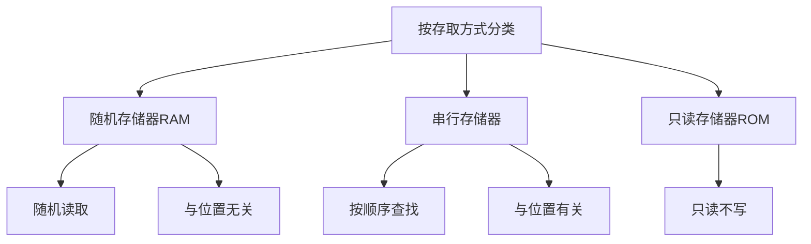

## 计算机组成

### 发展简史 

冯洛伊曼瓶颈：CPU和存储器速率之间的问题无法调和。CPU经常空转等待数据传输。

一条机器指令对应一个微程序，一个微程序对应一组微指令。

8bit=1Byte

硬盘商一般用10进位标记容量。

### 组成

$总线分类\begin{cases}片内总线 \\ 系统总线 \end{cases}$

#### 片内总线

高集成度芯片内部的信息传输线

#### 系统总线

CPU、主内存、IO设备、各组件之间的信息传输线。

- 数据总线：双向传输各个部件的数据信息，一般与CPU位数相同(32位,64位)，数据总线的位数(总线宽度)是数据总线的重要参数。
- 地址总线：地址总线位数=n，寻址范围：0~$2^n$。指定源数据或目的数据在内存中的地址。地址总线的位数与存储单元有关。
- 控制总线：用来发出各种控制信号的传输线，控制信号经由控制总线从一个组件发给另一个组件。控制总线可以监控不同组件之间的状态。(就绪/未就绪)

总线仲裁是为了解决总线使用权的冲突问题。

总线的仲裁方法：

- 链式查询

  

  好处：电路复杂度低，仲裁方式简单

  缺点：优先级低的设备难以获取总线使用权，对电路故障敏感。

- 计时器定时查询

  - 仲裁控制器对设备编号使用计数器累计计数
  - 接收到仲裁信号后，往所有设备发出计数值
  - 计数值与设备编号一致则获得总线使用权

- 独立请求

  - 每个设备均有总线独立连接仲裁器
  - 设备可单独想仲裁器发送请求和接收请求
  - 当同时收到多个请求信号，仲裁器有权按优先级分配使用权

  好处：响应速度快，优先顺序可动态改变

  缺点：设备连线多，总线控制复杂

#### 存储器

RAM通过电容存储数据，必须隔一段时间刷新一次。如果掉电，一段时间后将丢失所有数据。

##### 磁盘算法

- 先来先服务算法
- 最短寻道时间算法
- 扫描算法（电梯算法）：每次只往一个方向移动，到达一个方向需要服务的尽头再反方向移动。
- 循环扫描算法：区别于扫描算法在于扫描算法可以向两个方法移动，循环扫描算法只能一个方法。

字：指存放在一个存储单元中的二进制代码组合

字块：存储在连续的存储单元中而被看作是一个单元的一组字

字的地址=前m位指定字块的地址+后b位指定字在字块中的地址

$高速缓存的命中率=\frac{访问Cache次数}{访问Cache次数+访问主存次数}$

$访问Cache-主存系统平均时间t_a=ht_c+(1-h)t_m,t_m:访问主存时间,t_c:访问缓存时间$

$高速缓存的访问效率e=\frac{t_c}{t_a}=\frac{t_c}{ht_c+(1-h)t_m}$

##### 高速缓存

- 随机算法
- 先进先出算法(FIFO)
- 最不经常使用算法(LFU)
- 最近最少使用算法(LRU)

### 指令系统

#### 机器指令

机器指令=操作码字段+地址码字段

操作码指令指明所要完成的操作，操作码的位数反映了机器的操作类型。

地址码给出操作数或者操作数的地址。

##### 寻址方式

###### 指令寻址

- 顺序寻址
- 跳跃寻址

###### 数据寻址

- 立即寻址：指令直接获得操作数，无需访问存储器
- 直接寻址：直接给出操作数的地址
- 间接寻址：给出的是操作数的地址的地址

#### 数值的表现形式

小数的十进制转二进制采用重复相乘法。将小数换成分数形式，乘上2,看是否可以取出1,能则取1,不能取0,一直累成2,直至最后变成1。最后逆序。

##### 原码表示法

- 使用0表示正数，1表示负数
- 规定符号位位于数值第一位

